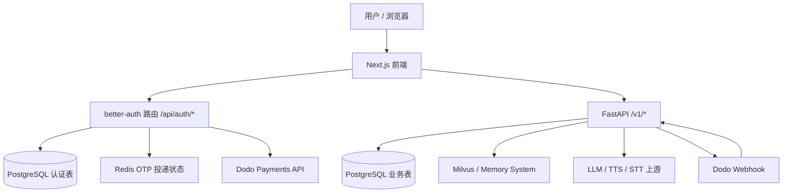
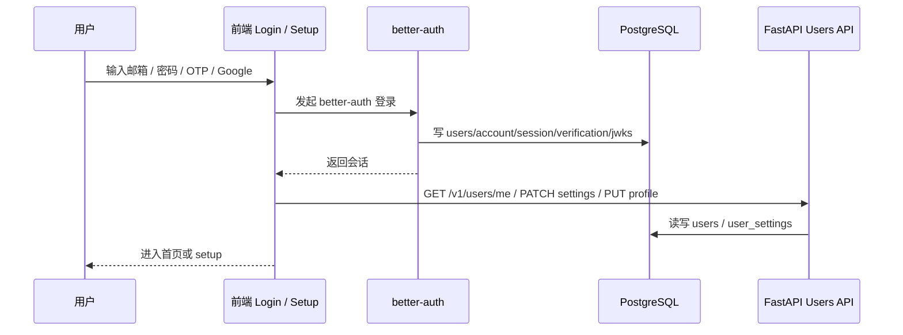
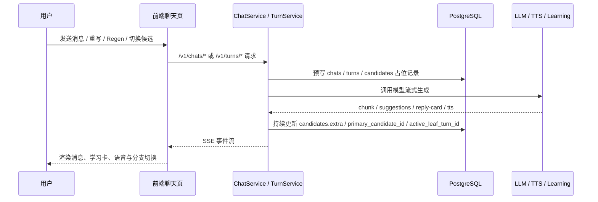

# ParlaSoul 数据库文档

本文档由脚本直接连接 PostgreSQL 实例并基于实时元数据生成。

- 生成时间: `2026-04-11 07:37:02 北京时间`
- 目标数据库: `localhost:5432/role_play_mem`
- Schema: `public`
- 表数量: `19`

## 业务语义总览

### 1. 系统边界与数据职责

ParlaSoul 当前是一个“前端认证层 + 后端业务层 + 共享 PostgreSQL”的系统：

- 前端仓库 `E:\code\parlasoul-frontend`
  - 负责 `better-auth` 登录、定价与账单页、角色发现页、聊天页、收藏页、个人中心、成长统计页。
  - 通过同源 `/api/auth/*` 处理认证，通过 `/v1/*` 调用后端业务 API。
- 后端仓库 `E:\code\parlasoul-backend`
  - 负责角色、聊天树、学习卡、收藏、音色、成长系统、订阅权益同步、Webhook 处理。
- PostgreSQL
  - 同时承载两类表：
    - `better-auth` 维护的认证表
    - FastAPI 维护的业务表
- Redis
  - 只保存前端邮箱 OTP 的短期投递状态，不保存业务主数据。
- Milvus / Zilliz
  - 保存 memory system 的向量与记忆正文，不在 PostgreSQL 里落“记忆业务表”。
- Dodo Payments
  - 保存完整订阅与支付流水；本地库只保存用户订阅摘要和 webhook 审计记录。
- 本地文件系统 / `/uploads`
  - 保存头像等静态上传文件，数据库只记录文件名或 URL。

### 2. 当前主链路与兼容 / 遗留链路

- 当前认证主链路
  - 前端登录页调用 `better-auth`
  - 主表是 [`users`](#table-users)、[`account`](#table-account)、[`session`](#table-session)、[`verification`](#table-verification)、[`jwks`](#table-jwks)
- 当前业务主链路
  - 角色与市场：[`characters`](#table-characters)
  - 聊天树：[`chats`](#table-chats)、[`turns`](#table-turns)、[`candidates`](#table-candidates)
  - 收藏：[`saved_items`](#table-saved_items)
  - 音色：[`voice_profiles`](#table-voice_profiles)
  - 成长系统：[`growth_user_stats`](#table-growth_user_stats) 等 5 张统计表
  - 订阅审计：[`subscription_webhook_events`](#table-subscription_webhook_events)
- 当前非前端主链路 / 兼容遗留
  - 当前旧验证码登录链路已经从代码库与数据库 schema 中移除，认证统一收敛到 `better-auth`。

### 3. 顶层框架

这个结构的关键点是：

- 认证与账单入口有一部分在前端完成，而不是全部走后端。
- 用户主表 [`users`](#table-users) 是共享表，`better-auth` 和 FastAPI 都会读写它。
- 业务核心状态仍在后端控制，尤其是聊天树、成长统计、角色与音色。

### 4. 核心业务流程

#### 4.1 登录、建号与资料补全

这条链路里：

- `better-auth` 负责“会话建立”和“认证凭据落库”。
- FastAPI 负责“资料补全”和“偏好设置”。
- 前端是否允许进入主应用，最终取决于 `username + avatar_url` 是否完整。

#### 4.2 角色发现、聊天树与流式生成

这条链路的核心不是“聊天消息表”，而是“聊天树”：

- [`chats`](#table-chats) 是会话壳和当前活动分支指针。
- [`turns`](#table-turns) 是树节点。
- [`candidates`](#table-candidates) 是同一节点的多个文本版本。

#### 4.3 学习辅助、收藏与成长系统

- 回复卡、输入改写、错误信息主要落在 [`candidates.extra`](#table-candidates)。
- 收藏不是把候选或卡片直接外键化，而是把卡片快照写入 [`saved_items`](#table-saved_items)。
- 成长系统在“聊天完成”后实时更新，而不是离线跑批：
  - [`growth_daily_stats`](#table-growth_daily_stats)
  - [`growth_character_daily_stats`](#table-growth_character_daily_stats)
  - [`growth_character_stats`](#table-growth_character_stats)
  - [`growth_user_stats`](#table-growth_user_stats)
  - [`growth_share_triggers`](#table-growth_share_triggers)

#### 4.4 订阅与权益

- 定价页与账单页主要通过前端 `better-auth + Dodo` 直接拿远端数据。
- 本地库只保留两层状态：
  - [`users`](#table-users) 上的订阅摘要字段
  - [`subscription_webhook_events`](#table-subscription_webhook_events) webhook 审计与幂等记录
- 真正的“功能是否可用”由后端 `SubscriptionService` 根据 `subscription_tier + subscription_status + subscription_current_period_end` 计算。

### 5. 数据域分组

- 共享用户核心域
  - [`users`](#table-users)
  - [`user_settings`](#table-user_settings)
- Better Auth 认证域
  - [`account`](#table-account)
  - [`session`](#table-session)
  - [`verification`](#table-verification)
  - [`jwks`](#table-jwks)
- 角色与会话域
  - [`characters`](#table-characters)
  - [`voice_profiles`](#table-voice_profiles)
  - [`chats`](#table-chats)
  - [`turns`](#table-turns)
  - [`candidates`](#table-candidates)
  - [`saved_items`](#table-saved_items)
- 成长系统域
  - [`growth_user_stats`](#table-growth_user_stats)
  - [`growth_daily_stats`](#table-growth_daily_stats)
  - [`growth_character_daily_stats`](#table-growth_character_daily_stats)
  - [`growth_character_stats`](#table-growth_character_stats)
  - [`growth_share_triggers`](#table-growth_share_triggers)
- 订阅审计域
  - [`subscription_webhook_events`](#table-subscription_webhook_events)
- 基础设施域
  - [`alembic_version`](#table-alembic_version)

## 表业务语义

### 共享用户核心域

#### [users](#table-users)

- 表职责
  - 这是全系统的共享用户主表。
  - `better-auth` 用它承载用户身份主体。
  - FastAPI 用它承载业务资料和订阅摘要。
- 表协作
  - 被认证表、聊天表、角色表、音色表、收藏表、成长表广泛引用。
  - `/setup` 主要补全 `username` 和 `avatar_url`。
  - `/billing`、`/v1/users/me/entitlements` 读取订阅摘要字段。
- 当前地位
  - 主链路核心表。

| 字段 | 业务语义 | 典型读写场景 |
| --- | --- | --- |
| `id` | 用户全局主键，认证域和业务域都以它作为统一身份。 | 登录建号、会话、角色创建、聊天、成长统计全部引用。 |
| `email` | 用户登录主标识。 | `better-auth` 登录、Dodo customer 反查、用户展示。 |
| `username` | 面向产品内展示的用户名，也是“资料是否完善”的判定字段之一。 | setup 页写入，前端侧边栏 / 个人主页读取。 |
| `display_name` | `better-auth` 的 name 映射字段，当前产品主展示仍以 `username` 为主。 | `better-auth` 用户创建钩子会填充；业务页很少直接消费。 |
| `avatar_url` | 用户头像 URL，是资料补全判定字段之一。 | setup 页上传后写入，聊天页与个人中心读取。 |
| `email_verified` | 邮箱是否已验证。 | 账单页决定是否允许进入 Dodo 订阅管理。 |
| `dodoCustomerId` | Dodo Payments 侧客户 ID 的本地镜像。 | webhook 对账、订阅 reconciliation、账单相关能力。 |
| `subscription_tier` | 本地记住的套餐档位原始值，不等于最终生效权益。 | webhook / reconcile 更新；后端计算 effective tier。 |
| `subscription_status` | 上游订阅状态原始值。 | 后端判断是否过期、冻结、取消。 |
| `subscription_product_id` | 当前关联的 Dodo 商品 ID。 | 用于从 product 映射到 `plus/pro/free`。 |
| `subscription_current_period_end` | 当前订阅周期结束时间。 | 判断付费权益是否仍有效。 |
| `last_login_at` | 最近一次成功登录时间。 | `better-auth` session create hook 回写。 |
| `created_at` | 用户在本系统第一次落库的时间。 | 用户审计与基础展示。 |
| `updated_at` | 用户记录最近更新时间。 | 用户资料或订阅摘要变化时刷新。 |

#### [user_settings](#table-user_settings)

- 表职责
  - 保存每个用户的个性化学习偏好和聊天体验开关。
- 表协作
  - 由 `UserSettingsService` 懒创建。
  - 聊天、学习卡、TTS、成长提示会实时读取这些开关。
- 当前地位
  - 主链路核心表。

| 字段 | 业务语义 | 典型读写场景 |
| --- | --- | --- |
| `user_id` | 与 `users.id` 一一对应的主键兼外键。 | 首次访问设置时 `get_or_create` 建行。 |
| `display_mode` | 学习展示模式，决定 UI 偏简洁还是偏详细。 | 聊天页、学习辅助 UI 读取。 |
| `memory_enabled` | 是否启用 memory feature；开启前会先做订阅权益校验。 | 设置页切换；后端 `SubscriptionService.assert_feature` gating。 |
| `reply_card_enabled` | 是否自动生成回复卡。 | 聊天流结束后决定是否跑 reply card。 |
| `mixed_input_auto_translate_enabled` | 是否对中英混输做自动转写/翻译。 | `ChatService` / `TurnService` 在流式生成前读取。 |
| `auto_read_aloud_enabled` | 是否自动播放实时 TTS。 | 前端聊天页消费 SSE `tts_audio_delta` 时判断。 |
| `preferred_expression_bias_enabled` | 是否使用用户偏好表达做回复建议偏置。 | 学习辅助和回复建议生成时读取。 |
| `message_font_size` | 聊天消息字号偏好。 | 前端设置页、聊天 UI。 |
| `created_at` | 设置行创建时间。 | 审计。 |
| `updated_at` | 最近一次设置变更时间。 | 前端显示“已同步/最后更新时间”。 |

### Better Auth 认证域

#### [account](#table-account)

- 表职责
  - `better-auth` 的“账号身份来源表”，一条用户可能对应多个 provider 账号。
- 表协作
  - 通过 `userId` 指向 [`users`](#table-users)。
  - 用于承载邮箱密码账号、社交登录账号或 OAuth 令牌。
- 当前地位
  - 当前认证主链路表，但业务服务基本不直接查询它。

| 字段 | 业务语义 | 典型读写场景 |
| --- | --- | --- |
| `id` | account 记录主键。 | `better-auth` 内部。 |
| `accountId` | provider 侧账号标识。 | 社交登录 / 凭证登录账号绑定。 |
| `providerId` | 身份提供方标识，如 email / google 等。 | `better-auth` 区分登录来源。 |
| `userId` | 关联到共享用户主表。 | 一个用户可挂多个 account。 |
| `accessToken` | OAuth provider 访问令牌。 | 社交登录场景按需保存。 |
| `refreshToken` | OAuth refresh token。 | 社交登录刷新令牌。 |
| `idToken` | OpenID Connect ID Token。 | OIDC / Google 等 provider。 |
| `accessTokenExpiresAt` | access token 到期时间。 | provider token 续期判断。 |
| `refreshTokenExpiresAt` | refresh token 到期时间。 | provider token 续期判断。 |
| `scope` | provider 授权 scope。 | 社交登录权限记录。 |
| `password` | 凭据登录使用的密文/散列载体。 | 邮箱密码登录时由 `better-auth` 维护。 |
| `createdAt` | 账号绑定创建时间。 | 审计。 |
| `updatedAt` | 账号绑定最后更新时间。 | provider 信息更新。 |

#### [session](#table-session)

- 表职责
  - 保存 `better-auth` 的服务端会话。
- 表协作
  - 通过 `userId` 回到 [`users`](#table-users)。
  - 登录态检查、登出、刷新都会影响这里。
- 当前地位
  - 当前认证主链路表。

| 字段 | 业务语义 | 典型读写场景 |
| --- | --- | --- |
| `id` | 会话主键。 | `better-auth` 内部。 |
| `token` | 会话 token 唯一值。 | 浏览器会话校验。 |
| `userId` | 会话所属用户。 | 登录后建立、登出时删除。 |
| `expiresAt` | 会话到期时间。 | 会话失效判断。 |
| `ipAddress` | 登录或会话来源 IP。 | 安全审计。 |
| `userAgent` | 登录或会话来源 UA。 | 安全审计。 |
| `createdAt` | 会话建立时间。 | 审计。 |
| `updatedAt` | 会话最近更新时间。 | 会话刷新。 |

#### [verification](#table-verification)

- 表职责
  - `better-auth` 的验证 / 一次性凭据表。
- 表协作
  - 与登录、邮箱验证、改邮箱、忘记密码等一次性流程相关。
- 当前地位
  - 当前认证主链路表。

| 字段 | 业务语义 | 典型读写场景 |
| --- | --- | --- |
| `id` | 验证记录主键。 | `better-auth` 内部。 |
| `identifier` | 被验证主体，如邮箱或某个 challenge key。 | OTP / 邮箱验证等流程定位记录。 |
| `value` | 一次性验证码、令牌或其持久化值。 | `better-auth` 校验。 |
| `expiresAt` | 失效时间。 | 过期验证。 |
| `createdAt` | 创建时间。 | 审计。 |
| `updatedAt` | 更新时间。 | 验证状态变更。 |

#### [jwks](#table-jwks)

- 表职责
  - 存放 `better-auth` / JWT 所需的密钥材料。
- 表协作
  - 为会话签发与验证提供密钥来源。
- 当前地位
  - 当前认证主链路表，但属于纯基础设施表。

| 字段 | 业务语义 | 典型读写场景 |
| --- | --- | --- |
| `id` | 密钥记录主键。 | 密钥轮换管理。 |
| `publicKey` | 对外验证 JWT 使用的公钥。 | JWK / token 验签。 |
| `privateKey` | 服务端签发 JWT 使用的私钥。 | 仅服务端使用，不应被业务代码直接消费。 |
| `createdAt` | 密钥创建时间。 | 轮换审计。 |
| `expiresAt` | 密钥失效时间。 | 轮换 / 废弃控制。 |

### 角色与会话域

#### [characters](#table-characters)

- 表职责
  - 保存角色的人设、展示信息、语音绑定和 LLM 路由绑定。
- 表协作
  - 由 `CharacterService` 创建与更新。
  - 与 [`voice_profiles`](#table-voice_profiles) 通过一组绑定键协作，而不是中间绑定表。
  - 与 [`chats`](#table-chats) 构成“角色 -> 多个用户会话”的关系。
- 当前地位
  - 主链路核心表。

| 字段 | 业务语义 | 典型读写场景 |
| --- | --- | --- |
| `id` | 角色主键。 | 市场、个人中心、聊天、成长统计全部引用。 |
| `identifier` | 预留的人类可读标识 / slug 位。 | 当前主链路几乎不依赖，更多是预留扩展位。 |
| `name` | 角色名称。 | 市场卡片、聊天页、个人中心展示。 |
| `description` | 角色简介。 | 市场卡片与资料页展示。 |
| `system_prompt` | 驱动角色行为的核心 system prompt。 | 聊天生成时构造 LLM system prompt。 |
| `greeting_message` | 首次建 chat 时自动插入的开场白。 | `create_chat` 时创建第一条主动消息。 |
| `avatar_file_name` | 角色头像文件名。 | 前端拼接 `/uploads/*` 展示。 |
| `visibility` | 角色可见性，决定市场是否可见。 | 市场查询、详情页权限。 |
| `tags` | 角色标签。 | 市场卡片和搜索辅助展示。 |
| `interaction_count` | 角色互动计数，近似反映聊天生成完成次数。 | 聊天成功 finalize 后递增，用于市场热度。 |
| `creator_id` | 角色创建者。 | 个人中心、权限控制、创作者主页。 |
| `voice_provider` | 当前绑定音色的 provider。 | 聊天 TTS、角色详情展示。 |
| `voice_model` | 当前绑定音色的运行时模型。 | TTS 调用时直接使用。 |
| `voice_provider_voice_id` | 当前绑定音色在 provider 侧的 voice id。 | TTS 调用与角色绑定判断。 |
| `voice_source_type` | 当前绑定音色来源类型。 | 区分 system / clone 等来源。 |
| `llm_provider` | 角色专属 LLM provider；为空时走系统默认路由。 | 聊天生成路由解析。 |
| `llm_model` | 角色专属 LLM model。 | 聊天生成路由解析。 |
| `status` | 角色生命周期状态，当前重点是 `ACTIVE/UNPUBLISHED`。 | 下架后市场不可见，但历史聊天保留。 |
| `unpublished_at` | 下架时间。 | 只读历史与运营审计。 |
| `created_at` | 创建时间。 | 排序、审计。 |
| `updated_at` | 最后更新时间。 | 编辑角色后刷新。 |

#### [voice_profiles](#table-voice_profiles)

- 表职责
  - 保存“用户拥有的可复用音色资产”，尤其是克隆音色。
- 表协作
  - 由 `VoiceProfileService` 管理。
  - 并不通过中间绑定表和角色关联，而是由 [`characters`](#table-characters) 把当前选中的 voice binding 扁平化保存。
  - 角色绑定统计通过 `(provider, provider_voice_id, source_type)` 反向推导。
- 当前地位
  - 主链路核心表。

| 字段 | 业务语义 | 典型读写场景 |
| --- | --- | --- |
| `id` | 音色主键。 | 个人中心、音色详情、编辑页。 |
| `owner_user_id` | 资产所有者。 | “我的音色”分页和权限校验。 |
| `provider` | 音色来源 provider。 | 上游语音服务调用。 |
| `provider_voice_id` | provider 侧 voice id。 | 真正的语音资产识别键。 |
| `provider_model` | provider 侧使用的语音模型。 | TTS / preview 调用。 |
| `source_type` | system / clone / designed / imported。 | 区分系统音色与用户自定义音色。 |
| `status` | 本地归一化后的生命周期状态。 | UI 判断是否可试听、可选择、可删除。 |
| `provider_status` | 上游返回的原始状态。 | 调试和细粒度状态判断。 |
| `display_name` | 音色展示名。 | 选择器和音色卡片。 |
| `description` | 音色描述。 | 个人中心与编辑页。 |
| `avatar_file_name` | 音色头像文件名。 | 音色卡片展示。 |
| `preview_text` | 用于试听的文本。 | 预览音频生成。 |
| `preview_audio_url` | 上游直接提供的试听 URL。 | 可直接播放的 preview。 |
| `language_tags` | 音色语言标签。 | 选择器信息展示。 |
| `metadata` | provider 扩展元数据。当前会存 `usage_hint`、`audio_format`、`language_hint`、`idempotency_key` 等。 | 克隆创建结果、选择器使用建议。 |
| `created_at` | 创建时间。 | 我的音色排序。 |
| `updated_at` | 最后更新时间。 | 音色编辑后刷新。 |

#### [chats](#table-chats)

- 表职责
  - 保存某个用户与某个角色的一次会话实例，以及当前活动分支的入口指针。
- 表协作
  - 一条 chat 下面有多条 [`turns`](#table-turns)。
  - 前端聊天历史分页、最近会话、侧边栏角色列表都依赖这里的缓存字段。
- 当前地位
  - 主链路核心表。

| 字段 | 业务语义 | 典型读写场景 |
| --- | --- | --- |
| `id` | 会话主键。 | 聊天页路由参数。 |
| `user_id` | 会话归属用户。 | 权限隔离，聊天只对本人可见。 |
| `character_id` | 会话对应角色。 | 角色切换和历史归档。 |
| `type` | 会话类型，当前主链路是一对一聊天。 | 预留 ROOM 能力。 |
| `state` | 会话状态，当前主要是 `ACTIVE`。 | 历史查询和后续归档扩展。 |
| `visibility` | 会话可见性，当前默认 private。 | 为未来共享 / 可见性扩展留口。 |
| `title` | 会话标题。默认是占位标题，首条用户消息后可能被自动改写。 | 聊天历史列表与 header。 |
| `last_turn_at` | 当前会话最新 turn 的时间。 | 最近会话排序。 |
| `last_turn_id` | 当前记录的最新 turn。 | 历史列表和刷新定位。 |
| `last_turn_no` | 当前会话已占用的最大 turn_no。 | 生成新 turn 时分配序号。 |
| `active_leaf_turn_id` | 当前被选中的分支叶子节点。 | snapshot 加载当前活动分支。 |
| `last_read_turn_no` | 预留的已读游标。 | 当前主链路几乎未消费。 |
| `meta` | 会话级扩展上下文。 | create chat 时可携带附加信息。 |
| `archived_at` | 归档时间。 | 为未来 archive 场景预留。 |
| `created_at` | 建会话时间。 | 历史和最近会话回退排序。 |
| `updated_at` | 会话最近更新时间。 | 重命名、状态变化时刷新。 |

#### [turns](#table-turns)

- 表职责
  - 表示聊天树中的一个“轮次节点”，不是最终文本本身。
- 表协作
  - `turn.parent_turn_id` 决定节点挂在谁后面。
  - `turn.parent_candidate_id` 决定这条分支是从哪个候选版本延伸出来的。
  - `turn.primary_candidate_id` 决定当前这个 turn 选中的文本版本。
- 当前地位
  - 主链路核心表，是 turn tree 的骨架。

| 字段 | 业务语义 | 典型读写场景 |
| --- | --- | --- |
| `id` | turn 节点主键。 | 前端消息 id、反馈卡、regen、edit。 |
| `chat_id` | 所属会话。 | turn tree 归属。 |
| `turn_no` | 在 chat 内的单调序号。 | 消息排序、分页、诊断。 |
| `parent_turn_id` | 父节点 turn。 | 恢复当前分支路径。 |
| `parent_candidate_id` | 这条分支是从父 turn 的哪个 candidate 继续出来的。 | 候选切换与分支重建。 |
| `author_type` | 谁说的：用户、角色或系统。 | 前端消息角色映射。 |
| `author_user_id` | 用户消息的作者用户。 | `author_type=USER` 时有效。 |
| `author_character_id` | 角色消息的作者角色。 | `author_type=CHARACTER` 时有效。 |
| `state` | turn 级状态，如 `OK/ERROR`。 | 流式失败时标记错误。 |
| `is_proactive` | 是否主动消息。 | 开场白 turn 为 true。 |
| `primary_candidate_id` | 当前被选中的候选文本版本。 | 切换候选后更新。 |
| `meta` | turn 级扩展上下文。 | 当前主链路很少直接消费，更多是保留位。 |
| `created_at` | 创建时间。 | 排序、审计。 |
| `updated_at` | 更新时间。 | 切换 candidate / 状态变更。 |

#### [candidates](#table-candidates)

- 表职责
  - 保存某个 turn 的具体文本版本。
  - 同一个 turn 可以有多个 candidate，因此 turn tree 的“内容分叉”实际落在这里。
- 表协作
  - 与 [`turns`](#table-turns) 一对多。
  - 通过 `turn.primary_candidate_id` 选中当前展示版本。
  - `candidate.extra` 承载学习卡和流式附加数据。
- 当前地位
  - 主链路核心表。

| 字段 | 业务语义 | 典型读写场景 |
| --- | --- | --- |
| `id` | candidate 主键。 | 前端助手消息 candidate id、TTS、reply card。 |
| `turn_id` | 所属 turn。 | 一个 turn 的多个版本归组。 |
| `candidate_no` | 版本号，按 turn 内单调递增。 | regen、候选切换 UI 的 `k/n`。 |
| `content` | 具体消息文本。 | 聊天页直接展示。 |
| `model_type` | 生成这段文本时使用的模型标签。 | 调试、模型展示。 |
| `is_final` | 是否已经结束生成。 | 流式占位 candidate 初始为 false，完成后置 true。 |
| `rank` | 候选排序预留位。 | 当前主链路基本未使用。 |
| `extra` | 扩展 JSON。当前会存 `input_transform`、`reply_card`、`error_code/error_message`、`source=stream_placeholder/greeting` 等。 | 流式生成、学习辅助、错误回显。 |
| `created_at` | 创建时间。 | 排序、审计。 |
| `updated_at` | 更新时间。 | 流式写入、补写 reply card。 |

#### [saved_items](#table-saved_items)

- 表职责
  - 保存用户收藏的学习卡快照。
  - 这张表不是“消息引用表”，而是“可长期保留的卡片快照表”。
- 表协作
  - 来源可能是 reply card、word card、feedback card。
  - 保存来源上下文，但不强依赖原始 chat / turn / candidate 必须仍存在。
- 当前地位
  - 主链路核心表。

| 字段 | 业务语义 | 典型读写场景 |
| --- | --- | --- |
| `id` | 收藏主键。 | 收藏夹列表与删除操作。 |
| `user_id` | 收藏归属用户。 | 收藏隔离。 |
| `kind` | 收藏类型：`reply_card / word_card / feedback_card`。 | 收藏页过滤。 |
| `display_surface` | 收藏卡片的主英文展示文案。 | 列表标题、去重键。 |
| `display_zh` | 收藏卡片的主中文展示文案。 | 收藏列表副标题。 |
| `card` | 卡片完整 JSON 快照。 | 收藏页直接渲染，不必重新回源生成。 |
| `source_role_id` | 来源角色 ID。命名里的 `role` 延续了早期 role-playing 口径，本质上就是 `character_id`。 | 过滤某个角色的收藏。 |
| `source_chat_id` | 来源 chat。 | 过滤某段会话产生的收藏。 |
| `source_message_id` | 来源消息的前端/业务消息 ID 字符串。 | UI 回溯来源时使用；故意不用外键。 |
| `source_turn_id` | 来源 turn，如果有。 | 聊天树回链。 |
| `source_candidate_id` | 来源 candidate，如果有。 | 回复卡等精确回链。 |
| `source_meta` | 附加来源上下文。 | 额外补充生成来源信息。 |
| `created_at` | 收藏时间。 | 收藏页分页排序。 |

### 成长系统域

#### [growth_user_stats](#table-growth_user_stats)

- 表职责
  - 保存用户维度的成长累计状态。
- 表协作
  - 由 `GrowthService.record_canonical_chat_completed` 和 `apply_makeup` 更新。
  - 配合 [`growth_daily_stats`](#table-growth_daily_stats) 计算签到和补签。
- 当前地位
  - 主链路核心表。

| 字段 | 业务语义 | 典型读写场景 |
| --- | --- | --- |
| `user_id` | 统计归属用户。 | 与 `users` 一一对应。 |
| `current_natural_streak` | 当前自然签到连续天数。 | 签到弹窗、统计页 KPI。 |
| `longest_natural_streak` | 历史最长自然签到连续天数。 | 统计页 KPI。 |
| `makeup_card_balance` | 当前补签卡余额。 | 补签接口、签到弹窗。 |
| `last_natural_signin_date` | 最近一次自然签到日期。 | 连续签到推进逻辑。 |
| `last_rewarded_natural_streak` | 上次已发奖励的连续签到阈值。 | 防止重复发补签卡。 |
| `created_at` | 创建时间。 | 审计。 |
| `updated_at` | 最近更新时间。 | 成长状态变化。 |

#### [growth_daily_stats](#table-growth_daily_stats)

- 表职责
  - 保存用户在北京时间某一天的签到与总量统计。
- 表协作
  - 和 [`growth_user_stats`](#table-growth_user_stats) 一起完成签到推进。
  - 和前端 `GrowthProvider` / 签到日历弹窗直接对应。
- 当前地位
  - 主链路核心表。

| 字段 | 业务语义 | 典型读写场景 |
| --- | --- | --- |
| `id` | 每日统计行主键。 | 后端内部。 |
| `user_id` | 统计所属用户。 | 日历、概览。 |
| `stat_date` | 北京时间自然日。 | 签到与月历主键维度。 |
| `user_signin_message_count` | 仅统计用户自己发送的消息数，用于达到 15 条签到阈值。 | 自然签到判定。 |
| `total_message_count` | 当日全部消息数，包含用户与助手，也会计入 greeting。 | 概览页趋势。 |
| `total_word_count` | 当日累计英文词数。 | 阅读等价计算。 |
| `is_natural_signed` | 是否自然签到成功。 | 日历视觉状态。 |
| `natural_signed_at` | 自然签到完成时间。 | 审计与 UI 提示。 |
| `is_makeup_signed` | 是否通过补签卡完成签到。 | 日历视觉状态。 |
| `makeup_signed_at` | 补签完成时间。 | 审计。 |
| `popup_consumed_at` | 当日签到弹窗是否已经展示 / 消费。 | `consume_entry` 决定是否自动弹窗。 |
| `created_at` | 创建时间。 | 审计。 |
| `updated_at` | 最近更新时间。 | 每次聊天完成或补签。 |

#### [growth_character_daily_stats](#table-growth_character_daily_stats)

- 表职责
  - 保存“某用户在某天和某角色”的日粒度互动统计。
- 表协作
  - 是阅读环、角色日历、角色分布数据的日级基础。
- 当前地位
  - 主链路核心表。

| 字段 | 业务语义 | 典型读写场景 |
| --- | --- | --- |
| `id` | 行主键。 | 后端内部。 |
| `user_id` | 统计所属用户。 | 用户隔离。 |
| `character_id` | 统计所属角色。 | 角色日级统计。 |
| `stat_date` | 北京时间自然日。 | 日级聚合键。 |
| `total_message_count` | 该用户与该角色当日总消息量。 | 统计页和角色画像。 |
| `total_word_count` | 该用户与该角色当日总词数。 | 阅读等价。 |
| `total_exchange_count` | 该用户与该角色当日完成的用户-角色轮数。 | 角色互动密度分析。 |
| `last_chat_at` | 当日最后一次与该角色聊天的时间。 | 排序与 UI 提示。 |
| `created_at` | 创建时间。 | 审计。 |
| `updated_at` | 最近更新时间。 | 当日互动完成后刷新。 |

#### [growth_character_stats](#table-growth_character_stats)

- 表职责
  - 保存“某用户与某角色”的全局累计统计，是角色台账和排行榜的基础表。
- 表协作
  - 由聊天完成与 greeting 插入实时更新。
  - 统计页 `/stats` 和聊天 header 的阅读环都依赖这里。
- 当前地位
  - 主链路核心表。

| 字段 | 业务语义 | 典型读写场景 |
| --- | --- | --- |
| `id` | 行主键。 | 后端内部。 |
| `user_id` | 统计所属用户。 | 个人统计隔离。 |
| `character_id` | 统计所属角色。 | 角色台账。 |
| `total_message_count` | 历史累计消息量。包含 greeting 和后续对话。 | 排行榜、角色画像。 |
| `total_word_count` | 历史累计英文词数。 | 阅读等价、趋势总结。 |
| `total_exchange_count` | 历史累计完成轮数。 | 互动深度指标。 |
| `chatted_days_count` | 历史发生过有效交流的天数。 | 排行榜和成长画像。 |
| `last_chat_at` | 最近一次与该角色聊天时间。 | 排序与展示。 |
| `created_at` | 创建时间。 | 审计。 |
| `updated_at` | 最近更新时间。 | 每次聊天完成刷新。 |

#### [growth_share_triggers](#table-growth_share_triggers)

- 表职责
  - 保存“待展示 / 待消费”的成长分享卡触发器。
  - 这张表不是分享卡静态模板表，而是运行时待处理队列。
- 表协作
  - 由 `GrowthService` 在签到完成或里程碑跨越时写入。
  - 由前端 `GrowthProvider` 拉取待处理卡片并在消费后标记 `consumed_at`。
- 当前地位
  - 主链路核心表。

| 字段 | 业务语义 | 典型读写场景 |
| --- | --- | --- |
| `id` | 触发器主键。 | 前端 share card consume。 |
| `user_id` | 触发归属用户。 | 仅本人可见。 |
| `chat_id` | 触发所在 chat，上下文可选。 | 从聊天流弹出的分享卡可以回到具体会话。 |
| `character_id` | 触发关联角色，可选。 | 角色里程碑分享卡。 |
| `trigger_kind` | 触发类型，如 `daily_signin_completed`、`character_message_milestone`。 | 前端决定卡片种类。 |
| `trigger_key` | 幂等键，同一事件不会重复写卡。 | 后端 `create_share_trigger_if_absent` 去重。 |
| `payload` | 已经物化好的卡片数据来源。 | 前端直接渲染 share card，不用重新计算。 |
| `triggered_at` | 触发时间。 | 排序和展示。 |
| `consumed_at` | 前端已消费时间。 | 待办队列过滤。 |
| `created_at` | 创建时间。 | 审计。 |

### 订阅审计域

#### [subscription_webhook_events](#table-subscription_webhook_events)

- 表职责
  - 记录 Dodo 订阅 webhook 的原始事件、处理状态和幂等主键。
  - 这是“审计 + 幂等 + 本地同步中间态”表，不是账单查询表。
- 表协作
  - webhook 路由先验签，再写这里。
  - 处理成功后会把结果同步到 [`users`](#table-users) 的订阅摘要字段。
- 当前地位
  - 主链路支撑表。

| 字段 | 业务语义 | 典型读写场景 |
| --- | --- | --- |
| `id` | 本地事件记录主键。 | 审计。 |
| `webhook_id` | Dodo webhook 唯一事件 ID。 | 幂等去重主键。 |
| `event_type` | webhook 类型。 | 决定是否要更新用户订阅状态。 |
| `webhook_timestamp` | 上游 webhook 时间。 | 审计与时序诊断。 |
| `customer_id` | Dodo customer id。 | 反查本地用户。 |
| `subscription_id` | 上游 subscription id。 | 审计与关联支付事件。 |
| `product_id` | 上游 product id。 | 映射 plus / pro 套餐。 |
| `payload_json` | 原始 webhook 负载快照。 | 追查问题时复盘。 |
| `processing_status` | 本地处理状态，如 `received/processed/ignored/ignored_unknown_customer`。 | 运维与补偿判断。 |
| `processed_at` | 本地完成处理时间。 | 审计。 |
| `created_at` | 本地接收时间。 | 审计。 |

### 基础设施域

#### [alembic_version](#table-alembic_version)

- 表职责
  - 保存 Alembic 当前 migration head。
- 表协作
  - 只和迁移系统交互，不参与任何业务流程。
- 当前地位
  - 纯基础设施表。

| 字段 | 业务语义 | 典型读写场景 |
| --- | --- | --- |
| `version_num` | 当前数据库 schema 版本号。 | `alembic upgrade head`、启动前 schema guard。 |

## 读文档的建议方式

- 如果你想先理解系统怎么跑：
  - 先看“业务语义总览”的系统边界与核心流程。
- 如果你想理解某条链路：
  - 聊天看 [`chats`](#table-chats) / [`turns`](#table-turns) / [`candidates`](#table-candidates)
  - 成长看 [`growth_daily_stats`](#table-growth_daily_stats) 与 [`growth_character_stats`](#table-growth_character_stats)
  - 订阅看 [`users`](#table-users) 与 [`subscription_webhook_events`](#table-subscription_webhook_events)
  - 音色看 [`voice_profiles`](#table-voice_profiles) 与 [`characters`](#table-characters)
- 如果你想核对真实结构：
  - 直接往下看“实时结构快照”部分，它来自当前真实数据库。

## 实时结构快照

## 表目录

| 表名 | 类型 |
| --- | --- |
| [`account`](#table-account) | BASE TABLE |
| [`alembic_version`](#table-alembic_version) | BASE TABLE |
| [`candidates`](#table-candidates) | BASE TABLE |
| [`characters`](#table-characters) | BASE TABLE |
| [`chats`](#table-chats) | BASE TABLE |
| [`growth_character_daily_stats`](#table-growth_character_daily_stats) | BASE TABLE |
| [`growth_character_stats`](#table-growth_character_stats) | BASE TABLE |
| [`growth_daily_stats`](#table-growth_daily_stats) | BASE TABLE |
| [`growth_share_triggers`](#table-growth_share_triggers) | BASE TABLE |
| [`growth_user_stats`](#table-growth_user_stats) | BASE TABLE |
| [`jwks`](#table-jwks) | BASE TABLE |
| [`saved_items`](#table-saved_items) | BASE TABLE |
| [`session`](#table-session) | BASE TABLE |
| [`subscription_webhook_events`](#table-subscription_webhook_events) | BASE TABLE |
| [`turns`](#table-turns) | BASE TABLE |
| [`user_settings`](#table-user_settings) | BASE TABLE |
| [`users`](#table-users) | BASE TABLE |
| [`verification`](#table-verification) | BASE TABLE |
| [`voice_profiles`](#table-voice_profiles) | BASE TABLE |

## Table `account`

- 类型: `BASE TABLE`
- 行级安全: `未启用`

### 列

| 字段 | 类型 | 可空 | 默认值 | 额外属性 | 注释 |
| --- | --- | --- | --- | --- | --- |
| `id` | `uuid` | NOT NULL | gen_random_uuid() | - | - |
| `accountId` | `text` | NOT NULL | - | - | - |
| `providerId` | `text` | NOT NULL | - | - | - |
| `userId` | `uuid` | NOT NULL | - | - | - |
| `accessToken` | `text` | NULL | - | - | - |
| `refreshToken` | `text` | NULL | - | - | - |
| `idToken` | `text` | NULL | - | - | - |
| `accessTokenExpiresAt` | `timestamp with time zone` | NULL | - | - | - |
| `refreshTokenExpiresAt` | `timestamp with time zone` | NULL | - | - | - |
| `scope` | `text` | NULL | - | - | - |
| `password` | `text` | NULL | - | - | - |
| `createdAt` | `timestamp with time zone` | NOT NULL | CURRENT_TIMESTAMP | - | - |
| `updatedAt` | `timestamp with time zone` | NOT NULL | - | - | - |

### 约束

- `account_pkey` [PRIMARY KEY]
  定义: `PRIMARY KEY (id)`
- `account_userId_fkey` [FOREIGN KEY]
  定义: `FOREIGN KEY ("userId") REFERENCES users(id) ON DELETE CASCADE`

### 外键出站引用

- `account_userId_fkey` -> `public.users`
  定义: `FOREIGN KEY ("userId") REFERENCES users(id) ON DELETE CASCADE`

### 被其他表引用

- 无

### 索引

- `account_pkey` [PRIMARY / UNIQUE]
  大小: `16 kB`
  定义: `CREATE UNIQUE INDEX account_pkey ON public.account USING btree (id)`
- `account_userId_idx`
  大小: `16 kB`
  定义: `CREATE INDEX "account_userId_idx" ON public.account USING btree ("userId")`

## Table `alembic_version`

- 类型: `BASE TABLE`
- 行级安全: `未启用`

### 列

| 字段 | 类型 | 可空 | 默认值 | 额外属性 | 注释 |
| --- | --- | --- | --- | --- | --- |
| `version_num` | `character varying(32)` | NOT NULL | - | - | - |

### 约束

- `alembic_version_pkc` [PRIMARY KEY]
  定义: `PRIMARY KEY (version_num)`

### 外键出站引用

- 无

### 被其他表引用

- 无

### 索引

- `alembic_version_pkc` [PRIMARY / UNIQUE]
  大小: `16 kB`
  定义: `CREATE UNIQUE INDEX alembic_version_pkc ON public.alembic_version USING btree (version_num)`

## Table `candidates`

- 类型: `BASE TABLE`
- 行级安全: `已启用`（强制执行）

### 列

| 字段 | 类型 | 可空 | 默认值 | 额外属性 | 注释 |
| --- | --- | --- | --- | --- | --- |
| `id` | `uuid` | NOT NULL | gen_random_uuid() | - | - |
| `turn_id` | `uuid` | NOT NULL | - | - | - |
| `candidate_no` | `bigint` | NOT NULL | - | - | - |
| `content` | `text` | NOT NULL | - | - | - |
| `model_type` | `character varying(80)` | NULL | - | - | - |
| `is_final` | `boolean` | NOT NULL | true | - | - |
| `rank` | `integer` | NULL | - | - | - |
| `created_at` | `timestamp with time zone` | NOT NULL | now() | - | - |
| `updated_at` | `timestamp with time zone` | NOT NULL | now() | - | - |
| `extra` | `jsonb` | NOT NULL | '{}'::jsonb | - | - |

### 约束

- `candidates_pkey` [PRIMARY KEY]
  定义: `PRIMARY KEY (id)`
- `candidates_turn_candidate_no_uniq` [UNIQUE]
  定义: `UNIQUE (turn_id, candidate_no)`
- `uq_candidates_turn_id_id` [UNIQUE]
  定义: `UNIQUE (turn_id, id)`
- `candidates_turn_id_fkey` [FOREIGN KEY]
  定义: `FOREIGN KEY (turn_id) REFERENCES turns(id) ON DELETE CASCADE`

### 外键出站引用

- `candidates_turn_id_fkey` -> `public.turns`
  定义: `FOREIGN KEY (turn_id) REFERENCES turns(id) ON DELETE CASCADE`

### 被其他表引用

- `public.turns` 通过 `fk_turns_primary_candidate_belongs` 引用本表
  定义: `FOREIGN KEY (id, primary_candidate_id) REFERENCES candidates(turn_id, id)`

### 索引

- `candidates_pkey` [PRIMARY / UNIQUE]
  大小: `40 kB`
  定义: `CREATE UNIQUE INDEX candidates_pkey ON public.candidates USING btree (id)`
- `candidates_turn_candidate_no_uniq` [UNIQUE]
  大小: `40 kB`
  定义: `CREATE UNIQUE INDEX candidates_turn_candidate_no_uniq ON public.candidates USING btree (turn_id, candidate_no)`
- `candidates_turn_id_idx`
  大小: `40 kB`
  定义: `CREATE INDEX candidates_turn_id_idx ON public.candidates USING btree (turn_id)`
- `idx_candidates_turn_created`
  大小: `40 kB`
  定义: `CREATE INDEX idx_candidates_turn_created ON public.candidates USING btree (turn_id, created_at DESC)`
- `uq_candidates_turn_id_id` [UNIQUE]
  大小: `40 kB`
  定义: `CREATE UNIQUE INDEX uq_candidates_turn_id_id ON public.candidates USING btree (turn_id, id)`

## Table `characters`

- 类型: `BASE TABLE`
- 行级安全: `已启用`（强制执行）

### 列

| 字段 | 类型 | 可空 | 默认值 | 额外属性 | 注释 |
| --- | --- | --- | --- | --- | --- |
| `id` | `uuid` | NOT NULL | gen_random_uuid() | - | - |
| `identifier` | `text` | NULL | - | - | - |
| `name` | `character varying(100)` | NOT NULL | - | - | - |
| `description` | `text` | NOT NULL | - | - | - |
| `greeting_message` | `text` | NULL | - | - | - |
| `avatar_file_name` | `character varying(255)` | NULL | - | - | - |
| `visibility` | `visibility_t` | NOT NULL | 'PUBLIC'::visibility_t | - | - |
| `tags` | `text[]` | NOT NULL | ARRAY[]::text[] | - | - |
| `interaction_count` | `bigint` | NOT NULL | 0 | - | - |
| `creator_id` | `uuid` | NOT NULL | - | - | - |
| `created_at` | `timestamp with time zone` | NOT NULL | now() | - | - |
| `updated_at` | `timestamp with time zone` | NOT NULL | now() | - | - |
| `system_prompt` | `text` | NOT NULL | - | - | - |
| `voice_provider` | `character varying(40)` | NOT NULL | 'dashscope'::character varying | - | - |
| `voice_model` | `character varying(120)` | NOT NULL | 'qwen3-tts-instruct-flash-realtime'::character varying | - | - |
| `voice_provider_voice_id` | `character varying(191)` | NOT NULL | 'Cherry'::character varying | - | - |
| `voice_source_type` | `character varying(20)` | NOT NULL | 'system'::character varying | - | - |
| `llm_provider` | `character varying(40)` | NULL | - | - | - |
| `llm_model` | `character varying(120)` | NULL | - | - | - |
| `status` | `character varying(20)` | NOT NULL | 'ACTIVE'::character varying | - | - |
| `unpublished_at` | `timestamp with time zone` | NULL | - | - | - |

### 约束

- `characters_pkey` [PRIMARY KEY]
  定义: `PRIMARY KEY (id)`
- `characters_creator_id_fkey` [FOREIGN KEY]
  定义: `FOREIGN KEY (creator_id) REFERENCES users(id)`
- `characters_llm_binding_pair_check` [CHECK]
  定义: `CHECK (llm_provider IS NULL AND llm_model IS NULL OR llm_provider IS NOT NULL AND llm_model IS NOT NULL)`
- `characters_status_check` [CHECK]
  定义: `CHECK (status::text = ANY (ARRAY['ACTIVE'::character varying, 'UNPUBLISHED'::character varying]::text[]))`
- `characters_voice_source_type_check` [CHECK]
  定义: `CHECK (voice_source_type::text = ANY (ARRAY['system'::character varying, 'clone'::character varying, 'designed'::character varying, 'imported'::character varying]::text[]))`
- `chk_characters_tags_len` [CHECK]
  定义: `CHECK (COALESCE(array_length(tags, 1), 0) <= 3)`

### 外键出站引用

- `characters_creator_id_fkey` -> `public.users`
  定义: `FOREIGN KEY (creator_id) REFERENCES users(id)`

### 被其他表引用

- `public.chats` 通过 `chats_character_id_fkey` 引用本表
  定义: `FOREIGN KEY (character_id) REFERENCES characters(id)`
- `public.growth_character_daily_stats` 通过 `growth_character_daily_stats_character_id_fkey` 引用本表
  定义: `FOREIGN KEY (character_id) REFERENCES characters(id) ON DELETE CASCADE`
- `public.growth_character_stats` 通过 `growth_character_stats_character_id_fkey` 引用本表
  定义: `FOREIGN KEY (character_id) REFERENCES characters(id) ON DELETE CASCADE`
- `public.turns` 通过 `turns_author_character_id_fkey` 引用本表
  定义: `FOREIGN KEY (author_character_id) REFERENCES characters(id)`

### 索引

- `characters_creator_visibility_idx`
  大小: `16 kB`
  定义: `CREATE INDEX characters_creator_visibility_idx ON public.characters USING btree (creator_id, visibility)`
- `characters_pkey` [PRIMARY / UNIQUE]
  大小: `16 kB`
  定义: `CREATE UNIQUE INDEX characters_pkey ON public.characters USING btree (id)`
- `characters_voice_binding_idx`
  大小: `16 kB`
  定义: `CREATE INDEX characters_voice_binding_idx ON public.characters USING btree (voice_provider, voice_model, voice_provider_voice_id)`
- `idx_characters_creator`
  大小: `16 kB`
  定义: `CREATE INDEX idx_characters_creator ON public.characters USING btree (creator_id)`
- `idx_characters_tags_gin`
  大小: `24 kB`
  定义: `CREATE INDEX idx_characters_tags_gin ON public.characters USING gin (tags)`
- `idx_characters_visibility_interactions`
  大小: `16 kB`
  定义: `CREATE INDEX idx_characters_visibility_interactions ON public.characters USING btree (visibility, interaction_count DESC)`

## Table `chats`

- 类型: `BASE TABLE`
- 行级安全: `已启用`（强制执行）

### 列

| 字段 | 类型 | 可空 | 默认值 | 额外属性 | 注释 |
| --- | --- | --- | --- | --- | --- |
| `id` | `uuid` | NOT NULL | gen_random_uuid() | - | - |
| `user_id` | `uuid` | NOT NULL | - | - | - |
| `character_id` | `uuid` | NOT NULL | - | - | - |
| `type` | `chat_type_t` | NOT NULL | 'ONE_ON_ONE'::chat_type_t | - | - |
| `state` | `chat_state_t` | NOT NULL | 'ACTIVE'::chat_state_t | - | - |
| `visibility` | `chat_visibility_t` | NOT NULL | 'PRIVATE'::chat_visibility_t | - | - |
| `last_turn_at` | `timestamp with time zone` | NULL | - | - | - |
| `last_turn_id` | `uuid` | NULL | - | - | - |
| `last_read_turn_no` | `bigint` | NULL | - | - | - |
| `created_at` | `timestamp with time zone` | NOT NULL | now() | - | - |
| `updated_at` | `timestamp with time zone` | NOT NULL | now() | - | - |
| `archived_at` | `timestamp with time zone` | NULL | - | - | - |
| `meta` | `jsonb` | NOT NULL | '{}'::jsonb | - | - |
| `last_turn_no` | `bigint` | NULL | - | - | - |
| `active_leaf_turn_id` | `uuid` | NULL | - | - | - |
| `title` | `character varying(120)` | NOT NULL | '新聊天'::character varying | - | - |

### 约束

- `chats_pkey` [PRIMARY KEY]
  定义: `PRIMARY KEY (id)`
- `chats_character_id_fkey` [FOREIGN KEY]
  定义: `FOREIGN KEY (character_id) REFERENCES characters(id)`
- `chats_user_id_fkey` [FOREIGN KEY]
  定义: `FOREIGN KEY (user_id) REFERENCES users(id)`

### 外键出站引用

- `chats_character_id_fkey` -> `public.characters`
  定义: `FOREIGN KEY (character_id) REFERENCES characters(id)`
- `chats_user_id_fkey` -> `public.users`
  定义: `FOREIGN KEY (user_id) REFERENCES users(id)`

### 被其他表引用

- `public.turns` 通过 `turns_chat_id_fkey` 引用本表
  定义: `FOREIGN KEY (chat_id) REFERENCES chats(id) ON DELETE CASCADE`

### 索引

- `chats_pkey` [PRIMARY / UNIQUE]
  大小: `16 kB`
  定义: `CREATE UNIQUE INDEX chats_pkey ON public.chats USING btree (id)`
- `chats_user_character_state_sort_idx`
  大小: `16 kB`
  定义: `CREATE INDEX chats_user_character_state_sort_idx ON public.chats USING btree (user_id, character_id, state, COALESCE(last_turn_at, created_at) DESC, id DESC)`
- `chats_user_id_idx`
  大小: `16 kB`
  定义: `CREATE INDEX chats_user_id_idx ON public.chats USING btree (user_id)`
- `chats_user_state_sort_idx`
  大小: `16 kB`
  定义: `CREATE INDEX chats_user_state_sort_idx ON public.chats USING btree (user_id, state, COALESCE(last_turn_at, created_at) DESC, id DESC)`
- `idx_chats_character`
  大小: `16 kB`
  定义: `CREATE INDEX idx_chats_character ON public.chats USING btree (character_id)`
- `idx_chats_user_state_last`
  大小: `16 kB`
  定义: `CREATE INDEX idx_chats_user_state_last ON public.chats USING btree (user_id, state, last_turn_at DESC NULLS LAST)`

## Table `growth_character_daily_stats`

- 类型: `BASE TABLE`
- 行级安全: `未启用`

### 列

| 字段 | 类型 | 可空 | 默认值 | 额外属性 | 注释 |
| --- | --- | --- | --- | --- | --- |
| `id` | `uuid` | NOT NULL | - | - | - |
| `user_id` | `uuid` | NOT NULL | - | - | - |
| `character_id` | `uuid` | NOT NULL | - | - | - |
| `stat_date` | `date` | NOT NULL | - | - | - |
| `total_message_count` | `bigint` | NOT NULL | 0 | - | - |
| `total_word_count` | `bigint` | NOT NULL | 0 | - | - |
| `total_exchange_count` | `bigint` | NOT NULL | 0 | - | - |
| `last_chat_at` | `timestamp with time zone` | NULL | - | - | - |
| `created_at` | `timestamp with time zone` | NOT NULL | now() | - | - |
| `updated_at` | `timestamp with time zone` | NOT NULL | now() | - | - |

### 约束

- `growth_character_daily_stats_pkey` [PRIMARY KEY]
  定义: `PRIMARY KEY (id)`
- `growth_character_daily_stats_user_character_date_uniq` [UNIQUE]
  定义: `UNIQUE (user_id, character_id, stat_date)`
- `growth_character_daily_stats_character_id_fkey` [FOREIGN KEY]
  定义: `FOREIGN KEY (character_id) REFERENCES characters(id) ON DELETE CASCADE`
- `growth_character_daily_stats_user_id_fkey` [FOREIGN KEY]
  定义: `FOREIGN KEY (user_id) REFERENCES users(id) ON DELETE CASCADE`

### 外键出站引用

- `growth_character_daily_stats_character_id_fkey` -> `public.characters`
  定义: `FOREIGN KEY (character_id) REFERENCES characters(id) ON DELETE CASCADE`
- `growth_character_daily_stats_user_id_fkey` -> `public.users`
  定义: `FOREIGN KEY (user_id) REFERENCES users(id) ON DELETE CASCADE`

### 被其他表引用

- 无

### 索引

- `growth_character_daily_stats_pkey` [PRIMARY / UNIQUE]
  大小: `16 kB`
  定义: `CREATE UNIQUE INDEX growth_character_daily_stats_pkey ON public.growth_character_daily_stats USING btree (id)`
- `growth_character_daily_stats_user_character_date_idx`
  大小: `16 kB`
  定义: `CREATE INDEX growth_character_daily_stats_user_character_date_idx ON public.growth_character_daily_stats USING btree (user_id, character_id, stat_date DESC)`
- `growth_character_daily_stats_user_character_date_uniq` [UNIQUE]
  大小: `16 kB`
  定义: `CREATE UNIQUE INDEX growth_character_daily_stats_user_character_date_uniq ON public.growth_character_daily_stats USING btree (user_id, character_id, stat_date)`
- `growth_character_daily_stats_user_date_idx`
  大小: `16 kB`
  定义: `CREATE INDEX growth_character_daily_stats_user_date_idx ON public.growth_character_daily_stats USING btree (user_id, stat_date DESC)`

## Table `growth_character_stats`

- 类型: `BASE TABLE`
- 行级安全: `未启用`

### 列

| 字段 | 类型 | 可空 | 默认值 | 额外属性 | 注释 |
| --- | --- | --- | --- | --- | --- |
| `id` | `uuid` | NOT NULL | - | - | - |
| `user_id` | `uuid` | NOT NULL | - | - | - |
| `character_id` | `uuid` | NOT NULL | - | - | - |
| `total_message_count` | `bigint` | NOT NULL | 0 | - | - |
| `total_word_count` | `bigint` | NOT NULL | 0 | - | - |
| `total_exchange_count` | `bigint` | NOT NULL | 0 | - | - |
| `chatted_days_count` | `bigint` | NOT NULL | 0 | - | - |
| `last_chat_at` | `timestamp with time zone` | NULL | - | - | - |
| `created_at` | `timestamp with time zone` | NOT NULL | now() | - | - |
| `updated_at` | `timestamp with time zone` | NOT NULL | now() | - | - |

### 约束

- `growth_character_stats_pkey` [PRIMARY KEY]
  定义: `PRIMARY KEY (id)`
- `growth_character_stats_user_character_uniq` [UNIQUE]
  定义: `UNIQUE (user_id, character_id)`
- `growth_character_stats_character_id_fkey` [FOREIGN KEY]
  定义: `FOREIGN KEY (character_id) REFERENCES characters(id) ON DELETE CASCADE`
- `growth_character_stats_user_id_fkey` [FOREIGN KEY]
  定义: `FOREIGN KEY (user_id) REFERENCES users(id) ON DELETE CASCADE`

### 外键出站引用

- `growth_character_stats_character_id_fkey` -> `public.characters`
  定义: `FOREIGN KEY (character_id) REFERENCES characters(id) ON DELETE CASCADE`
- `growth_character_stats_user_id_fkey` -> `public.users`
  定义: `FOREIGN KEY (user_id) REFERENCES users(id) ON DELETE CASCADE`

### 被其他表引用

- 无

### 索引

- `growth_character_stats_pkey` [PRIMARY / UNIQUE]
  大小: `16 kB`
  定义: `CREATE UNIQUE INDEX growth_character_stats_pkey ON public.growth_character_stats USING btree (id)`
- `growth_character_stats_user_character_uniq` [UNIQUE]
  大小: `16 kB`
  定义: `CREATE UNIQUE INDEX growth_character_stats_user_character_uniq ON public.growth_character_stats USING btree (user_id, character_id)`
- `growth_character_stats_user_sort_days_idx`
  大小: `16 kB`
  定义: `CREATE INDEX growth_character_stats_user_sort_days_idx ON public.growth_character_stats USING btree (user_id, chatted_days_count DESC, total_message_count DESC, total_exchange_count DESC, character_id DESC)`
- `growth_character_stats_user_sort_messages_idx`
  大小: `16 kB`
  定义: `CREATE INDEX growth_character_stats_user_sort_messages_idx ON public.growth_character_stats USING btree (user_id, total_message_count DESC, chatted_days_count DESC, total_exchange_count DESC, character_id DESC)`
- `growth_character_stats_user_sort_words_idx`
  大小: `16 kB`
  定义: `CREATE INDEX growth_character_stats_user_sort_words_idx ON public.growth_character_stats USING btree (user_id, total_word_count DESC, chatted_days_count DESC, total_exchange_count DESC, character_id DESC)`

## Table `growth_daily_stats`

- 类型: `BASE TABLE`
- 行级安全: `未启用`

### 列

| 字段 | 类型 | 可空 | 默认值 | 额外属性 | 注释 |
| --- | --- | --- | --- | --- | --- |
| `id` | `uuid` | NOT NULL | - | - | - |
| `user_id` | `uuid` | NOT NULL | - | - | - |
| `stat_date` | `date` | NOT NULL | - | - | - |
| `user_signin_message_count` | `bigint` | NOT NULL | 0 | - | - |
| `total_message_count` | `bigint` | NOT NULL | 0 | - | - |
| `total_word_count` | `bigint` | NOT NULL | 0 | - | - |
| `is_natural_signed` | `boolean` | NOT NULL | false | - | - |
| `natural_signed_at` | `timestamp with time zone` | NULL | - | - | - |
| `is_makeup_signed` | `boolean` | NOT NULL | false | - | - |
| `makeup_signed_at` | `timestamp with time zone` | NULL | - | - | - |
| `popup_consumed_at` | `timestamp with time zone` | NULL | - | - | - |
| `created_at` | `timestamp with time zone` | NOT NULL | now() | - | - |
| `updated_at` | `timestamp with time zone` | NOT NULL | now() | - | - |

### 约束

- `growth_daily_stats_pkey` [PRIMARY KEY]
  定义: `PRIMARY KEY (id)`
- `growth_daily_stats_user_date_uniq` [UNIQUE]
  定义: `UNIQUE (user_id, stat_date)`
- `growth_daily_stats_user_id_fkey` [FOREIGN KEY]
  定义: `FOREIGN KEY (user_id) REFERENCES users(id) ON DELETE CASCADE`

### 外键出站引用

- `growth_daily_stats_user_id_fkey` -> `public.users`
  定义: `FOREIGN KEY (user_id) REFERENCES users(id) ON DELETE CASCADE`

### 被其他表引用

- 无

### 索引

- `growth_daily_stats_pkey` [PRIMARY / UNIQUE]
  大小: `16 kB`
  定义: `CREATE UNIQUE INDEX growth_daily_stats_pkey ON public.growth_daily_stats USING btree (id)`
- `growth_daily_stats_user_date_idx`
  大小: `16 kB`
  定义: `CREATE INDEX growth_daily_stats_user_date_idx ON public.growth_daily_stats USING btree (user_id, stat_date DESC)`
- `growth_daily_stats_user_date_uniq` [UNIQUE]
  大小: `16 kB`
  定义: `CREATE UNIQUE INDEX growth_daily_stats_user_date_uniq ON public.growth_daily_stats USING btree (user_id, stat_date)`

## Table `growth_share_triggers`

- 类型: `BASE TABLE`
- 行级安全: `未启用`

### 列

| 字段 | 类型 | 可空 | 默认值 | 额外属性 | 注释 |
| --- | --- | --- | --- | --- | --- |
| `id` | `uuid` | NOT NULL | - | - | - |
| `user_id` | `uuid` | NOT NULL | - | - | - |
| `chat_id` | `uuid` | NULL | - | - | - |
| `character_id` | `uuid` | NULL | - | - | - |
| `trigger_kind` | `character varying(50)` | NOT NULL | - | - | - |
| `trigger_key` | `character varying(255)` | NOT NULL | - | - | - |
| `payload` | `jsonb` | NOT NULL | '{}'::jsonb | - | - |
| `triggered_at` | `timestamp with time zone` | NOT NULL | now() | - | - |
| `consumed_at` | `timestamp with time zone` | NULL | - | - | - |
| `created_at` | `timestamp with time zone` | NOT NULL | now() | - | - |

### 约束

- `growth_share_triggers_pkey` [PRIMARY KEY]
  定义: `PRIMARY KEY (id)`
- `growth_share_triggers_trigger_key_uniq` [UNIQUE]
  定义: `UNIQUE (trigger_key)`
- `growth_share_triggers_user_id_fkey` [FOREIGN KEY]
  定义: `FOREIGN KEY (user_id) REFERENCES users(id) ON DELETE CASCADE`
- `growth_share_triggers_kind_check` [CHECK]
  定义: `CHECK (trigger_kind::text = ANY (ARRAY['daily_signin_completed'::character varying, 'character_message_milestone'::character varying]::text[]))`

### 外键出站引用

- `growth_share_triggers_user_id_fkey` -> `public.users`
  定义: `FOREIGN KEY (user_id) REFERENCES users(id) ON DELETE CASCADE`

### 被其他表引用

- 无

### 索引

- `growth_share_triggers_pkey` [PRIMARY / UNIQUE]
  大小: `8192 bytes`
  定义: `CREATE UNIQUE INDEX growth_share_triggers_pkey ON public.growth_share_triggers USING btree (id)`
- `growth_share_triggers_trigger_key_uniq` [UNIQUE]
  大小: `8192 bytes`
  定义: `CREATE UNIQUE INDEX growth_share_triggers_trigger_key_uniq ON public.growth_share_triggers USING btree (trigger_key)`
- `growth_share_triggers_user_pending_idx`
  大小: `8192 bytes`
  定义: `CREATE INDEX growth_share_triggers_user_pending_idx ON public.growth_share_triggers USING btree (user_id, consumed_at, triggered_at, id)`

## Table `growth_user_stats`

- 类型: `BASE TABLE`
- 行级安全: `未启用`

### 列

| 字段 | 类型 | 可空 | 默认值 | 额外属性 | 注释 |
| --- | --- | --- | --- | --- | --- |
| `user_id` | `uuid` | NOT NULL | - | - | - |
| `current_natural_streak` | `bigint` | NOT NULL | 0 | - | - |
| `longest_natural_streak` | `bigint` | NOT NULL | 0 | - | - |
| `makeup_card_balance` | `bigint` | NOT NULL | 0 | - | - |
| `last_natural_signin_date` | `date` | NULL | - | - | - |
| `last_rewarded_natural_streak` | `bigint` | NOT NULL | 0 | - | - |
| `created_at` | `timestamp with time zone` | NOT NULL | now() | - | - |
| `updated_at` | `timestamp with time zone` | NOT NULL | now() | - | - |

### 约束

- `growth_user_stats_pkey` [PRIMARY KEY]
  定义: `PRIMARY KEY (user_id)`
- `growth_user_stats_user_id_fkey` [FOREIGN KEY]
  定义: `FOREIGN KEY (user_id) REFERENCES users(id) ON DELETE CASCADE`

### 外键出站引用

- `growth_user_stats_user_id_fkey` -> `public.users`
  定义: `FOREIGN KEY (user_id) REFERENCES users(id) ON DELETE CASCADE`

### 被其他表引用

- 无

### 索引

- `growth_user_stats_pkey` [PRIMARY / UNIQUE]
  大小: `16 kB`
  定义: `CREATE UNIQUE INDEX growth_user_stats_pkey ON public.growth_user_stats USING btree (user_id)`

## Table `jwks`

- 类型: `BASE TABLE`
- 行级安全: `未启用`

### 列

| 字段 | 类型 | 可空 | 默认值 | 额外属性 | 注释 |
| --- | --- | --- | --- | --- | --- |
| `id` | `uuid` | NOT NULL | gen_random_uuid() | - | - |
| `publicKey` | `text` | NOT NULL | - | - | - |
| `privateKey` | `text` | NOT NULL | - | - | - |
| `createdAt` | `timestamp with time zone` | NOT NULL | - | - | - |
| `expiresAt` | `timestamp with time zone` | NULL | - | - | - |

### 约束

- `jwks_pkey` [PRIMARY KEY]
  定义: `PRIMARY KEY (id)`

### 外键出站引用

- 无

### 被其他表引用

- 无

### 索引

- `jwks_pkey` [PRIMARY / UNIQUE]
  大小: `16 kB`
  定义: `CREATE UNIQUE INDEX jwks_pkey ON public.jwks USING btree (id)`

## Table `saved_items`

- 类型: `BASE TABLE`
- 行级安全: `已启用`（强制执行）

### 列

| 字段 | 类型 | 可空 | 默认值 | 额外属性 | 注释 |
| --- | --- | --- | --- | --- | --- |
| `id` | `uuid` | NOT NULL | - | - | - |
| `user_id` | `uuid` | NOT NULL | - | - | - |
| `kind` | `character varying(50)` | NOT NULL | - | - | - |
| `display_surface` | `text` | NOT NULL | - | - | - |
| `display_zh` | `text` | NOT NULL | - | - | - |
| `card` | `jsonb` | NOT NULL | - | - | - |
| `source_role_id` | `uuid` | NOT NULL | - | - | - |
| `source_chat_id` | `uuid` | NOT NULL | - | - | - |
| `source_message_id` | `character varying(255)` | NOT NULL | - | - | - |
| `source_turn_id` | `uuid` | NULL | - | - | - |
| `source_candidate_id` | `uuid` | NULL | - | - | - |
| `source_meta` | `jsonb` | NULL | - | - | - |
| `created_at` | `timestamp with time zone` | NOT NULL | now() | - | - |

### 约束

- `saved_items_pkey` [PRIMARY KEY]
  定义: `PRIMARY KEY (id)`
- `saved_items_user_kind_surface_uniq` [UNIQUE]
  定义: `UNIQUE (user_id, kind, display_surface)`
- `saved_items_user_id_fkey` [FOREIGN KEY]
  定义: `FOREIGN KEY (user_id) REFERENCES users(id) ON DELETE CASCADE`

### 外键出站引用

- `saved_items_user_id_fkey` -> `public.users`
  定义: `FOREIGN KEY (user_id) REFERENCES users(id) ON DELETE CASCADE`

### 被其他表引用

- 无

### 索引

- `saved_items_pkey` [PRIMARY / UNIQUE]
  大小: `16 kB`
  定义: `CREATE UNIQUE INDEX saved_items_pkey ON public.saved_items USING btree (id)`
- `saved_items_user_created_at_idx`
  大小: `16 kB`
  定义: `CREATE INDEX saved_items_user_created_at_idx ON public.saved_items USING btree (user_id, created_at DESC)`
- `saved_items_user_kind_idx`
  大小: `16 kB`
  定义: `CREATE INDEX saved_items_user_kind_idx ON public.saved_items USING btree (user_id, kind)`
- `saved_items_user_kind_surface_uniq` [UNIQUE]
  大小: `16 kB`
  定义: `CREATE UNIQUE INDEX saved_items_user_kind_surface_uniq ON public.saved_items USING btree (user_id, kind, display_surface)`
- `saved_items_user_source_chat_idx`
  大小: `16 kB`
  定义: `CREATE INDEX saved_items_user_source_chat_idx ON public.saved_items USING btree (user_id, source_chat_id)`

## Table `session`

- 类型: `BASE TABLE`
- 行级安全: `未启用`

### 列

| 字段 | 类型 | 可空 | 默认值 | 额外属性 | 注释 |
| --- | --- | --- | --- | --- | --- |
| `id` | `uuid` | NOT NULL | gen_random_uuid() | - | - |
| `expiresAt` | `timestamp with time zone` | NOT NULL | - | - | - |
| `token` | `text` | NOT NULL | - | - | - |
| `createdAt` | `timestamp with time zone` | NOT NULL | CURRENT_TIMESTAMP | - | - |
| `updatedAt` | `timestamp with time zone` | NOT NULL | - | - | - |
| `ipAddress` | `text` | NULL | - | - | - |
| `userAgent` | `text` | NULL | - | - | - |
| `userId` | `uuid` | NOT NULL | - | - | - |

### 约束

- `session_pkey` [PRIMARY KEY]
  定义: `PRIMARY KEY (id)`
- `session_token_key` [UNIQUE]
  定义: `UNIQUE (token)`
- `session_userId_fkey` [FOREIGN KEY]
  定义: `FOREIGN KEY ("userId") REFERENCES users(id) ON DELETE CASCADE`

### 外键出站引用

- `session_userId_fkey` -> `public.users`
  定义: `FOREIGN KEY ("userId") REFERENCES users(id) ON DELETE CASCADE`

### 被其他表引用

- 无

### 索引

- `session_pkey` [PRIMARY / UNIQUE]
  大小: `16 kB`
  定义: `CREATE UNIQUE INDEX session_pkey ON public.session USING btree (id)`
- `session_token_key` [UNIQUE]
  大小: `16 kB`
  定义: `CREATE UNIQUE INDEX session_token_key ON public.session USING btree (token)`
- `session_userId_idx`
  大小: `16 kB`
  定义: `CREATE INDEX "session_userId_idx" ON public.session USING btree ("userId")`

## Table `subscription_webhook_events`

- 类型: `BASE TABLE`
- 行级安全: `未启用`

### 列

| 字段 | 类型 | 可空 | 默认值 | 额外属性 | 注释 |
| --- | --- | --- | --- | --- | --- |
| `id` | `uuid` | NOT NULL | - | - | - |
| `webhook_id` | `text` | NOT NULL | - | - | - |
| `event_type` | `character varying(80)` | NOT NULL | - | - | - |
| `webhook_timestamp` | `timestamp with time zone` | NULL | - | - | - |
| `customer_id` | `text` | NULL | - | - | - |
| `subscription_id` | `text` | NULL | - | - | - |
| `product_id` | `text` | NULL | - | - | - |
| `payload_json` | `jsonb` | NOT NULL | '{}'::jsonb | - | - |
| `processing_status` | `character varying(32)` | NOT NULL | 'received'::character varying | - | - |
| `processed_at` | `timestamp with time zone` | NULL | - | - | - |
| `created_at` | `timestamp with time zone` | NOT NULL | now() | - | - |

### 约束

- `subscription_webhook_events_pkey` [PRIMARY KEY]
  定义: `PRIMARY KEY (id)`

### 外键出站引用

- 无

### 被其他表引用

- 无

### 索引

- `subscription_webhook_events_customer_created_at_idx`
  大小: `8192 bytes`
  定义: `CREATE INDEX subscription_webhook_events_customer_created_at_idx ON public.subscription_webhook_events USING btree (customer_id, created_at)`
- `subscription_webhook_events_pkey` [PRIMARY / UNIQUE]
  大小: `8192 bytes`
  定义: `CREATE UNIQUE INDEX subscription_webhook_events_pkey ON public.subscription_webhook_events USING btree (id)`
- `subscription_webhook_events_processing_status_created_at_idx`
  大小: `8192 bytes`
  定义: `CREATE INDEX subscription_webhook_events_processing_status_created_at_idx ON public.subscription_webhook_events USING btree (processing_status, created_at)`
- `subscription_webhook_events_webhook_id_uniq` [UNIQUE]
  大小: `8192 bytes`
  定义: `CREATE UNIQUE INDEX subscription_webhook_events_webhook_id_uniq ON public.subscription_webhook_events USING btree (webhook_id)`

## Table `turns`

- 类型: `BASE TABLE`
- 行级安全: `已启用`（强制执行）

### 列

| 字段 | 类型 | 可空 | 默认值 | 额外属性 | 注释 |
| --- | --- | --- | --- | --- | --- |
| `id` | `uuid` | NOT NULL | gen_random_uuid() | - | - |
| `chat_id` | `uuid` | NOT NULL | - | - | - |
| `turn_no` | `bigint` | NOT NULL | - | - | - |
| `author_type` | `author_type_t` | NOT NULL | - | - | - |
| `author_user_id` | `uuid` | NULL | - | - | - |
| `author_character_id` | `uuid` | NULL | - | - | - |
| `state` | `turn_state_t` | NOT NULL | 'OK'::turn_state_t | - | - |
| `is_proactive` | `boolean` | NOT NULL | false | - | - |
| `primary_candidate_id` | `uuid` | NULL | - | - | - |
| `created_at` | `timestamp with time zone` | NOT NULL | now() | - | - |
| `updated_at` | `timestamp with time zone` | NOT NULL | now() | - | - |
| `meta` | `jsonb` | NOT NULL | '{}'::jsonb | - | - |
| `parent_turn_id` | `uuid` | NULL | - | - | - |
| `parent_candidate_id` | `uuid` | NULL | - | - | - |

### 约束

- `turns_pkey` [PRIMARY KEY]
  定义: `PRIMARY KEY (id)`
- `turns_chat_turn_no_uniq` [UNIQUE]
  定义: `UNIQUE (chat_id, turn_no)`
- `fk_turns_primary_candidate_belongs` [FOREIGN KEY]
  定义: `FOREIGN KEY (id, primary_candidate_id) REFERENCES candidates(turn_id, id)`
- `turns_author_character_id_fkey` [FOREIGN KEY]
  定义: `FOREIGN KEY (author_character_id) REFERENCES characters(id)`
- `turns_author_user_id_fkey` [FOREIGN KEY]
  定义: `FOREIGN KEY (author_user_id) REFERENCES users(id)`
- `turns_chat_id_fkey` [FOREIGN KEY]
  定义: `FOREIGN KEY (chat_id) REFERENCES chats(id) ON DELETE CASCADE`
- `chk_turns_author_consistency` [CHECK]
  定义: `CHECK (author_type = 'USER'::author_type_t AND author_user_id IS NOT NULL AND author_character_id IS NULL OR author_type = 'CHARACTER'::author_type_t AND author_character_id IS NOT NULL AND author_user_id IS NULL OR author_type = 'SYSTEM'::author_type_t AND author_user_id IS NULL AND author_character_id IS NULL)`

### 外键出站引用

- `fk_turns_primary_candidate_belongs` -> `public.candidates`
  定义: `FOREIGN KEY (id, primary_candidate_id) REFERENCES candidates(turn_id, id)`
- `turns_author_character_id_fkey` -> `public.characters`
  定义: `FOREIGN KEY (author_character_id) REFERENCES characters(id)`
- `turns_author_user_id_fkey` -> `public.users`
  定义: `FOREIGN KEY (author_user_id) REFERENCES users(id)`
- `turns_chat_id_fkey` -> `public.chats`
  定义: `FOREIGN KEY (chat_id) REFERENCES chats(id) ON DELETE CASCADE`

### 被其他表引用

- `public.candidates` 通过 `candidates_turn_id_fkey` 引用本表
  定义: `FOREIGN KEY (turn_id) REFERENCES turns(id) ON DELETE CASCADE`

### 索引

- `idx_turns_chat_turnno_desc`
  大小: `40 kB`
  定义: `CREATE INDEX idx_turns_chat_turnno_desc ON public.turns USING btree (chat_id, turn_no DESC)`
- `turns_chat_id_idx`
  大小: `16 kB`
  定义: `CREATE INDEX turns_chat_id_idx ON public.turns USING btree (chat_id)`
- `turns_chat_parent_turn_idx`
  大小: `40 kB`
  定义: `CREATE INDEX turns_chat_parent_turn_idx ON public.turns USING btree (chat_id, parent_turn_id)`
- `turns_chat_turn_no_uniq` [UNIQUE]
  大小: `40 kB`
  定义: `CREATE UNIQUE INDEX turns_chat_turn_no_uniq ON public.turns USING btree (chat_id, turn_no)`
- `turns_parent_candidate_uniq` [UNIQUE]
  大小: `40 kB`
  定义: `CREATE UNIQUE INDEX turns_parent_candidate_uniq ON public.turns USING btree (parent_candidate_id) WHERE (parent_candidate_id IS NOT NULL)`
  谓词: `parent_candidate_id IS NOT NULL`
- `turns_pkey` [PRIMARY / UNIQUE]
  大小: `16 kB`
  定义: `CREATE UNIQUE INDEX turns_pkey ON public.turns USING btree (id)`

## Table `user_settings`

- 类型: `BASE TABLE`
- 行级安全: `已启用`（强制执行）

### 列

| 字段 | 类型 | 可空 | 默认值 | 额外属性 | 注释 |
| --- | --- | --- | --- | --- | --- |
| `user_id` | `uuid` | NOT NULL | - | - | - |
| `message_font_size` | `smallint` | NOT NULL | 16 | - | - |
| `created_at` | `timestamp with time zone` | NOT NULL | now() | - | - |
| `updated_at` | `timestamp with time zone` | NOT NULL | now() | - | - |
| `display_mode` | `character varying(20)` | NOT NULL | 'concise'::character varying | - | - |
| `reply_card_enabled` | `boolean` | NOT NULL | true | - | - |
| `mixed_input_auto_translate_enabled` | `boolean` | NOT NULL | true | - | - |
| `auto_read_aloud_enabled` | `boolean` | NOT NULL | true | - | - |
| `preferred_expression_bias_enabled` | `boolean` | NOT NULL | true | - | - |
| `memory_enabled` | `boolean` | NOT NULL | true | - | - |

### 约束

- `user_settings_pkey` [PRIMARY KEY]
  定义: `PRIMARY KEY (user_id)`
- `user_settings_user_id_fkey` [FOREIGN KEY]
  定义: `FOREIGN KEY (user_id) REFERENCES users(id) ON DELETE CASCADE`
- `user_settings_display_mode_check` [CHECK]
  定义: `CHECK (display_mode::text = ANY (ARRAY['concise'::character varying, 'detailed'::character varying]::text[]))`
- `user_settings_message_font_size_check` [CHECK]
  定义: `CHECK (message_font_size >= 14 AND message_font_size <= 24)`

### 外键出站引用

- `user_settings_user_id_fkey` -> `public.users`
  定义: `FOREIGN KEY (user_id) REFERENCES users(id) ON DELETE CASCADE`

### 被其他表引用

- 无

### 索引

- `user_settings_pkey` [PRIMARY / UNIQUE]
  大小: `16 kB`
  定义: `CREATE UNIQUE INDEX user_settings_pkey ON public.user_settings USING btree (user_id)`
- `user_settings_user_id_idx`
  大小: `16 kB`
  定义: `CREATE INDEX user_settings_user_id_idx ON public.user_settings USING btree (user_id)`

## Table `users`

- 类型: `BASE TABLE`
- 行级安全: `未启用`

### 列

| 字段 | 类型 | 可空 | 默认值 | 额外属性 | 注释 |
| --- | --- | --- | --- | --- | --- |
| `id` | `uuid` | NOT NULL | gen_random_uuid() | - | - |
| `email` | `citext` | NOT NULL | - | - | - |
| `username` | `character varying(50)` | NULL | - | - | - |
| `avatar_url` | `text` | NULL | - | - | - |
| `created_at` | `timestamp with time zone` | NOT NULL | now() | - | - |
| `updated_at` | `timestamp with time zone` | NOT NULL | now() | - | - |
| `last_login_at` | `timestamp with time zone` | NULL | - | - | - |
| `display_name` | `character varying(255)` | NULL | - | - | - |
| `email_verified` | `boolean` | NOT NULL | false | - | - |
| `dodoCustomerId` | `text` | NULL | - | - | - |
| `subscription_tier` | `character varying(20)` | NOT NULL | 'free'::character varying | - | - |
| `subscription_status` | `character varying(40)` | NULL | - | - | - |
| `subscription_product_id` | `text` | NULL | - | - | - |
| `subscription_current_period_end` | `timestamp with time zone` | NULL | - | - | - |

### 约束

- `users_pkey` [PRIMARY KEY]
  定义: `PRIMARY KEY (id)`
- `users_email_key` [UNIQUE]
  定义: `UNIQUE (email)`
- `users_username_key` [UNIQUE]
  定义: `UNIQUE (username)`

### 外键出站引用

- 无

### 被其他表引用

- `public.account` 通过 `account_userId_fkey` 引用本表
  定义: `FOREIGN KEY ("userId") REFERENCES users(id) ON DELETE CASCADE`
- `public.characters` 通过 `characters_creator_id_fkey` 引用本表
  定义: `FOREIGN KEY (creator_id) REFERENCES users(id)`
- `public.chats` 通过 `chats_user_id_fkey` 引用本表
  定义: `FOREIGN KEY (user_id) REFERENCES users(id)`
- `public.growth_character_daily_stats` 通过 `growth_character_daily_stats_user_id_fkey` 引用本表
  定义: `FOREIGN KEY (user_id) REFERENCES users(id) ON DELETE CASCADE`
- `public.growth_character_stats` 通过 `growth_character_stats_user_id_fkey` 引用本表
  定义: `FOREIGN KEY (user_id) REFERENCES users(id) ON DELETE CASCADE`
- `public.growth_daily_stats` 通过 `growth_daily_stats_user_id_fkey` 引用本表
  定义: `FOREIGN KEY (user_id) REFERENCES users(id) ON DELETE CASCADE`
- `public.growth_share_triggers` 通过 `growth_share_triggers_user_id_fkey` 引用本表
  定义: `FOREIGN KEY (user_id) REFERENCES users(id) ON DELETE CASCADE`
- `public.growth_user_stats` 通过 `growth_user_stats_user_id_fkey` 引用本表
  定义: `FOREIGN KEY (user_id) REFERENCES users(id) ON DELETE CASCADE`
- `public.saved_items` 通过 `saved_items_user_id_fkey` 引用本表
  定义: `FOREIGN KEY (user_id) REFERENCES users(id) ON DELETE CASCADE`
- `public.session` 通过 `session_userId_fkey` 引用本表
  定义: `FOREIGN KEY ("userId") REFERENCES users(id) ON DELETE CASCADE`
- `public.turns` 通过 `turns_author_user_id_fkey` 引用本表
  定义: `FOREIGN KEY (author_user_id) REFERENCES users(id)`
- `public.user_settings` 通过 `user_settings_user_id_fkey` 引用本表
  定义: `FOREIGN KEY (user_id) REFERENCES users(id) ON DELETE CASCADE`
- `public.voice_profiles` 通过 `voice_profiles_owner_user_id_fkey` 引用本表
  定义: `FOREIGN KEY (owner_user_id) REFERENCES users(id) ON DELETE SET NULL`

### 索引

- `users_dodo_customer_id_uniq` [UNIQUE]
  大小: `16 kB`
  定义: `CREATE UNIQUE INDEX users_dodo_customer_id_uniq ON public.users USING btree ("dodoCustomerId") WHERE ("dodoCustomerId" IS NOT NULL)`
  谓词: `"dodoCustomerId" IS NOT NULL`
- `users_email_key` [UNIQUE]
  大小: `16 kB`
  定义: `CREATE UNIQUE INDEX users_email_key ON public.users USING btree (email)`
- `users_pkey` [PRIMARY / UNIQUE]
  大小: `16 kB`
  定义: `CREATE UNIQUE INDEX users_pkey ON public.users USING btree (id)`
- `users_username_key` [UNIQUE]
  大小: `16 kB`
  定义: `CREATE UNIQUE INDEX users_username_key ON public.users USING btree (username)`

## Table `verification`

- 类型: `BASE TABLE`
- 行级安全: `未启用`

### 列

| 字段 | 类型 | 可空 | 默认值 | 额外属性 | 注释 |
| --- | --- | --- | --- | --- | --- |
| `id` | `uuid` | NOT NULL | gen_random_uuid() | - | - |
| `identifier` | `text` | NOT NULL | - | - | - |
| `value` | `text` | NOT NULL | - | - | - |
| `expiresAt` | `timestamp with time zone` | NOT NULL | - | - | - |
| `createdAt` | `timestamp with time zone` | NOT NULL | CURRENT_TIMESTAMP | - | - |
| `updatedAt` | `timestamp with time zone` | NOT NULL | CURRENT_TIMESTAMP | - | - |

### 约束

- `verification_pkey` [PRIMARY KEY]
  定义: `PRIMARY KEY (id)`

### 外键出站引用

- 无

### 被其他表引用

- 无

### 索引

- `verification_identifier_idx`
  大小: `16 kB`
  定义: `CREATE INDEX verification_identifier_idx ON public.verification USING btree (identifier)`
- `verification_pkey` [PRIMARY / UNIQUE]
  大小: `16 kB`
  定义: `CREATE UNIQUE INDEX verification_pkey ON public.verification USING btree (id)`

## Table `voice_profiles`

- 类型: `BASE TABLE`
- 行级安全: `未启用`

### 列

| 字段 | 类型 | 可空 | 默认值 | 额外属性 | 注释 |
| --- | --- | --- | --- | --- | --- |
| `id` | `uuid` | NOT NULL | - | - | - |
| `owner_user_id` | `uuid` | NULL | - | - | - |
| `provider` | `character varying(40)` | NOT NULL | - | - | - |
| `provider_voice_id` | `character varying(191)` | NOT NULL | - | - | - |
| `source_type` | `character varying(20)` | NOT NULL | - | - | - |
| `status` | `character varying(20)` | NOT NULL | - | - | - |
| `provider_status` | `character varying(40)` | NULL | - | - | - |
| `provider_model` | `character varying(120)` | NOT NULL | - | - | - |
| `display_name` | `character varying(80)` | NOT NULL | - | - | - |
| `description` | `text` | NULL | - | - | - |
| `preview_audio_url` | `text` | NULL | - | - | - |
| `language_tags` | `text[]` | NULL | - | - | - |
| `metadata` | `jsonb` | NOT NULL | '{}'::jsonb | - | - |
| `created_at` | `timestamp with time zone` | NOT NULL | now() | - | - |
| `updated_at` | `timestamp with time zone` | NOT NULL | now() | - | - |
| `preview_text` | `text` | NULL | - | - | - |
| `avatar_file_name` | `character varying(255)` | NULL | - | - | - |

### 约束

- `voice_profiles_pkey` [PRIMARY KEY]
  定义: `PRIMARY KEY (id)`
- `voice_profiles_provider_voice_uniq` [UNIQUE]
  定义: `UNIQUE (provider, provider_voice_id)`
- `voice_profiles_owner_user_id_fkey` [FOREIGN KEY]
  定义: `FOREIGN KEY (owner_user_id) REFERENCES users(id) ON DELETE SET NULL`
- `voice_profiles_source_type_check` [CHECK]
  定义: `CHECK (source_type::text = ANY (ARRAY['system'::character varying, 'clone'::character varying, 'designed'::character varying, 'imported'::character varying]::text[]))`
- `voice_profiles_status_check` [CHECK]
  定义: `CHECK (status::text = ANY (ARRAY['creating'::character varying, 'processing'::character varying, 'ready'::character varying, 'failed'::character varying, 'deleting'::character varying, 'deleted'::character varying]::text[]))`

### 外键出站引用

- `voice_profiles_owner_user_id_fkey` -> `public.users`
  定义: `FOREIGN KEY (owner_user_id) REFERENCES users(id) ON DELETE SET NULL`

### 被其他表引用

- 无

### 索引

- `voice_profiles_owner_user_created_at_idx`
  大小: `16 kB`
  定义: `CREATE INDEX voice_profiles_owner_user_created_at_idx ON public.voice_profiles USING btree (owner_user_id, created_at DESC)`
- `voice_profiles_pkey` [PRIMARY / UNIQUE]
  大小: `16 kB`
  定义: `CREATE UNIQUE INDEX voice_profiles_pkey ON public.voice_profiles USING btree (id)`
- `voice_profiles_provider_status_idx`
  大小: `16 kB`
  定义: `CREATE INDEX voice_profiles_provider_status_idx ON public.voice_profiles USING btree (provider, status)`
- `voice_profiles_provider_voice_uniq` [UNIQUE]
  大小: `16 kB`
  定义: `CREATE UNIQUE INDEX voice_profiles_provider_voice_uniq ON public.voice_profiles USING btree (provider, provider_voice_id)`

## 枚举类型

- `author_type_t`: `USER`, `CHARACTER`, `SYSTEM`
- `chat_state_t`: `ACTIVE`, `ARCHIVED`
- `chat_type_t`: `ONE_ON_ONE`, `ROOM`
- `chat_visibility_t`: `PRIVATE`, `UNLISTED`, `PUBLIC`
- `turn_state_t`: `OK`, `FILTERED`, `DELETED`, `ERROR`
- `visibility_t`: `PUBLIC`, `PRIVATE`, `UNLISTED`
