# NeuraChar（前后端一体）项目总结

## 0. 文档范围与结论

本项目由两个代码仓库组成，但在运行时是一个完整系统：

1. 前端仓库：`E:\code\role-playing`（Next.js App Router）
2. 后端仓库：`E:\code\NeuraChar`（FastAPI + PostgreSQL + Milvus + LLM）

系统主链路是：`浏览器 -> Next.js 前端 -> /v1 与 /uploads 重写代理 -> FastAPI -> PostgreSQL / Milvus / LLM / SMTP / 文件存储`。

`src/main.py` 是当前完整后端入口（含 auth/users/upload/characters/chat/memories 全路由）；`src/api/main.py` 是 memory-only 的子入口（主要用于独立 memory API 运行或开发调试）。

## 1. 完整项目架构

### 1.1 前后端目录结构

说明：按你的要求，目录结构以“目录”为最小单位；仅在一个目录同时包含“文件 + 子目录”时，才在该目录下展示具体文件。

#### 1.1.1 前端仓库 `E:\code\role-playing`

```text
role-playing/
├─ .agent/
├─ .githooks/
├─ example/
├─ public/
├─ src/
│  ├─ app/                         # 既有文件也有目录，展开文件
│  │  ├─ favicon.ico
│  │  ├─ globals.css
│  │  ├─ layout.tsx
│  │  ├─ login/
│  │  ├─ setup/
│  │  └─ (app)/                    # 既有文件也有目录，展开文件
│  │     ├─ layout.tsx
│  │     ├─ page.tsx
│  │     ├─ chat/
│  │     └─ profile/
│  ├─ components/
│  └─ lib/
├─ .editorconfig
├─ .gitattributes
├─ .gitignore
├─ eslint.config.mjs
├─ next-env.d.ts
├─ next.config.ts
├─ package-lock.json
├─ package.json
├─ postcss.config.mjs
├─ tsconfig.json
└─ tsconfig.tsbuildinfo
```

#### 1.1.2 后端仓库 `E:\code\NeuraChar`

```text
NeuraChar/
├─ .agent/
├─ .githooks/
├─ docs/
├─ src/                            # 既有文件也有目录，展开文件
│  ├─ main.py
│  ├─ config.py
│  ├─ observability.py
│  ├─ api/                         # 既有文件也有目录，展开文件
│  │  ├─ main.py
│  │  ├─ deps.py
│  │  ├─ exceptions.py
│  │  ├─ response.py
│  │  ├─ schemas.py
│  │  └─ routers/
│  ├─ db/
│  ├─ memory_system/               # 既有文件也有目录，展开文件
│  │  ├─ __init__.py
│  │  ├─ config.py
│  │  ├─ exceptions.py
│  │  ├─ memory.py
│  │  ├─ prompts.py
│  │  ├─ clients/
│  │  ├─ processors/
│  │  └─ utils/
│  ├─ schemas/
│  └─ services/
├─ static/
├─ tests/
├─ .editorconfig
├─ .env
├─ .env.example
├─ .gitattributes
├─ .gitignore
├─ check_collection_status.py
├─ delete_collection.py
├─ mental model.md
├─ nextjs_integration_guide (2).md
└─ verification.log
```

### 1.2 架构层次 Mermaid 图

```mermaid
flowchart TB
    user[Browser User]

    subgraph F1[Frontend Presentation Layer]
      f_root[src/app/layout.tsx]
      f_login[src/app/login/page.tsx]
      f_setup[src/app/setup/page.tsx]
      f_app_layout[src/app/(app)/layout.tsx]
      f_discover[src/app/(app)/page.tsx]
      f_profile[src/app/(app)/profile/page.tsx]
      f_chat[src/app/(app)/chat/[id]/page.tsx]
    end

    subgraph F2[Frontend Component Layer]
      c_sidebar[Sidebar + ProfileDialog]
      c_character[CharacterCard + CreateCharacterModal + DeleteConfirmDialog]
      c_chat[ChatHeader + ChatMessage + ChatInput]
      c_cropper[AvatarCropper]
    end

    subgraph F3[Frontend State & Service Layer]
      s_auth[AuthContext]
      s_token[TokenStore]
      s_api[api.ts facade]
      s_api_service[ApiService]
      s_http[HttpClient]
      s_rewrite[next.config.ts rewrites]
    end

    subgraph B1[Backend API Entry Layer]
      b_main[src/main.py]
      b_sub_main[src/api/main.py]
      b_router_auth[routers/auth.py]
      b_router_users[routers/users.py]
      b_router_upload[routers/upload.py]
      b_router_char[routers/characters.py]
      b_router_chat[routers/chat.py]
      b_router_mem[routers/memories.py]
      b_deps[api/deps.py]
      b_resp_exc[response.py + exceptions.py]
    end

    subgraph B2[Backend Domain/Service Layer]
      b_auth_service[services/auth_service.py]
      b_storage_service[services/storage_service.py]
      b_memory_core[memory_system/memory.py]
      b_proc_epi[EpisodicMemoryManager]
      b_proc_sem[SemanticWriter]
      b_proc_narr[NarrativeMemoryManager]
      b_proc_usage[MemoryUsageJudge]
    end

    subgraph B3[Backend Infrastructure Layer]
      b_db_session[db/session.py]
      b_db_models[db/models.py]
      b_milvus[MilvusStore]
      b_embed[EmbeddingClient]
      b_llm[LLMClient]
      b_retry[RetryExecutor]
      b_obs[observability.py]
    end

    subgraph EXT[External Systems]
      ext_pg[(PostgreSQL)]
      ext_milvus[(Milvus)]
      ext_llm[(DeepSeek/OpenRouter/SiliconFlow)]
      ext_smtp[(SMTP Mail Server)]
      ext_fs[(static/uploads)]
      ext_langfuse[(Langfuse Optional)]
    end

    user --> F1
    F1 --> F2
    F1 --> F3
    F2 --> F3
    s_auth --> s_token
    s_api --> s_api_service --> s_http --> s_rewrite --> b_main

    b_main --> b_router_auth
    b_main --> b_router_users
    b_main --> b_router_upload
    b_main --> b_router_char
    b_main --> b_router_chat
    b_main --> b_router_mem

    b_router_auth --> b_auth_service
    b_router_upload --> b_storage_service
    b_router_chat --> b_memory_core
    b_router_mem --> b_memory_core
    b_router_users --> b_db_session
    b_router_char --> b_db_session
    b_router_char --> b_db_models

    b_memory_core --> b_proc_epi
    b_memory_core --> b_proc_sem
    b_memory_core --> b_proc_narr
    b_memory_core --> b_proc_usage
    b_memory_core --> b_milvus
    b_memory_core --> b_embed
    b_memory_core --> b_llm
    b_llm --> b_retry

    b_auth_service --> ext_smtp
    b_db_session --> ext_pg
    b_milvus --> ext_milvus
    b_embed --> ext_llm
    b_llm --> ext_llm
    b_storage_service --> ext_fs
    b_obs --> ext_langfuse
```

## 2. 程序处理流程

### 2.0 流程覆盖清单（前后端全量）

本节流程覆盖以下全部业务路由与核心内部流程：

1. 前端路由：`/login`、`/setup`、`/`、`/profile`、`/chat/[id]`
2. 后端 auth：`/v1/auth/send_code`、`/v1/auth/login`、`/v1/auth/me`
3. 后端 users：`/v1/users/me`(GET/PUT)、`/v1/users/{creator_id}/characters`
4. 后端 upload：`/v1/upload`
5. 后端 characters：`/v1/characters`(POST/GET)、`/v1/characters/market`、`/v1/characters/{character_id}`(GET/PUT/DELETE)
6. 后端 chat：`/v1/chat`（SSE）
7. 后端 memories：`/v1/memories/manage`、`/search`、`/{memory_id}`、`/reset`、`/consolidate`
8. 内部 memory 流程：manage/search/narrative grouping/consolidate
9. 鉴权失效与异常统一响应流程

---

### 2.1 子流程 1：系统启动与初始化

前后端初始化顺序（开发模式）如下：

1. 前端 `next dev` 启动，加载 `next.config.ts` 重写规则：
   - `/v1/:path* -> http://localhost:8000/v1/:path*`
   - `/uploads/:path* -> http://localhost:8000/uploads/:path*`
2. 后端 `src/main.py` 启动 FastAPI：
   - 初始化 Langfuse（可选）
   - 初始化 DB engine 连通性检查
   - 注册统一异常处理器
   - 挂载 routers
   - 创建并挂载 `static/uploads`
3. 首个前端请求进入时，`AuthProvider` 从 localStorage 恢复 token，并尝试拉取 `/v1/auth/me`。

### 2.2 子流程 1 UML 时序图

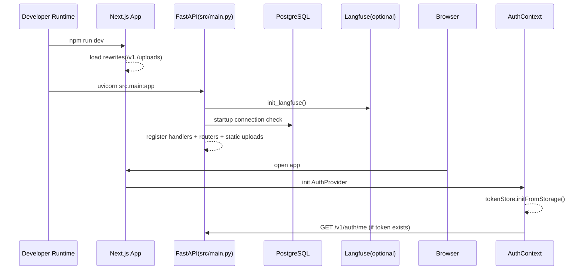

---

### 2.3 子流程 2：匿名访问与前端路由守卫

1. 访问 `/login`：无需登录，进入验证码登录流程。
2. 访问 `/setup`：
   - 未登录：跳 `/login`
   - 已登录且资料已完整：跳 `/`
3. 访问 `(app)` 分组路由（`/`、`/profile`、`/chat/[id]`）：
   - 未登录：跳 `/login`
   - 已登录但资料不完整：跳 `/setup`
   - 通过后加载侧边栏与页面业务数据。

### 2.4 子流程 2 UML 时序图

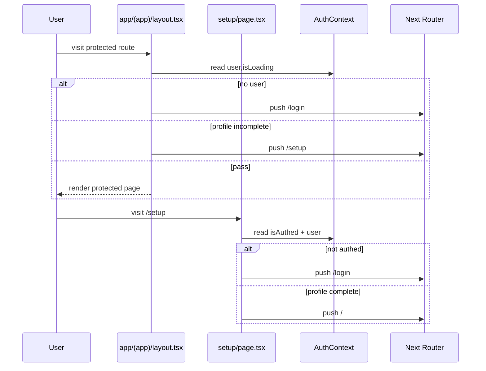

---

### 2.5 子流程 3：邮箱验证码认证（send_code -> login -> me）

1. 前端 `/login` 先调用 `POST /v1/auth/send_code` 发送验证码邮件。
2. 用户输入验证码后，调用 `POST /v1/auth/login`。
3. 后端 `auth_service.verify_login_code` 校验验证码有效性并标记 `used_at`。
4. 后端 `authenticate_user`：
   - 若用户不存在则创建
   - 更新 `last_login_at`
5. 后端签发 JWT（`sub=email`）并返回 `access_token`。
6. 前端保存 token 后立即调用 `/v1/auth/me` 获取用户信息，决定跳转 `/` 或 `/setup`。

### 2.6 子流程 3 UML 时序图

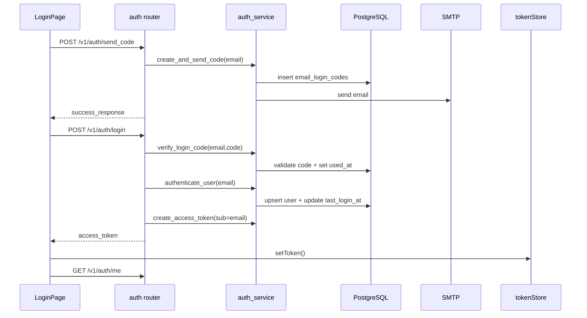

---

### 2.7 子流程 4：首次资料补全（用户名 + 头像）

1. 用户在 `/setup` 输入用户名并上传头像。
2. 头像先在 `AvatarCropper` 前端裁剪为 400x400 JPEG。
3. 前端调用 `POST /v1/upload` 上传，后端 `LocalStorage` 写入 `static/uploads`。
4. 前端调用 `PUT /v1/users/me` 更新 `username/avatar_url`。
5. 前端 `refreshUser()` 同步上下文后跳转 `/`。

### 2.8 子流程 4 UML 时序图

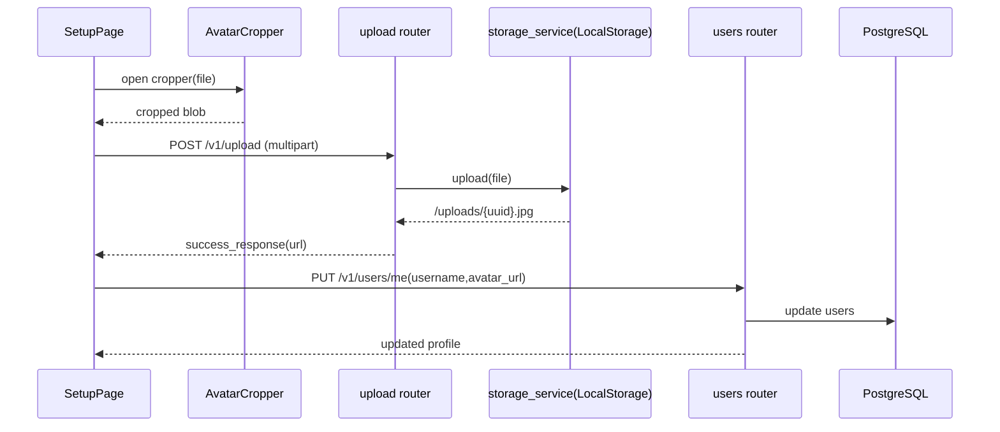

---

### 2.9 子流程 5：角色发现与侧边栏联动

1. `app/(app)/layout.tsx` 初始化时调用 `GET /v1/characters/market`，渲染 `Sidebar`。
2. 发现页 `app/(app)/page.tsx` 也调用 `GET /v1/characters/market` 渲染 `CharacterCard`。
3. 创建/编辑/删除角色成功后，都会触发 `refreshSidebarCharacters()`，确保侧边栏与页面列表一致。

### 2.10 子流程 5 UML 时序图

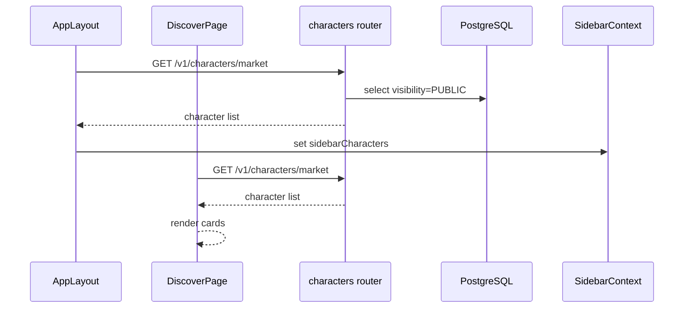

---

### 2.11 子流程 6：角色创建（CreateCharacterModal）

1. 发现页或个人页打开 `CreateCharacterModal(mode=create)`。
2. 可选头像上传链路与子流程 4 相同（先裁剪再 `/v1/upload`）。
3. 提交调用 `POST /v1/characters`，写入 `characters` 表。
4. 成功后刷新页面角色列表 + 侧边栏。

### 2.12 子流程 6 UML 时序图

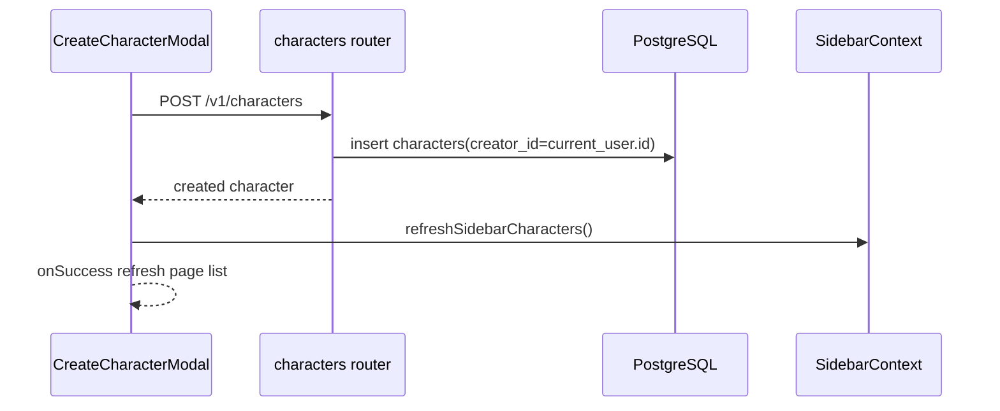

---

### 2.13 子流程 7：角色编辑与删除（Profile 页面）

1. Profile 页加载 `GET /v1/users/{creator_id}/characters`。
2. 编辑：`PUT /v1/characters/{character_id}`（仅 creator 可更新）。
3. 删除：`DELETE /v1/characters/{character_id}`（仅 creator 可删除，204 无 body）。
4. 权限由后端通过 token 用户与 `creator_id` 对比控制。

### 2.14 子流程 7 UML 时序图

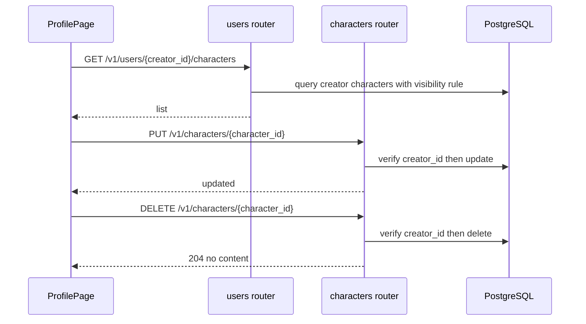

---

### 2.15 子流程 8：聊天主链路（SSE 流式响应）

1. Chat 页先调用 `GET /v1/characters/{character_id}` 获取角色信息。
2. 用户发送消息后调用 `POST /v1/chat`（SSE）。
3. 后端流程：
   - 校验 `request.user_id == current_user.id`
   - 调用 memory.search 召回 episodic + semantic
   - 拼装 prompt（memory + history + current message）
   - `LLMClient.chat_stream_async` 流式生成
4. 后端按 SSE 发送：
   - `type=chunk`
   - `type=done`
   - `type=error`
5. 前端边收边更新 assistant 消息内容。

### 2.16 子流程 8 UML 时序图

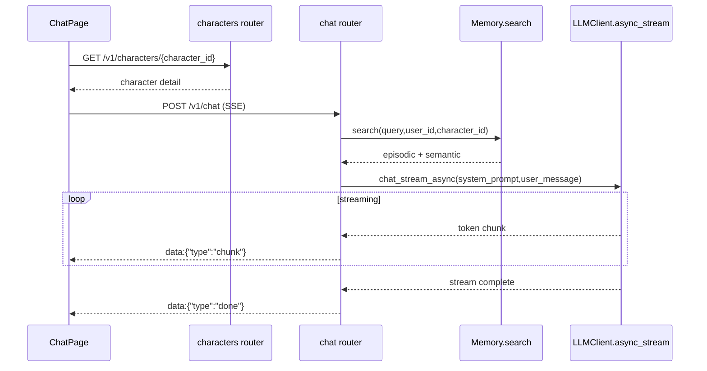

---

### 2.17 子流程 9：聊天后置记忆管理（后台异步）

1. `/v1/chat` 结束后触发 `asyncio.create_task(_manage_memory_background)`。
2. 后台任务调用 `memory.manage_async`：
   - 查询该用户该角色全部 episodic memories
   - 调用 `EpisodicMemoryManager`（LLM 决策 add/update/delete）
   - 执行实际 CRUD：delete -> update -> add
   - add 时生成 embedding 并写 Milvus
3. 当前代码中 `MemoryUsageJudge` 与 `assign_to_narrative_group` 已具备能力，但 chat 路由尚未串联这两步（属于可扩展点）。

### 2.18 子流程 9 UML 时序图

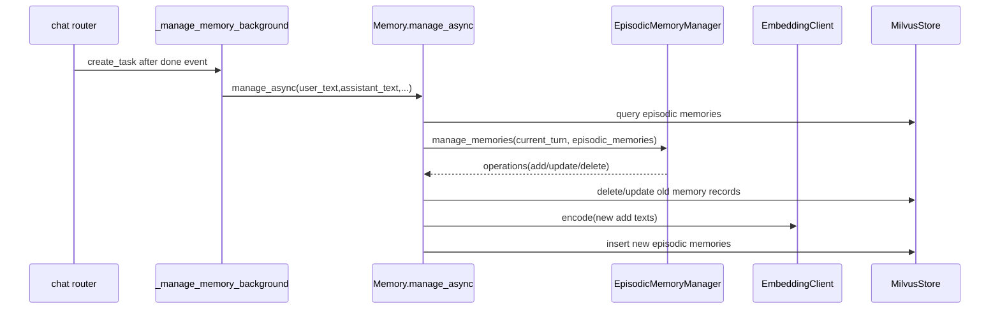

---

### 2.19 子流程 10：记忆检索与叙事组扩展

`memory.search` 的完整检索算法是：

1. 对 query 生成 embedding。
2. semantic 召回：
   - `use_all_semantic=true`：直接 query 全量 semantic（按 user_id/character_id）
   - 否则：vector search top-k semantic
3. episodic 召回：vector search top-k seeds。
4. 从 seeds 提取 `group_id`，对 `group_id!=-1` 的组做扩展查询。
5. 合并 seeds + 组成员并去重，返回给 chat prompt。

### 2.20 子流程 10 UML 时序图

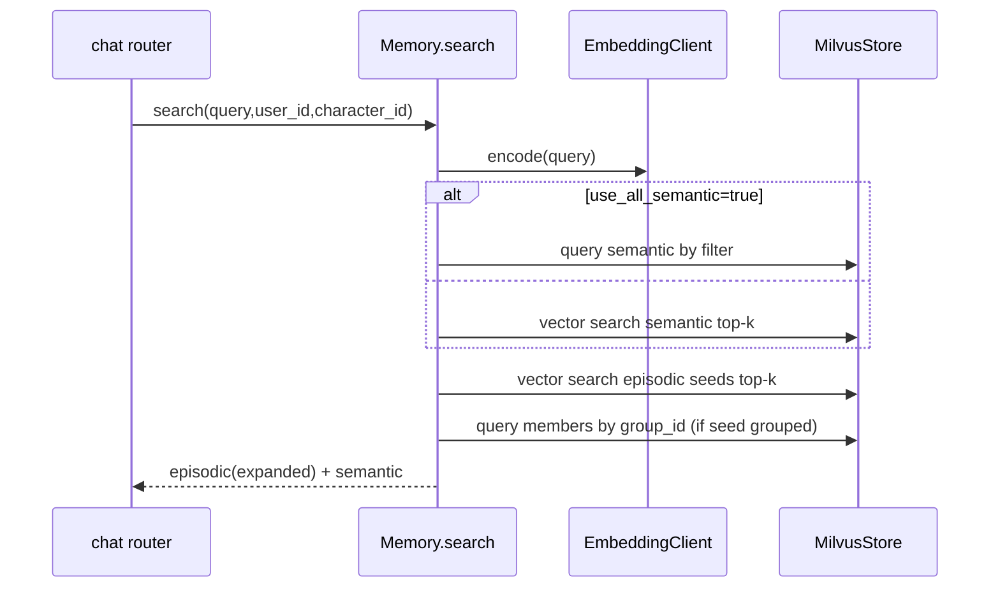

---

### 2.21 子流程 11：记忆 API（manage/search/delete/reset/consolidate）

memory 路由可被外部直接调用，不依赖 chat 路由。

1. `POST /v1/memories/manage`：显式触发记忆管理。
2. `POST /v1/memories/search`：显式检索记忆。
3. `DELETE /v1/memories/{memory_id}`：删除单条（需 user_id/character_id ownership 校验）。
4. `DELETE /v1/memories/reset`：按 user_id + character_id 全量删除。
5. `POST /v1/memories/consolidate`：批量语义归纳，调用 `SemanticWriter` 输出语义事实并写入 semantic memories。

### 2.22 子流程 11 UML 时序图

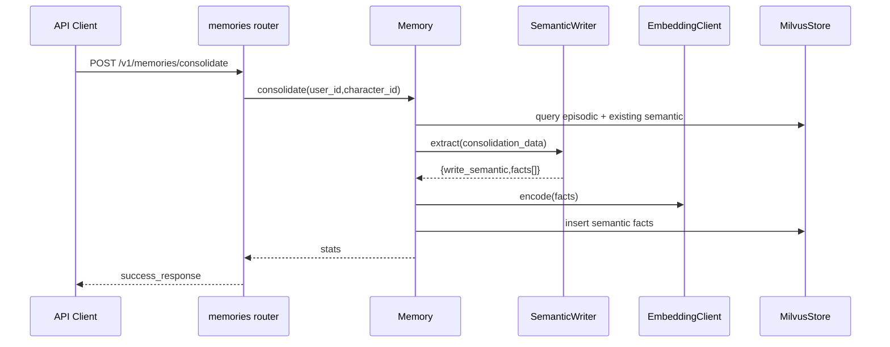

---

### 2.23 子流程 12：退出登录与全局错误回收

1. 用户在前端 Sidebar 菜单点击退出登录：
   - `tokenStore.clearToken()` 清 localStorage 与内存 token
   - `AuthContext` 订阅回调触发 user=null
   - 路由跳转 `/login`
2. 所有后端异常最终通过 `register_exception_handlers` 统一包装：
   - `APIError` / `HTTPException` / ValidationError / UnexpectedError
   - 响应体统一 `{code,message,status}`
3. 前端 `HttpClient` 对 401 特殊处理：
   - 清 token
   - 抛 `UnauthorizedError`
   - 页面层按逻辑跳登录或展示错误。

### 2.24 子流程 12 UML 时序图

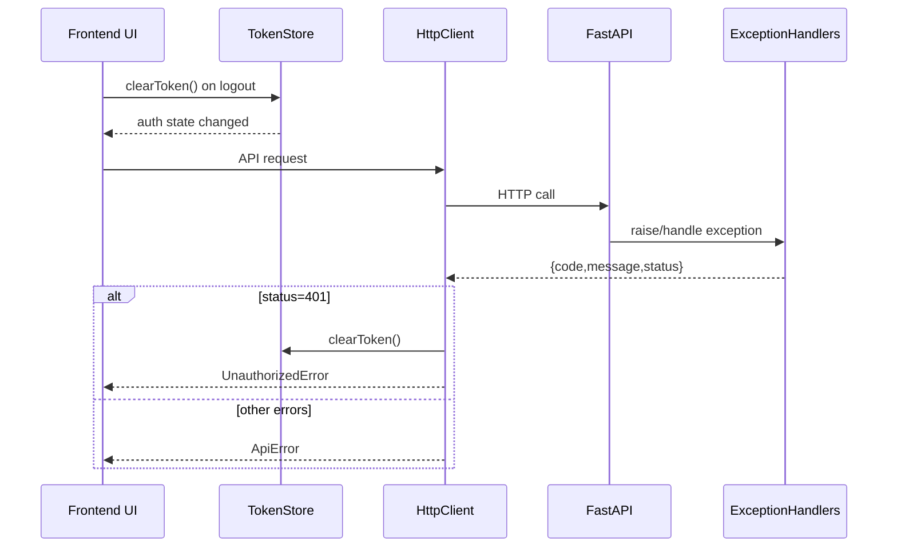

## 3. 各模块详细说明（覆盖架构图全部模块）

### 3.1 前端展示层模块（F1）

| 模块 | 代码位置 | 职责 | 关键依赖 |
|---|---|---|---|
| 全局根布局 | `src/app/layout.tsx` | 注入字体/全局样式，挂载 `AuthProvider` | `auth-context.tsx` |
| 登录页 | `src/app/login/page.tsx` | 验证码登录双阶段（发送验证码/提交验证码） | `api.ts`、`useAuth` |
| 资料补全页 | `src/app/setup/page.tsx` | 首次填写用户名与头像上传裁剪 | `AvatarCropper`、`upload/update profile` |
| 受保护壳层 | `src/app/(app)/layout.tsx` | 认证守卫、资料完整性守卫、SidebarContext 管理 | `useAuth`、`getMarketCharacters` |
| 发现页 | `src/app/(app)/page.tsx` | 角色卡片列表展示、创建角色入口 | `CharacterCard`、`CreateCharacterModal` |
| 个人页 | `src/app/(app)/profile/page.tsx` | 本人角色列表、编辑、删除 | `CreateCharacterModal`、`DeleteConfirmDialog` |
| 聊天页 | `src/app/(app)/chat/[id]/page.tsx` | 角色加载、消息列表、SSE 消息流更新 | `sendChatMessage`、`Chat*` 组件 |

### 3.2 前端组件层模块（F2）

| 模块 | 代码位置 | 职责 |
|---|---|---|
| Sidebar | `src/components/Sidebar.tsx` | 左侧角色列表、选中态、底部用户入口 |
| ProfileDialog | `src/components/ProfileDialog.tsx` | 个人资料入口与退出登录入口 |
| CharacterCard | `src/components/CharacterCard.tsx` | 角色卡片渲染，支持编辑/删除菜单 |
| CreateCharacterModal | `src/components/CreateCharacterModal.tsx` | 角色创建/编辑统一弹窗，表单与标签校验 |
| DeleteConfirmDialog | `src/components/DeleteConfirmDialog.tsx` | 删除确认和删除中状态 |
| AvatarCropper | `src/components/AvatarCropper.tsx` | 图片裁剪交互与 blob 导出 |
| ChatHeader | `src/components/ChatHeader.tsx` | 聊天头部角色信息 |
| ChatMessage | `src/components/ChatMessage.tsx` | 聊天气泡（用户/助手） |
| ChatInput | `src/components/ChatInput.tsx` | 输入框、Enter 发送、禁用态 |

### 3.3 前端状态与服务层模块（F3）

| 模块 | 代码位置 | 职责 |
|---|---|---|
| AuthContext | `src/lib/auth-context.tsx` | 用户态生命周期管理（恢复、登录、刷新、登出） |
| TokenStore | `src/lib/token-store.ts` | token 内存态 + localStorage 持久化 + 订阅机制 |
| API Facade | `src/lib/api.ts` | 向页面导出稳定调用接口 |
| ApiService | `src/lib/api-service.ts` | 业务 API 协议实现（auth/user/character/chat/memory） |
| HttpClient | `src/lib/http-client.ts` | 统一请求、统一解包、统一错误处理 |
| 重写代理 | `next.config.ts` | 将浏览器同域请求代理到后端 8000 |

### 3.4 后端 API 入口层模块（B1）

| 模块 | 代码位置 | 职责 |
|---|---|---|
| 主入口 | `src/main.py` | 完整 API 应用启动、DB 连接检查、路由挂载、静态文件挂载 |
| 子入口（memory-only） | `src/api/main.py` | 独立 memory API 入口（chat + memories + health） |
| 依赖注入 | `src/api/deps.py` | `get_current_user`、`get_optional_current_user`、`get_memory_system` |
| 统一响应 | `src/api/response.py` | `success_response`、`no_content_response`、`APIError` |
| 统一异常处理 | `src/api/exceptions.py` | Validation/HTTP/APIError/通用异常统一编码输出 |
| Auth 路由 | `src/api/routers/auth.py` | send_code/login/me |
| Users 路由 | `src/api/routers/users.py` | me profile get/put + creator 主页角色列表 |
| Upload 路由 | `src/api/routers/upload.py` | 文件上传与 MIME/大小错误映射 |
| Characters 路由 | `src/api/routers/characters.py` | 角色 CRUD 与 market 列表 |
| Chat 路由 | `src/api/routers/chat.py` | SSE 对话、记忆检索、后台记忆管理 |
| Memories 路由 | `src/api/routers/memories.py` | memory 管理/检索/删除/重置/归纳 |

### 3.5 后端业务服务层模块（B2）

| 模块 | 代码位置 | 职责 |
|---|---|---|
| AuthService | `src/services/auth_service.py` | 验证码生成与校验、邮件发送、用户创建与 JWT 签发 |
| StorageService | `src/services/storage_service.py` | 上传验证（类型/大小）与本地文件存储 |
| Memory（核心编排） | `src/memory_system/memory.py` | manage/search/update/delete/reset/consolidate 总编排 |
| EpisodicMemoryManager | `src/memory_system/processors/memory_manager.py` | 基于 LLM 的 episodic CRUD 决策 |
| SemanticWriter | `src/memory_system/processors/semantic_writer.py` | 批量语义事实抽取 |
| NarrativeMemoryManager | `src/memory_system/processors/narrative_memory_manager.py` | 叙事组分配、组中心更新、组清理 |
| MemoryUsageJudge | `src/memory_system/processors/memory_usage_judge.py` | 判断哪些 episodic 真实被回复使用（当前主链未接入） |

### 3.6 后端基础设施层模块（B3）

| 模块 | 代码位置 | 职责 |
|---|---|---|
| DB 会话层 | `src/db/session.py` | Async SQLAlchemy engine/session 管理 |
| DB 模型层 | `src/db/models.py` | users/email_login_codes/characters/chats/turns/candidates ORM 映射 |
| Milvus 客户端 | `src/memory_system/clients/milvus_store.py` | 向量数据 CRUD、相似检索、groups 集合维护 |
| Embedding 客户端 | `src/memory_system/clients/embedding.py` | 文本 -> 向量（带重试） |
| LLM 客户端 | `src/memory_system/clients/llm.py` | 文本生成/流式生成/JSON 解析（带重试与可选 fallback） |
| 重试器 | `src/memory_system/utils/retry.py` | 同步/异步/流式统一重试执行器 |
| 工具函数 | `src/memory_system/utils/__init__.py` | filter 构建与向量 normalize |
| 可观测性适配 | `src/observability.py` | Langfuse 可选依赖兼容层 |

### 3.7 数据与外部依赖模块（EXT）

| 模块 | 作用 | 被谁使用 |
|---|---|---|
| PostgreSQL | 用户、验证码、角色、聊天结构化数据 | `db/session.py` + routers/services |
| Milvus | episodic/semantic 向量记忆与叙事组 | `MilvusStore` + `Memory` |
| LLM API | 对话生成、memory 决策、语义抽取 | `LLMClient` |
| Embedding API | 文本向量化 | `EmbeddingClient` |
| SMTP | 登录验证码邮件发送 | `auth_service.send_email` |
| static/uploads | 头像等文件持久化 | `storage_service.LocalStorage` |
| Langfuse | 追踪链路（可选，不装也可运行） | `observe/get_client` |

## 4. 关键实现特征与当前边界（深入总结）

### 4.1 双后端入口并存

1. `src/main.py`：完整 BFF + 业务路由入口（生产主路径）。
2. `src/api/main.py`：memory-focused 子入口（更轻量）。
3. 两者共用 `api` 路由与 memory 模块，但路由集合不同。

### 4.2 统一响应规范已落地

1. 成功：`{code:"ok",message:"ok",status,data}`。
2. 错误：`{code,message,status}`。
3. 由 `response.py + exceptions.py` 统一落地，前端 `HttpClient` 统一解包与报错。

### 4.3 聊天与持久化存在“能力已建、链路分层”的状态

1. 聊天流当前主依赖 memory + LLM，不直接落地 `chats/turns/candidates` 表。
2. 但 PostgreSQL 聊天模型已建好，表明后续可扩展到完整会话持久化/重放/多候选。

### 4.4 记忆系统具备完整生命周期能力

1. 写入：`manage_async` + add/update/delete。
2. 读取：semantic + episodic + narrative group expansion。
3. 维护：delete/reset/consolidate。
4. 组织：groups collection 管理叙事聚类。
5. 稳定性：RetryExecutor + APIError + 可选 Langfuse 追踪。

### 4.5 前后端边界清晰

1. 前端仅调用 API 合同，不内嵌业务规则。
2. 权限与可见性判定（PUBLIC/PRIVATE/UNLISTED）在后端执行。
3. 前端主要负责路由守卫、交互状态与流式渲染。

## 5. 自审查（错误与遗漏检查）

### 5.1 覆盖检查

已覆盖：

1. 两个仓库的目录结构（按你给的展示规则）
2. 全链路分层图（前后端 + 中间代理 + 外部依赖）
3. 全流程时序（12 个主流程，按逻辑顺序）
4. 架构图中所有模块的逐项说明（F1/F2/F3/B1/B2/B3/EXT）
5. 后端所有核心路由与 memory 内核流程

### 5.2 事实一致性检查

1. 前端重写路径、鉴权流程、创建/编辑/删除/聊天链路与当前代码一致。
2. 后端响应规范、异常码映射、依赖注入、路由分工与代码一致。
3. memory 内部流程（manage/search/consolidate/narrative）与实现一致。
4. `MemoryUsageJudge` 当前未挂入 chat 主链路，此状态已在文档明确标注。

### 5.3 已知边界

1. 本文档聚焦“代码已实现链路”，不含未实现的业务规划。
2. 本文档不替代 API 逐字段文档与 data schema 文档（两者你已有独立文档）。

文档更新时间：2026-02-15 15:48:28
