# role-playing 项目全景总结

## 0. 范围与边界

本总结基于当前仓库 `E:\code\role-playing` 的真实代码实现，聚焦前端系统本身。

- 前端框架：Next.js App Router（React 19 + TypeScript）
- 核心能力：邮箱验证码登录、首次资料补全、角色发现、角色创建/编辑/删除、流式聊天
- 后端依赖：通过 `/v1/*` 与 `/uploads/*` 重写代理到 `http://localhost:8000`
- 状态持久化：`localStorage(access_token)` + 内存态 `AuthContext`

## 1. 项目架构

### 1.1 目录结构

```text
role-playing/
├─ .agent/
│  ├─ AGENTS.md
│  ├─ API.md
│  ├─ Response.md
│  ├─ dataschema.md
│  └─ project.md
├─ .githooks/
│  ├─ pre-commit
│  └─ check_utf8_staged.py
├─ public/
│  ├─ default-avatar.svg
│  ├─ find.svg
│  ├─ me.svg
│  ├─ out.svg
│  ├─ setting.svg
│  ├─ edit.svg
│  ├─ delete.svg
│  ├─ vertical dots.svg
│  └─ ... (other static assets)
├─ src/
│  ├─ app/
│  │  ├─ globals.css
│  │  ├─ layout.tsx
│  │  ├─ login/page.tsx
│  │  ├─ setup/page.tsx
│  │  └─ (app)/
│  │     ├─ layout.tsx
│  │     ├─ page.tsx
│  │     ├─ profile/page.tsx
│  │     └─ chat/[id]/page.tsx
│  ├─ components/
│  │  ├─ Sidebar.tsx
│  │  ├─ ProfileDialog.tsx
│  │  ├─ CharacterCard.tsx
│  │  ├─ CreateCharacterModal.tsx
│  │  ├─ AvatarCropper.tsx
│  │  ├─ DeleteConfirmDialog.tsx
│  │  ├─ ChatHeader.tsx
│  │  ├─ ChatMessage.tsx
│  │  └─ ChatInput.tsx
│  └─ lib/
│     ├─ auth-context.tsx
│     ├─ token-store.ts
│     ├─ http-client.ts
│     ├─ api-service.ts
│     └─ api.ts
├─ next.config.ts
├─ package.json
├─ tsconfig.json
└─ eslint.config.mjs
```

### 1.2 架构层次图（Mermaid）

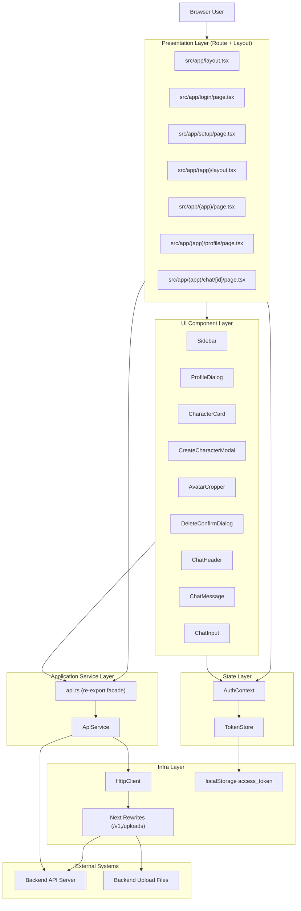

## 2. 程序处理流程

以下流程按用户真实使用时间顺序组织，覆盖当前项目的所有业务链路与基础链路。

### 2.1 子流程 1：应用启动与鉴权恢复（App Bootstrap）

1. 浏览器进入任意页面后，`RootLayout` 挂载 `AuthProvider`。
2. `AuthProvider` 启动时执行 `tokenStore.initFromStorage()`，从 `localStorage` 读取 `access_token`。
3. 若 token 不存在，标记 `isLoading=false`，进入未登录路径。
4. 若 token 存在，调用 `/v1/auth/me` 获取当前用户。
5. 成功则设置 `user`，失败则视为未鉴权（通常在 `http-client` 内触发清 token）。

### 2.2 子流程 1 UML 时序图（Sequence Diagram）

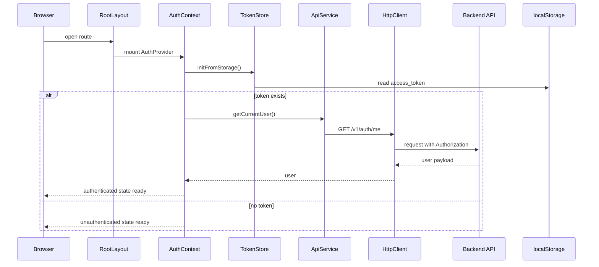

### 2.3 子流程 2：邮箱验证码登录

1. 用户在 `/login` 输入邮箱，提交后调用 `sendVerificationCode`。
2. 前端调用 `/v1/auth/send_code`，若成功则切换到验证码输入步骤。
3. 用户输入验证码并提交，调用 `login` -> `/v1/auth/login`。
4. 登录成功后 token 写入 `tokenStore`，并落盘到 `localStorage`。
5. 页面额外请求 `/v1/auth/me` 判断资料是否完整：
   - 完整：跳转 `/`
   - 不完整：跳转 `/setup`

### 2.4 子流程 2 UML 时序图（Sequence Diagram）

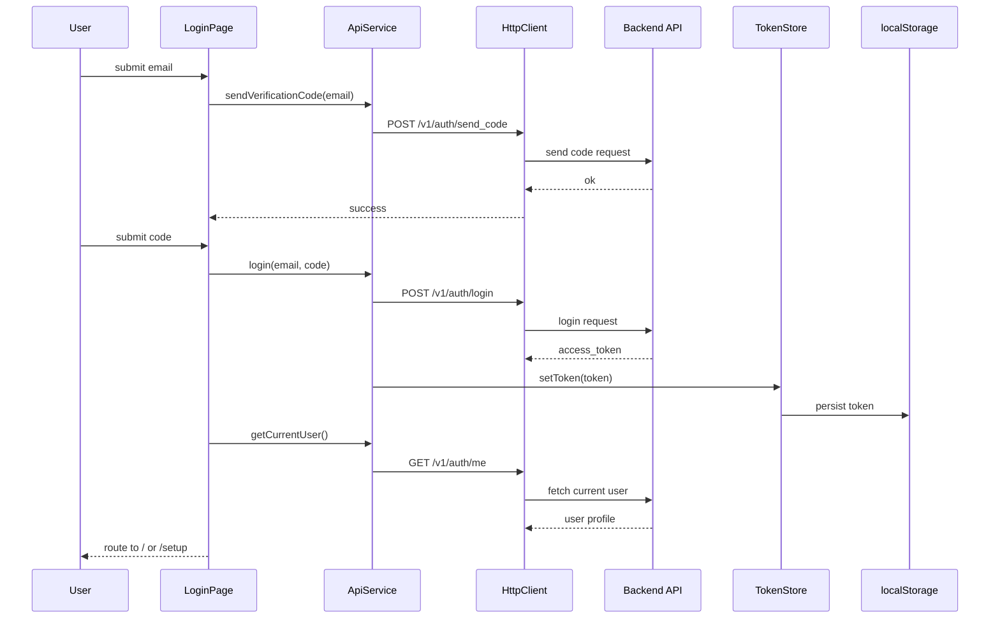

### 2.5 子流程 3：首次资料补全（用户名 + 头像）

1. `/setup` 页面先做访问控制：未登录跳 `/login`；已完善资料跳 `/`。
2. 用户选择头像文件后进入 `AvatarCropper`，执行方形裁剪，输出 400x400 JPEG Blob。
3. 前端上传头像：`uploadFile(file)` -> `/v1/upload`，获得 `avatar_url`。
4. 调用 `updateUserProfile({ username, avatar_url })` -> `/v1/users/me`。
5. 调用 `refreshUser` 同步 `AuthContext.user`，最后跳转 `/`。

### 2.6 子流程 3 UML 时序图（Sequence Diagram）

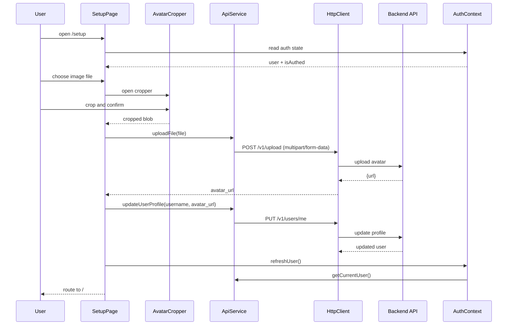

### 2.7 子流程 4：主框架加载与侧边栏角色数据

1. 所有 `(app)` 受保护页面都经过 `src/app/(app)/layout.tsx`。
2. Layout 基于 `useAuth` 做二次守卫：
   - 未登录 -> `/login`
   - 已登录但资料不完整 -> `/setup`
3. Layout 拉取市场角色列表 `getMarketCharacters`，映射为 `Sidebar` 所需结构。
4. `SidebarContext` 暴露全局侧边栏状态与刷新函数，供发现页/资料页复用。

### 2.8 子流程 4 UML 时序图（Sequence Diagram）

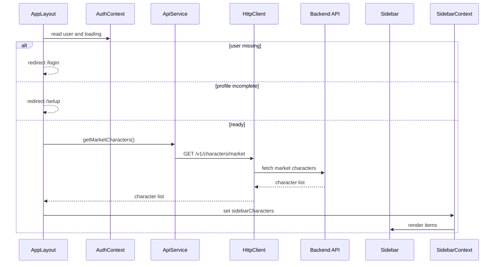

### 2.9 子流程 5：发现页浏览与进入聊天

1. 发现页 `/` 在用户就绪后调用 `getMarketCharacters`。
2. 返回结果映射为 `CharacterCard` 数据并渲染卡片列表。
3. 点击卡片进入 `/chat/{characterId}`。
4. 发现页创建成功后会同时刷新本页列表与侧边栏列表。

### 2.10 子流程 5 UML 时序图（Sequence Diagram）

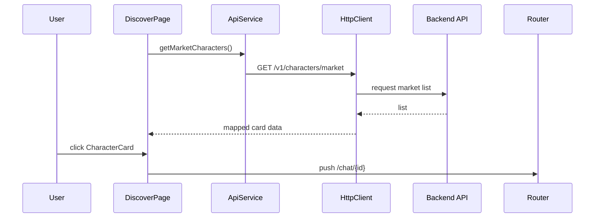

### 2.11 子流程 6：创建角色（含头像裁剪上传）

1. 用户在发现页或资料页打开 `CreateCharacterModal`。
2. 用户可上传头像（进入 `AvatarCropper`）并调用 `/v1/upload`。
3. 表单校验通过后，调用 `createCharacter` -> `POST /v1/characters`。
4. 创建成功后执行 `onSuccess`：
   - 刷新当前页角色列表
   - 调用 `refreshSidebarCharacters()` 刷新侧边栏

### 2.12 子流程 6 UML 时序图（Sequence Diagram）

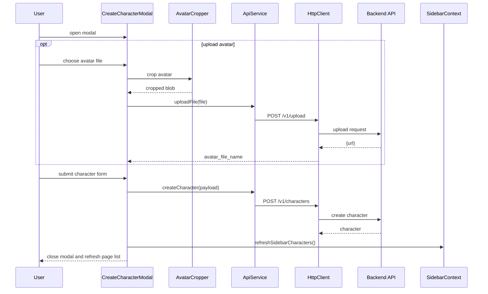

### 2.13 子流程 7：资料页编辑与删除角色

1. `/profile` 拉取当前用户角色：`/v1/users/{userId}/characters`。
2. 编辑：
   - 打开 `CreateCharacterModal(mode=edit)` 预填数据
   - 提交后调用 `PUT /v1/characters/{id}`
3. 删除：
   - 打开 `DeleteConfirmDialog`
   - 确认后调用 `DELETE /v1/characters/{id}`
4. 两类操作成功后均刷新：
   - 资料页角色列表
   - 侧边栏角色列表

### 2.14 子流程 7 UML 时序图（Sequence Diagram）

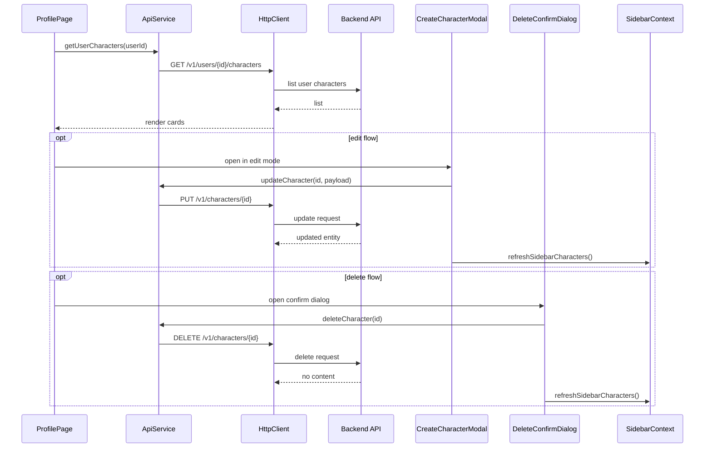

### 2.15 子流程 8：聊天流式对话（SSE）

1. 聊天页根据路由参数加载角色详情 `GET /v1/characters/{id}`。
2. 如角色包含 `greeting_message`，前端先注入一条助手欢迎消息。
3. 用户发送消息后：
   - 先本地追加用户消息
   - 预插入空的助手消息占位
4. 调用 `sendChatMessage` 向 `/v1/chat` 发起请求，读取流式 `data:` 行。
5. `chunk` 事件持续拼接助手消息；`done` 事件写入完整消息；`error` 写入错误文本。

### 2.16 子流程 8 UML 时序图（Sequence Diagram）

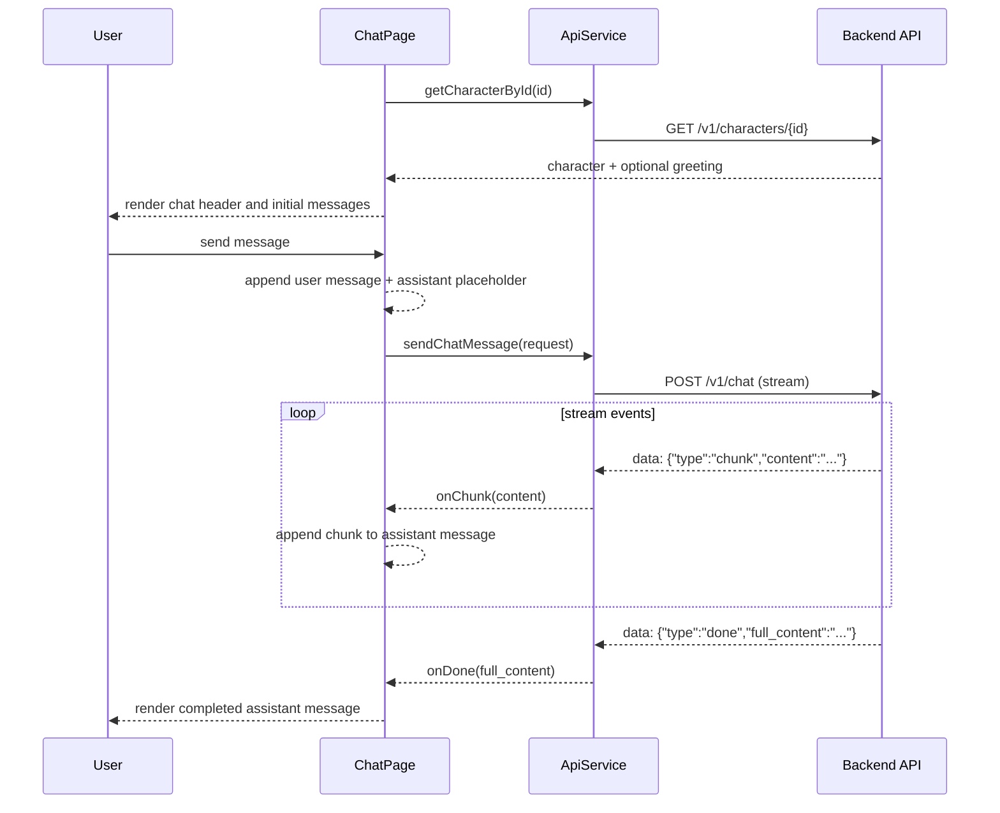

### 2.17 子流程 9：用户菜单、跳转资料页与退出登录

1. 用户点击 Sidebar 底部头像，打开 `ProfileDialog`。
2. 选择“个人资料”则跳 `/profile`。
3. 选择“退出登录”则执行 `logout()`：
   - `tokenStore.clearToken()`
   - 清 `localStorage` token
   - 通过订阅机制触发 `AuthContext.user=null`
   - 跳转 `/login`

### 2.18 子流程 9 UML 时序图（Sequence Diagram）

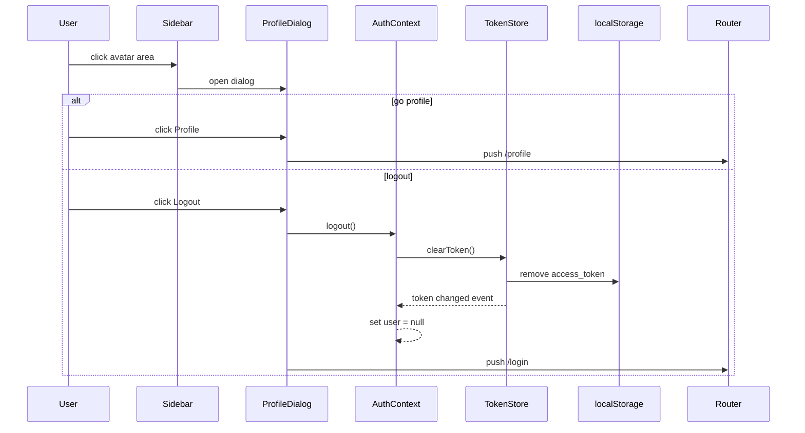

### 2.19 子流程 10：通用错误处理与 401 失效回收

1. `HttpClient` 对非 2xx 响应统一进入 `handleError`。
2. 401 会清 token，并抛 `UnauthorizedError`。
3. 业务页面可按需显示错误信息，或跳转登录页。
4. 聊天流中发生错误时，采用 `onError` 回调把错误显示到消息区。

### 2.20 子流程 10 UML 时序图（Sequence Diagram）

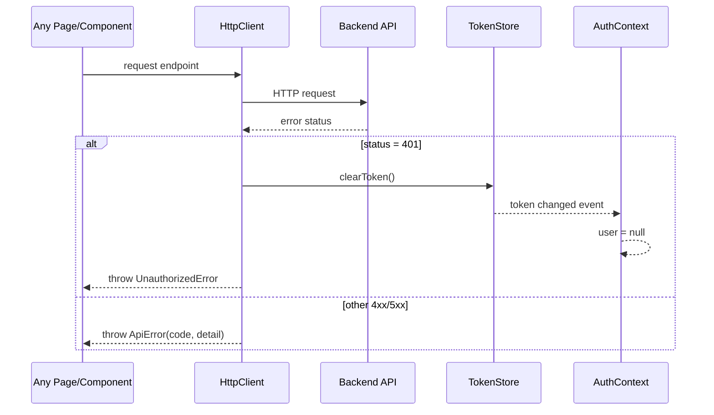

### 2.21 子流程 11：扩展记忆 API 调用（当前页面未接入）

1. `ApiService` 已提供 `manageMemories` 与 `searchMemories`。
2. 目前仓库内页面组件未直接调用这两个方法。
3. 该链路已具备接入条件，可由后续页面直接复用 `api.ts` 导出的函数。

### 2.22 子流程 11 UML 时序图（Sequence Diagram）

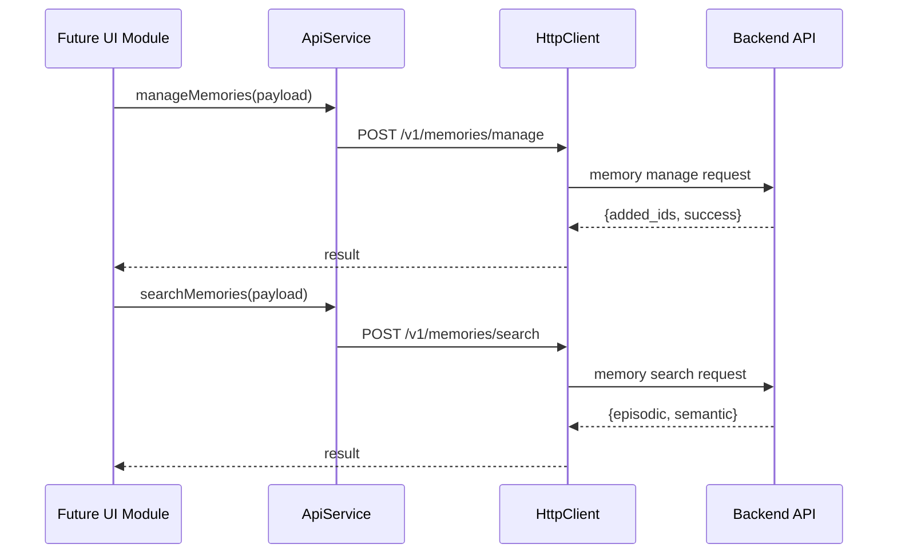

## 3. 各模块详细说明

本节覆盖 1.2 架构图中出现的所有模块。

### 3.1 Presentation Layer（Route + Layout）

| 模块 | 职责 | 关键输入 | 关键输出 | 主要依赖 |
|---|---|---|---|---|
| `src/app/layout.tsx` | 全局 HTML 框架与字体注入，挂载 `AuthProvider` | 子页面 `children` | 全局认证上下文 | `AuthProvider`, `globals.css` |
| `src/app/login/page.tsx` | 邮箱验证码登录双步骤 | email, code | 登录成功后跳转 `/` 或 `/setup` | `useAuth.login`, `sendVerificationCode`, `getCurrentUser` |
| `src/app/setup/page.tsx` | 首次资料补全（用户名+头像） | 用户输入、头像文件 | 更新资料并跳转 `/` | `uploadFile`, `updateUserProfile`, `refreshUser`, `AvatarCropper` |
| `src/app/(app)/layout.tsx` | 受保护应用壳、侧边栏容器、路由守卫、SidebarContext | `user`, `isLoading` | 页面访问控制、侧边栏数据 | `useAuth`, `getMarketCharacters`, `Sidebar` |
| `src/app/(app)/page.tsx` | 发现页：市场角色展示、进入聊天、打开创建弹窗 | 当前用户、角色列表 | 渲染卡片与导航 | `getMarketCharacters`, `CharacterCard`, `CreateCharacterModal` |
| `src/app/(app)/chat/[id]/page.tsx` | 聊天页：角色加载、历史消息态、流式消息更新 | 路由 `id`, 消息输入 | 消息流 UI | `getCharacterById`, `sendChatMessage`, `ChatHeader`, `ChatInput`, `ChatMessage` |
| `src/app/(app)/profile/page.tsx` | 个人页：本人角色列表、编辑、删除 | 当前用户、tab 状态 | 角色管理 UI | `getUserCharacters`, `updateCharacter`, `deleteCharacter`, `CreateCharacterModal`, `DeleteConfirmDialog` |

### 3.2 UI Component Layer

| 模块 | 职责 | 被谁使用 | 关键行为 |
|---|---|---|---|
| `src/components/Sidebar.tsx` | 左侧导航与角色列表展示，底部用户入口 | `AppLayout` | 展示角色、选中态、打开 `ProfileDialog` |
| `src/components/ProfileDialog.tsx` | 用户菜单弹层 | `Sidebar` | 跳转 `/profile`、执行 `logout` |
| `src/components/CharacterCard.tsx` | 角色卡片统一展示组件 | Discover/Profile | 卡片点击、可选编辑/删除菜单 |
| `src/components/CreateCharacterModal.tsx` | 创建/编辑角色的统一弹窗 | Discover/Profile | 表单校验、头像上传、创建或更新角色 |
| `src/components/AvatarCropper.tsx` | 图片裁剪器 | Setup/CreateCharacterModal | 拖拽/缩放裁剪框、导出 JPEG Blob |
| `src/components/DeleteConfirmDialog.tsx` | 删除确认弹窗 | Profile | 二次确认、删除态 loading |
| `src/components/ChatHeader.tsx` | 聊天顶部角色信息 | ChatPage | 展示头像与角色名 |
| `src/components/ChatMessage.tsx` | 聊天气泡渲染 | ChatPage | 用户/助手双样式消息 |
| `src/components/ChatInput.tsx` | 聊天输入区 | ChatPage | Enter 发送、Shift+Enter 换行 |

### 3.3 State Layer

| 模块 | 职责 | 状态/机制 | 关键点 |
|---|---|---|---|
| `src/lib/auth-context.tsx` | 全局用户态管理 | `user`, `isLoading`, `isAuthed` | 首屏恢复用户，暴露 `login/logout/refreshUser` |
| `src/lib/token-store.ts` | token 内存与持久化 | `token`, listeners | `setToken` 会同步 `localStorage` 并通知订阅者 |

### 3.4 Application Service Layer

| 模块 | 职责 | 输出能力 |
|---|---|---|
| `src/lib/api-service.ts` | 业务 API 方法实现 + 类型定义 | auth/user/character/chat/memory 全套方法 |
| `src/lib/api.ts` | Facade（向后兼容导出） | 统一导出给页面和组件调用 |

`ApiService` 已实现方法清单：

1. `sendVerificationCode`
2. `login`
3. `getCurrentUser`
4. `uploadFile`
5. `updateUserProfile`
6. `createCharacter`
7. `getMarketCharacters`
8. `getCharacterById`
9. `getUserCharacters`
10. `updateCharacter`
11. `deleteCharacter`
12. `sendChatMessage`（SSE 流）
13. `manageMemories`
14. `searchMemories`

### 3.5 Infra Layer

| 模块 | 职责 | 关键实现 |
|---|---|---|
| `src/lib/http-client.ts` | 通用请求器 | 自动注入 token、统一解包 `{code,status,data}`、统一错误处理 |
| `next.config.ts` | 本地代理重写 | `/v1/:path*` 与 `/uploads/:path*` 代理到 `http://localhost:8000` |
| `localStorage`（runtime） | token 落盘 | key: `access_token` |

### 3.6 样式与静态资源层

| 模块 | 职责 |
|---|---|
| `src/app/globals.css` | Tailwind v4 基础样式、CSS 变量、聊天气泡样式、输入框样式、滚动条与弹窗动画 |
| `src/app/favicon.ico` | 站点标签页图标 |
| `public/*` | 图标、默认头像、示例图等静态资源 |

## 4. 第一轮总结后的自审查（错误与遗漏检查）

### 4.1 覆盖性检查

已逐项核对，当前文档已覆盖：

1. 路由与布局文件：`src/app` 下全部页面与 layout。
2. 组件文件：`src/components` 下 9 个组件全部说明。
3. 业务库文件：`src/lib` 下 5 个核心模块全部说明。
4. 关键配置：`next.config.ts`、`globals.css`、`public` 静态资源层。
5. API 方法：`ApiService` 的 14 个方法全部列出。
6. 业务流程：从启动、登录、资料补全、发现、创建、编辑、删除、聊天、登出、错误处理、记忆扩展全部覆盖。

### 4.2 准确性检查

1. 鉴权机制描述与代码一致：基于 `access_token` + `/v1/auth/me` 恢复用户态。
2. 聊天机制描述与代码一致：`POST /v1/chat` + `data:` 行解析 + `chunk/done/error` 三类事件。
3. 角色管理描述与代码一致：创建/编辑复用同一弹窗，删除有独立确认弹窗。
4. 侧边栏刷新机制描述与代码一致：通过 `SidebarContext.refreshSidebarCharacters` 在多个页面联动更新。

### 4.3 边界说明（非遗漏）

1. 记忆接口 `manageMemories/searchMemories` 已在服务层实现，但当前页面未接入。
2. 后端业务细节（数据库、LLM、向量库）不在本仓库内，本文件仅以前端调用契约描述该边界。
