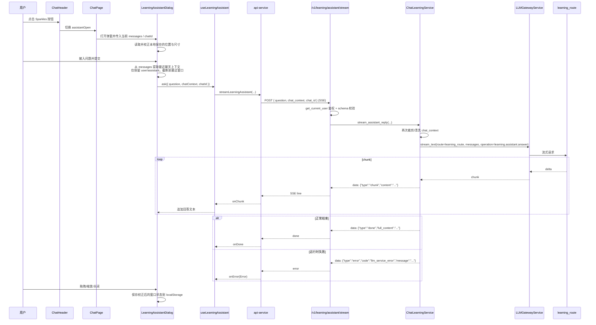

# Phase 10: 学习助手弹窗

## 0. Status

- 状态：已完成
- 完成时间：2026-04-16
- 当前实现说明：
  - 学习助手为可持续会话的悬浮窗，关闭后重新打开会保留助教会话历史。
  - 助教上下文已拆分为两类：角色聊天上下文、助教会话上下文，并在后端分别加上中文前缀说明。
  - 当前仅支持通过右下角缩放按钮调整窗口大小。

## 1. 当前现状

### 前端
- `ChatHeader` 右侧按钮区当前顺序为：ReadingRing → 新建聊天 → 历史记录。
- 聊天页 `src/app/(app)/chat/[id]/page.tsx` 已经接入 realtime 通话弹窗相关状态，后续新增学习助手弹窗必须与这部分进行中的改动共存，不能回退或重写现有 realtime 入口。
- 弹窗体系基于 shadcn/ui 的 Radix Dialog 封装；如果要自定义定位，不能直接复用现有 `DialogContent`，应手动组合 `DialogPortal` / `DialogOverlay` / `DialogPrimitive.Content`。
- 仓库没有现成拖拽依赖，但 `AvatarCropper` 已经有完整的 pointer 事件拖拽/缩放处理，可复用其交互模式。
- 已存在项目级 `Markdown` 组件和成熟的 SSE 解析模式（`api-service.ts` 中的 `streamChatMessage`、`regenAssistantTurn`、`editUserTurnAndStreamReply`）。
- `lucide-react ^0.575.0` 已安装，可直接使用 `Sparkles`、`GripHorizontal`、`CornerDownRight` 等图标。

### 后端
- 学习相关能力已经收敛在 `ChatLearningService`，具备 `_learning_route()`、`_llm_text()`、`_llm_json()` 等封装。
- `LLMGatewayService.stream_text()` 已支持传入 `messages` 列表做多轮流式生成，并要求显式提供 `operation`、`route_role` 与 observability 相关上下文。
- 现有 SSE 事件统一使用 `data: {json}\n\n`，错误事件口径是 `{"type":"error","code":"...","message":"..."}`。
- 当前不存在“学习助手弹窗”的专用流式接口，也不存在相关数据库表；这次功能应保持无状态，不落库。

### 关键约束
- 前端通过 `fetchWithBetterAuth` 自动带 JWT，后端必须继续走 `get_current_user`。
- 不能修改主聊天流式链路 `useChatSession` / `streamChatMessage` 的行为契约。
- 不能新建数据库表，也不能把弹窗问答落持久化。
- `chat/[id]/page.tsx`、`useChatSession.ts`、`api-service.ts` 当前工作树已存在用户在做的 realtime 改动，新增实现必须在其之上叠加。

## 2. 系统位置与影响边界

### 功能位置
- 前端：`ChatHeader` 新增学习助手按钮，点击后打开一个可拖拽、可缩放的学习助手弹窗。
- 后端：`/v1/learning` 路由组下新增 `POST /v1/learning/assistant/stream`。

### 影响范围
| 层 | 改动 | 不改动 |
|---|---|---|
| 后端路由 | `src/api/routers/learning.py` 新增助手流式端点 | 不改动现有 `word-card` / `reply-card` 端点 |
| 后端服务 | `src/services/chat_learning_service.py` 新增流式回答能力与上下文裁剪 | 不改动现有学习卡生成逻辑 |
| 后端 schema | `src/schemas/learning.py` 新增助手请求 schema | 不改动现有卡片 payload |
| 前端 API | `src/lib/api-service.ts` 新增 `streamLearningAssistant()` | 不抽离或重构现有聊天 SSE 通道 |
| 前端组件 | `src/components/ChatHeader.tsx`、`src/components/LearningAssistantDialog.tsx` | 不改动 `ChatThread` / `ChatInput` 主交互语义 |
| 前端状态 | `src/hooks/useLearningAssistant.ts`、`chat/[id]/page.tsx` | 不改动 `useChatSession` 对主消息流的状态管理 |

### 明确不改动
- 主聊天 SSE 事件结构。
- 学习卡、收藏、TTS、STT、Growth、realtime 通话逻辑。
- 认证与数据库结构。

## 3. 核心流程



### 关键说明
- 前端和后端都要做上下文裁剪。前端负责降低传输体积；后端负责防御性兜底，保证即便前端漏裁剪也不会把整段 50 条 turns 全量送进 learning route。
- 弹窗拖拽只能发生在标题栏拖拽手柄区域，不能把整个内容区设成拖拽区，否则会与文本选择、滚动和 textarea 输入冲突。
- 关闭弹窗时如果仍在流式生成，需要主动 `abort` 当前请求，避免悬挂 SSE 连接。

## 4. 契约级细节

### 4.1 后端端点

`POST /v1/learning/assistant/stream`

**请求：**
```json
{
  "question": "What's the difference between 'affect' and 'effect'?",
  "chat_context": [
    {"role": "assistant", "content": "How was your weekend?"},
    {"role": "user", "content": "It was great! I went to a park."},
    {"role": "assistant", "content": "That sounds lovely! What did you do there?"}
  ],
  "chat_id": "uuid"
}
```

**字段说明：**
| 字段 | 类型 | 必填 | 说明 |
|------|------|------|------|
| `question` | `string` | 是 | 当前提问，`1-2000` 字符 |
| `chat_context` | `array<ChatContextMessage>` | 否 | 当前聊天页上下文，仅允许 `user` / `assistant` |
| `chat_id` | `string (uuid)` | 否 | 当前聊天 ID，仅用于 observability / trace |

**`ChatContextMessage` 约束：**
| 字段 | 类型 | 必填 | 说明 |
|------|------|------|------|
| `role` | `Literal["user", "assistant"]` | 是 | 仅允许与真实聊天消息一致的角色 |
| `content` | `string` | 是 | 单条内容非空，建议上限 `4000` 字符 |

**上下文裁剪规则：**
1. 前端发送前先过滤空字符串与非 `user/assistant` 角色。
2. 前端只保留最近 `12` 条消息，并将总字符数裁剪到约 `6000` 字符。
3. 后端在 service 层重复执行同样的裁剪与清洗，不能信任客户端。

**SSE 事件：**

| 事件 | Payload | 说明 |
|------|---------|------|
| `chunk` | `{"type":"chunk","content":"text delta"}` | 流式文本片段 |
| `done` | `{"type":"done","full_content":"..."}` | 流结束，带聚合后的完整文本 |
| `error` | `{"type":"error","code":"llm_service_error","message":"..."}` | 流式运行时错误 |

注意：
- 预校验失败仍走普通 JSON 错误包裹，不走 SSE。
- 进入流式阶段后的异常才发 `type=error` 事件。

**系统提示词（内置于后端，英文）：**

```text
You are an English learning assistant embedded in a language-learning chat app.

The user is practicing English by conversing with an AI character. Below is the ongoing conversation between the user and the character, followed by the user's question.

Your job:
- Help the user understand grammar, vocabulary, idioms, tone, and phrasing in the conversation or in the question.
- Explain why certain wording is used and suggest better alternatives when helpful.
- Keep the answer concise, practical, and easy to apply.
- Use short examples only when they make the explanation clearer.
- Reply in Chinese when the user asks in Chinese; reply in English when the user asks in English.
```

**后端 messages 构建逻辑：**
1. 第一条固定是 system prompt。
2. 追加裁剪后的 `chat_context`。
3. 最后一条追加当前问题：`{"role": "user", "content": question}`。
4. 调用：
   `gateway.stream_text(route=self._learning_route(), messages=all_messages, operation="learning.assistant.answer", route_role="learning", user_id=..., chat_id=...)`

### 4.2 前端 API 方法

`src/lib/api-service.ts` 新增：

```typescript
async streamLearningAssistant(
  request: {
    question: string;
    chat_context?: Array<{ role: "user" | "assistant"; content: string }>;
    chat_id?: string;
  },
  handlers: {
    signal?: AbortSignal;
    onChunk: (content: string) => void;
    onDone: (fullContent: string) => void;
    onError: (error: Error) => void;
  },
): Promise<void>
```

要求：
- SSE 解析行为与现有 `streamChatMessage` 保持一致。
- 失败口径保持与当前手写 SSE 接口一致：`401` 转 `UnauthorizedError`，其他非 2xx 转 `ApiError`，SSE 内部 `type=error` 再转普通 `Error` 给上层。

### 4.3 弹窗行为

**实现方式：** Radix Dialog primitives + 自定义 fixed 面板 + pointer 事件拖拽/缩放。

**不使用 `DialogContent` 封装层**，因为它已经固定了 portal 和居中定位；本功能需要手动控制窗口矩形。

参考结构：

```tsx
<Dialog open={open} onOpenChange={handleOpenChange}>
  <DialogPortal>
    <DialogOverlay />
    <DialogPrimitive.Content
      style={{ left: rect.x, top: rect.y, width: rect.width, height: rect.height }}
      className="fixed z-50 m-0 translate-x-0 translate-y-0 ..."
    >
      <DialogPrimitive.Title>学习助手</DialogPrimitive.Title>
      {/* 标题栏 = 唯一拖拽手柄 */}
      {/* 消息区域 */}
      {/* 输入区域 */}
      {/* 右下角 resize handle */}
    </DialogPrimitive.Content>
  </DialogPortal>
</Dialog>
```

| 行为 | 规则 |
|------|------|
| 初始位置 | 若无缓存，按当前视口居中计算 |
| 拖拽 | 仅标题栏拖拽，内容区禁止触发拖拽 |
| 缩放 | 右下角单一 resize handle，限制最小宽高 |
| 边界约束 | 拖拽和缩放都要 clamp 到视口内，避免标题栏彻底拖出屏幕 |
| 持久化 | 保存 `{x, y, width, height}` 到 `localStorage` key `learning-assistant-dialog-state` |
| 恢复 | 打开时读取缓存，并按当前视口重新 clamp |
| 关闭 | 关闭弹窗时如正在流式，先 `abort` 再关闭 |

推荐默认尺寸：`width=440`、`height=560`，最小尺寸：`380 x 440`。

## 5. 方案与决策

### 推荐方案：Radix Dialog + 自定义 pointer 拖拽/缩放

**核心思路：**
- 继续使用现有 Dialog primitives 负责 overlay、焦点管理和 ESC 关闭。
- 通过自定义窗口矩形状态和 pointer 事件完成拖拽/缩放，不新增 `react-rnd`。
- 后端新增无状态 SSE 端点，直接复用 learning route。

**优点：**
- 与现有仓库技术栈更一致，不引入新的拖拽依赖。
- 可以把拖拽范围严格限制在标题栏，避免“整窗可拖”带来的文本选择与输入冲突。
- 更容易复用 `AvatarCropper` 已验证过的 pointer 事件处理模式。
- 后端只新增轻量流式接口，不涉及数据库一致性。

**缺点：**
- 需要自己处理窗口 clamp、拖拽和缩放状态。

**不推荐本阶段采用 `react-rnd` 的原因：**
- 当前仓库没有该依赖。
- 如果按默认“整窗拖拽”实现，会直接干扰内容滚动、文本复制和输入框交互。
- 这个弹窗只有单一窗口模型，手写受控矩形状态成本可控，收益大于引入新库。

## 6. 落地锚点

### 前端锚点文件

| 文件 | 变更 |
|------|------|
| `src/components/ChatHeader.tsx` | 新增 Sparkles 按钮与激活态 props |
| `src/components/LearningAssistantDialog.tsx` | 新建：可拖拽/可缩放弹窗 + 对话 UI |
| `src/hooks/useLearningAssistant.ts` | 新建：学习助手流式状态管理 |
| `src/lib/api-service.ts` | 新增 `streamLearningAssistant()` |
| `src/app/(app)/chat/[id]/page.tsx` | 维护弹窗开关状态并传入当前消息上下文 |

### 后端锚点文件

| 文件 | 变更 |
|------|------|
| `src/api/routers/learning.py` | 新增 `POST /assistant/stream` |
| `src/services/chat_learning_service.py` | 新增上下文清洗 + 流式回答方法 |
| `src/schemas/learning.py` | 新增助手请求 schema |

## 7. 实施路径

### Step 1: 后端 schema
**文件：** `src/schemas/learning.py`
- 新增 `ChatContextMessage`：
  - `role: Literal["user", "assistant"]`
  - `content: str`
- 新增 `AssistantStreamRequest`：
  - `question: str`
  - `chat_context: list[ChatContextMessage]`
  - `chat_id: uuid.UUID | None`
- 明确长度与空值校验，禁止额外字段。

### Step 2: 后端 service
**文件：** `src/services/chat_learning_service.py`
- 新增私有清洗方法，例如：
  - `_sanitize_assistant_context(...)`
  - `_build_assistant_messages(...)`
- 新增 `stream_assistant_reply(...)` 异步生成器：
  - 输入 `question`、`chat_context`、`user_id`、`chat_id`
  - 复用 `_learning_route()`
  - 调用 `self._gateway_service.stream_text(...)`
  - 用与现有聊天流一致的 `data: {json}\n\n` 输出 `chunk` / `done`
- 捕获流内异常并输出 `type=error`，错误码使用现有错误码基线，例如 `llm_service_error` / `internal_error`。

### Step 3: 后端 router
**文件：** `src/api/routers/learning.py`
- 新增 `POST /assistant/stream`
- 鉴权：`Depends(deps.get_current_user)`
- 预校验全部在进入 `StreamingResponse` 之前完成
- 返回头与现有 SSE 路由保持一致：
  - `Cache-Control: no-cache`
  - `Connection: keep-alive`
  - `X-Accel-Buffering: no`

### Step 4: 前端 API
**文件：** `src/lib/api-service.ts`
- 新增学习助手请求/事件类型。
- 新增 `streamLearningAssistant()`：
  - 复用 `fetchWithBetterAuth`
  - 逐行读取 SSE
  - 识别 `chunk` / `done` / `error`
  - 把 `type=error` 映射为普通 `Error`

### Step 5: 前端状态 hook
**文件：** `src/hooks/useLearningAssistant.ts`
- 状态：
  - `question`
  - `answer`
  - `error`
  - `isStreaming`
- 方法：
  - `ask({ question, chatContext, chatId })`
  - `stop()`
  - `reset()`
- 使用 `AbortController` 管理中断。
- `onError` 统一通过 `getErrorMessage` 生成中文展示文案。

### Step 6: 前端弹窗组件
**文件：** `src/components/LearningAssistantDialog.tsx`
- 手动组合 `Dialog` / `DialogPortal` / `DialogOverlay` / `DialogPrimitive.Content`。
- 用标题栏 drag handle 和右下角 resize handle 控制窗口矩形。
- 恢复并持久化窗口位置/尺寸。
- 回答区域使用现有 `Markdown` 组件渲染，不额外引入 markdown 渲染逻辑。
- 输入区使用 textarea + 发送按钮；流式期间按钮切为“停止”。
- 每次提问前清空上一次回答，不维护弹窗内部多轮历史。

### Step 7: Header 集成
**文件：** `src/components/ChatHeader.tsx`
- 新增 props：
  - `onToggleAssistant?: () => void`
  - `isAssistantOpen?: boolean`
- 在 ReadingRing 和新建聊天按钮之间加入 Sparkles 按钮。
- 样式与现有 header icon button 保持一致，激活态沿用历史按钮的蓝色视觉语言。

### Step 8: 聊天页集成
**文件：** `src/app/(app)/chat/[id]/page.tsx`
- 添加 `assistantOpen` 状态。
- 从当前 `messages` 派生学习助手上下文：
  - 仅保留 `role=user|assistant`
  - 过滤空内容
  - 裁剪到最近窗口
- 把 `onToggleAssistant` / `isAssistantOpen` 传给 `ChatHeader`。
- 渲染 `LearningAssistantDialog`，传入 `chatId` 和裁剪后的上下文。
- 不能破坏现有 realtime 弹窗状态和 `ChatInput` 上的 realtime 入口。

## 8. Non-Goals

- 不实现学习助手自身的多轮持久化历史。
- 不实现 TTS / STT / 语音通话能力。
- 不实现新的学习卡类型。
- 不改动聊天消息存储、turn tree、saved items。

## 9. 验证与验收标准

### 自动验证
```bash
# 前端
pnpm lint

# 后端
conda run -n parlasoul pytest tests/unit/services/test_chat_learning_service.py -q
```

如果当前仓库还没有对应测试文件，则补充最小单测，至少覆盖：
- 上下文裁剪与角色过滤
- `done` / `error` 事件输出

### 手动验证
1. ChatHeader 新按钮可见，位于 ReadingRing 和新建聊天按钮之间。
2. 点击按钮后弹窗能打开，不影响已有 realtime 通话弹窗。
3. 标题栏可拖拽，内容区可正常滚动、复制和输入，不会误触拖拽。
4. 右下角可缩放，关闭后再次打开能恢复上次窗口状态。
5. 输入问题后，助手按 SSE 流式输出回答。
6. 回答内容围绕当前英语对话上下文，且使用 `learning_route`。
7. 流式期间点击“停止”或关闭弹窗可以中断请求。
8. 异常时显示中文可读错误文案。
9. 主聊天链路、历史侧栏、realtime 通话入口不回归。

### E2E 验收
- 前端代码完成后，必须执行端到端验证：
  - 打开聊天页
  - 打开学习助手弹窗
  - 提问并观察流式回答
  - 拖拽、缩放、关闭再打开，确认状态恢复

### 最小验收标准
- 无新增 TypeScript / ESLint / Python 测试失败。
- 弹窗交互不与文本选择、输入和滚动冲突。
- SSE 文本显示正常，无乱码，错误事件口径与现有系统一致。
- 不引入新的依赖回归，不破坏已有 realtime 相关未提交改动。
