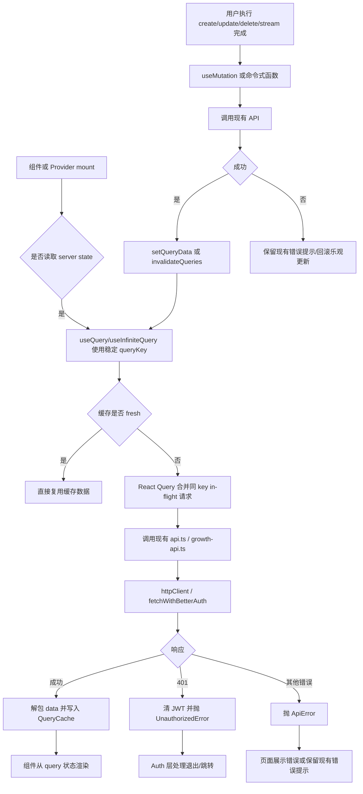

# Phase 1.1 · TanStack React Query 网络请求去重重构计划

## 0. 当前模式与任务目标

- 当前模式：Plan。
- 任务目标：使用 `@tanstack/react-query` 重构前端网络请求，解决页面、Provider、弹窗和聊天链路中多处 `useEffect` 自行发请求导致的重复请求问题。
- 工作范围：仅前端仓库 `E:\code\parlasoul-frontend`，本计划先落文档，不改运行时代码。
- 关键约束：
  - 保留现有 `src/lib/api.ts -> api-service.ts -> http-client.ts` 的 API 封装边界，组件不新增散落 `fetch`。
  - 不改变后端 `/v1/*` 契约、不改数据库、不新增错误码。
  - SSE、WebRTC、音频二进制、上传、日志上报属于命令式边界，不能被普通 query 缓存机制误处理。
  - 当前工作树已有大量非本任务修改，后续实现只能触碰本计划列出的文件，并且修改前必须重新阅读目标文件。

## 1. 当前现状

### 1.1 已确认依赖与文档依据

- `package.json` 当前没有 `@tanstack/react-query`。
- Context7 已解析并查询 `/tanstack/query` 文档。关键依据：
  - Next.js App Router 推荐用独立 `Providers` 客户端组件挂载 `QueryClientProvider`。
  - 浏览器侧应复用单例 `QueryClient`，服务端请求侧创建独立 client，避免跨请求共享数据。
  - SSR/App Router 场景建议默认 `staleTime > 0`，避免客户端立即重新请求。
  - `useInfiniteQuery` 适合当前 cursor/limit 分页模型，`getNextPageParam` 应直接读取后端返回的 `next_cursor`。
  - mutation 成功后通过 `queryClient.invalidateQueries({ queryKey })` 刷新相关 query。

### 1.1.1 本次代码复读后的优化结论

这次重构的主线应从“替换所有 `useEffect`”调整为“消灭所有手写 server state 管理”。也就是说：

- 必须迁移：`useEffect` 中发起的普通远端读取、Context 中保存的远端快照、页面中手写的 `isLoading/error/data` 三件套。
- 必须保留：UI 生命周期、DOM 监听、滚动定位、localStorage/sessionStorage、本地输入态、WebRTC/SSE/TTS/STT/上传等命令式生命周期。
- Context 不应被整体移除。`AuthProvider`、`UserSettingsProvider`、`GrowthProvider`、`SidebarContext` 仍然是 UI 协调层，但它们持有的远端数据来源应切换到 Query Cache。
- 聊天链路不能第一批整体重写。`useChatSession` 当前同时负责 snapshot、临时消息、SSE 增量、TTS、reply card、候选切换和 Growth 事件，第一轮只做 fetchQuery 去重和 cache 对齐，第二轮再考虑让消息快照完全由 Query Cache 驱动。

### 1.2 现有请求入口

- `src/lib/http-client.ts`
  - 统一 JSON 请求、成功包裹解包、`401` 清 JWT、错误转 `ApiError` / `UnauthorizedError`。
  - 当前 GET/POST 方法不显式接收 React Query `signal`，部分二进制/流式请求自行传 `AbortSignal`。
- `src/lib/api-service.ts`
  - 业务 API 主封装层，包含角色、聊天、收藏、音色、Growth、支付、Realtime、Learning 等请求。
  - `regenAssistantTurn`、`editUserTurnAndStreamReply`、`streamChatMessage`、`streamLearningAssistant` 是 SSE 解析链路。
  - `getTtsAudioStream`、`getVoicePreviewAudioStream` 返回 `ArrayBuffer`。
- `src/lib/api.ts`
  - 向页面导出 API facade，同时承载 better-auth / Dodo 客户端能力。
- `src/lib/better-auth-token.ts`
  - JWT 已有 `inflightJwtPromise`，可以去重 token 获取；这部分应保留。

### 1.3 现有重复请求热点

- 全局 Provider：
  - `src/lib/auth-context.tsx`：登录态变化后手动拉 `/v1/users/me/entitlements`。
  - `src/lib/user-settings-context.tsx`：mount 后拉 `/v1/users/me/settings`，本地存储与远端同步由组件状态维护。
  - `src/lib/growth-context.tsx`：登录后拉 `/v1/growth/share-cards/pending`，Discover 页还会触发 `/v1/growth/entry`。
  - `src/app/(app)/layout.tsx`：手动拉 `/v1/chats/characters`。
- 页面级：
  - `src/app/(app)/page.tsx`：Discover 配置和市场角色全量分页拉取，每次 mount 自行请求。
  - `src/app/(app)/profile/page.tsx`：角色列表、音色分页都由本地 state + `useEffect` 管理。
  - `src/app/(app)/favorites/page.tsx`：收藏分页由本地 state + `useEffect` 管理。
  - `src/app/(app)/stats/page.tsx`：Growth overview 由本地 state + `useEffect` 管理。
  - `src/components/billing/PricingPageContent.tsx`：微信商品、支付回跳订单状态和权益刷新混在多个 effect 中。
  - `src/components/billing/BillingPageContent.tsx`：微信订单、Dodo subscriptions、Dodo payments、回跳订单详情和 entitlements 刷新在一个 `loadBillingData` 中并发执行。
- 弹窗/选择器：
  - `src/components/ModelSelector.tsx`：每次组件启用时拉 `/v1/llm-models/catalog`。
  - `src/components/voice/VoiceSelector.tsx`：每次组件启用时拉 `/v1/voices/catalog`。
  - `src/components/voice/EditVoiceModal.tsx`：每次打开同时拉 `/v1/voices/{voice_id}` 与 `/v1/characters`。
  - `src/components/voice/VoiceAvatarField.tsx`：打开“使用角色头像”时手动拉 `/v1/characters`，与 Profile / EditVoice 共用同一远端资源。
  - `src/components/voice/VoiceUsageManagerDialog.tsx`：自身不发请求，但依赖上游传入的角色列表，应吃同一个 `characters.mine` cache。
  - `CreateCharacterModal` 间接挂载这些选择器，打开/关闭会放大重复请求。
- Growth 组件：
  - `src/components/growth/CheckInCalendarDialog.tsx`：月份跳转手动拉 `/v1/growth/calendar`，补签后手写同步局部状态。
  - `src/components/growth/ReadingRing.tsx`：首屏和 `growth:header:refresh` 事件都直接拉 `/v1/growth/chats/{chat_id}/header`。
- 聊天：
  - `src/hooks/useChatSession.ts`：初始 snapshot、候选切换、分页、stream 完成后的 reload 都由本地 effect/回调触发。
  - `src/components/chat/ChatHistorySidebar.tsx`：打开历史面板时拉 `/v1/chats`，依赖 `refreshKey` 手动刷新。
  - `src/app/(app)/chat/[id]/page.tsx`：新建/删除/重命名 chat、Realtime 结束后会触发 `reloadChatTurns`、刷新 sidebar、刷新历史面板。
  - `src/components/chat/ChatThread.tsx`：收藏、单词卡、反馈卡使用命令式 mutation，应在成功后失效收藏列表，而不是改成读取 query。

### 1.4 `useEffect` 与 Context 的迁移判定

| 场景 | 处理方式 | 当前代表文件 |
| --- | --- | --- |
| `useEffect` 里读取普通 GET 远端数据 | 改为 `useQuery` 或 `useInfiniteQuery` | Discover、Profile、Favorites、Stats、Selectors、Billing |
| Context 保存远端快照 | Context 保留，数据来源改为 query | `auth-context.tsx`、`user-settings-context.tsx`、`growth-context.tsx`、`app/(app)/layout.tsx` |
| POST/PUT/PATCH/DELETE 导致远端状态变化 | 改为 `useMutation`，成功后 `setQueryData` 或 `invalidateQueries` | Settings、Profile、Favorites、Billing、Growth |
| 用户点击后一次性命令，结果跳转第三方或播放音频 | 保留命令式，可用 mutation 管 loading/error，不进入长期缓存 | Dodo portal、checkout、TTS/voice preview、upload |
| SSE/WebRTC/录音/播放/滚动/DOM 监听 | 保留当前 effect/ref 生命周期 | Chat、Realtime、Audio、MessageNavigator |
| 本地持久化偏好 | 保留 effect，同步远端部分使用 mutation | `user-settings-context.tsx` |

## 2. 系统位置与影响边界

本次重构位于“浏览器 server state 同步层”，应插入在组件/Provider 与 `api.ts` facade 之间，而不是绕过现有 API 层。

受影响模块：

- 新增 React Query 基础设施：`src/lib/query/*`。
- 修改根布局：`src/app/layout.tsx` 挂载 `QueryProvider`。
- 修改读取型请求的调用方：Auth、Settings、Growth、Discover、Profile、Favorites、Stats、Chat、Selectors、Billing。
- 修改 mutation 成功后的失效策略：角色、聊天、收藏、音色、设置、Growth、支付。

不应改动：

- `/v1/*` 后端契约。
- `better-auth` route handler 与 `authClient` 的认证主链路。
- SSE payload 解析语义。
- TTS/STT/Reatime 的二进制和实时连接状态机。
- UI 排版和视觉样式。

## 3. 核心流程



设计说明：

- 重复请求的核心治理点是 `queryKey`，不是在 `httpClient` 里做匿名 URL 缓存。URL 缓存无法理解用户身份、分页、mutation 失效和跨页面复用。
- 读取型请求优先迁移到 `useQuery` / `useInfiniteQuery`。同一个 `queryKey` 的并发请求由 React Query 合并。
- 写入型请求使用 `useMutation` 或保留命令式函数，但必须补齐 `invalidateQueries` / `setQueryData`。
- SSE、音频、上传、Realtime 仍按命令式处理；它们不是普通 server state，不应自动重试或后台刷新。

## 4. 契约级设计

### 4.1 QueryClient 默认策略

- `staleTime`: 默认 `60_000ms`。
- `gcTime`: 默认 `10 * 60_000ms`。
- `refetchOnWindowFocus`: 默认 `false`，避免窗口切回导致大面积重复请求。
- `refetchOnReconnect`: `true`，断网恢复后允许刷新 stale query。
- `retry`:
  - `UnauthorizedError` 不重试。
  - `ApiError` 的 `4xx` 不重试。
  - 其他错误最多重试 2 次。
- mutation 默认 `retry: false`，避免非幂等操作重复提交。

### 4.2 Query Key 规范

所有 key 由 `src/lib/query/query-keys.ts` 生成，禁止组件手写数组。

约定：

- 登录相关数据必须带 `userId` 或 `"anonymous"`，避免切换账号后复用旧缓存。
- 分页 key 必须包含 cursor/limit/sort/filter。
- 公开目录可不带 `userId`，但可选鉴权接口若响应会因用户而变，必须带 `userId`。

核心 key：

```ts
queryKeys.auth.entitlements(userId)
queryKeys.user.settings(userId)
queryKeys.sidebar.characters(userId)
queryKeys.characters.market({ skip, limit })
queryKeys.characters.marketAll()
queryKeys.characters.mine(userId)
queryKeys.characters.detail(userId, characterId)
queryKeys.chats.recent(userId, characterId)
queryKeys.chats.history(userId, characterId, limit)
queryKeys.chats.turns(userId, chatId, { beforeTurnId, limit, includeLearningData })
queryKeys.savedItems.list(userId, params)
queryKeys.voices.mine(userId, params)
queryKeys.voices.catalog(userId, params)
queryKeys.voices.detail(userId, voiceId)
queryKeys.llm.catalog()
queryKeys.growth.entry(userId)
queryKeys.growth.calendar(userId, month)
queryKeys.growth.chatHeader(userId, chatId)
queryKeys.growth.overview(userId, focusCharacterId)
queryKeys.growth.pendingShareCards(userId, chatId)
queryKeys.billing.wechatProducts()
queryKeys.billing.wechatOrder(userId, orderId)
queryKeys.billing.wechatOrders(userId, params)
queryKeys.billing.dodoSubscriptions(userId, params)
queryKeys.billing.dodoPayments(userId, params)
```

补充约束：

- `src/app/pricing/page.tsx` 的 `getPricingCatalog()` 是 Server Component 侧 Dodo SDK 读取，并且 `dodo-payments.ts` 已有进程内 TTL 缓存；第一轮不迁移到 React Query。
- `authClient.useSession()` 继续由 better-auth 自己管理，不包一层 query。React Query 从 session 派生出的 `userId` 开始接管业务 server state。
- `queryKeys.llm.catalog()` 不带 `userId`，因为当前 LLM catalog 是全局目录。`queryKeys.voices.catalog()` 必须带 `userId`，因为它包含用户自定义音色。

### 4.3 Mutation 失效矩阵

| 操作 | 成功后更新 |
| --- | --- |
| 登录 | 清旧 query cache；重新取 session、entitlements、settings、sidebar、growth |
| 退出 | `queryClient.clear()`；清 JWT；清本地上下文状态 |
| `updateUserProfile` | 刷新 session/user；失效 `user.profile`、`sidebar.characters` |
| `updateMySettings` | `setQueryData(queryKeys.user.settings(userId))`；必要时失效 `auth.entitlements(userId)` |
| `createCharacter/updateCharacter/unpublishCharacter` | 失效 `characters.mine`、`characters.marketAll`、`characters.detail`、`sidebar.characters` |
| `createChat` | 设置 `chats.recent(userId, characterId)`；失效 `sidebar.characters`、`chats.history(userId, characterId)` |
| `updateChat/deleteChat` | 失效对应 `chats.history`、`sidebar.characters`；删除活跃 chat 时由页面负责跳转 |
| `selectTurnCandidateWithSnapshot` | `setQueryData(chats.turns(...))` 写入 snapshot |
| `streamChatMessage/regen/edit` 完成 | 写入最新 snapshot 或失效 `chats.turns`、`chats.history`、`sidebar.characters`、Growth header |
| `createSavedItem/deleteSavedItem` | 乐观更新收藏列表；失效 `savedItems.list` |
| `createWordCard/createReplyCard/createFeedbackCard` | 保留命令式生成；成功后只更新当前消息/卡片局部状态，不写全局 query |
| `createVoiceClone` | 失效 `voices.mine`、`voices.catalog`、`auth.entitlements` |
| `patchVoiceById` | 写入 `voices.detail`；失效 `voices.mine`、`voices.catalog`、`characters.mine`、`sidebar.characters` |
| `deleteVoiceById` | 从 `voices.mine` 移除；失效 `voices.catalog`、`characters.mine` |
| `uploadFile` | 保留命令式；上传成功的 URL 由调用方写入表单态 |
| `applyGrowthMakeUp` | 写入当前 `growth.calendar(userId, month)`；失效 `growth.entry`、`growth.overview` |
| `consumeShareCard` | 从 `growth.pendingShareCards` 移除；失效 `growth.entry` |
| `growth:header:refresh` | 改为 invalidate `growth.chatHeader(userId, chatId)`，不直接调用请求函数 |
| `createWechatCheckoutSession/createDodoCheckoutSession` | 保留命令式并跳转第三方，不自动重试 |
| 微信支付回跳订单查询 | 使用 `billing.wechatOrder(userId, orderId)`；支付完成后刷新 `auth.entitlements`、`billing.wechatOrders` |
| Dodo portal | 保留命令式并跳转第三方 |

### 4.4 请求分类

- 迁移为 query：
  - 所有普通 GET。
  - `fetchAllMarketCharacters` 这种分页聚合读取。
  - Dodo 列表读取、微信商品/订单读取。
  - Calendar、ReadingRing、音色详情、角色头像选择所需的角色列表。
- 迁移为 mutation：
  - POST/PUT/PATCH/DELETE。
  - `POST /v1/growth/entry`，因为它具有进站状态语义。
- 保留命令式，同时接入 query cache：
  - SSE：聊天三条 stream、Learning assistant stream。
  - STT/TTS/试听音频、Realtime session、文件上传、checkout/portal 跳转。
  - `/api/logs` 前端日志上报。

### 4.5 优先级分层

第一轮优先迁移“重复请求概率高、行为简单、对 UI 风险小”的读取链路：

1. 全局 Provider 远端数据：entitlements、settings、sidebar characters、pending share cards。
2. 目录与列表：Discover、Profile、Favorites、Stats、ModelSelector、VoiceSelector、EditVoiceModal、VoiceAvatarField。
3. Billing/Pricing：微信商品、订单、Dodo 列表拆成独立 query。
4. Growth 组件：Calendar、ReadingRing。
5. Chat：只做 fetchQuery 去重、history infinite query、mutation 失效；不在第一轮完全替换消息本地状态。

## 5. 方案与决策

### 方案 A：推荐，分层 Query Hooks + 保留 API facade

核心思路：

- 新增 `src/lib/query`，集中管理 `QueryClient`、`queryKeys`、各业务 query/mutation hooks。
- 现有 `src/lib/api.ts` 继续作为请求 facade；React Query hooks 只调用 facade，不绕过它。
- 页面逐步从 `useEffect + useState` 改为 `useQuery` / `useInfiniteQuery`。
- 对聊天这种复杂本地状态，先用 `queryClient.fetchQuery` 去重初始 snapshot/reload，再逐步把分页改为 `useInfiniteQuery`。

优点：

- 结构清晰，符合当前“API 统一走 lib”的仓库规则。
- 风险可分段控制，不需要一次重写聊天状态机。
- 后续新增页面天然复用 query key 与失效矩阵。

缺点：

- 需要新增一层 hooks 文件，并改多个调用点。
- 需要严格维护 query key，否则仍可能出现同资源多 key。

推荐理由：这是唯一同时满足全库治理、可审阅、低风险迁移的方案。

### 方案 B：仅在 `httpClient` 层做 GET in-flight 去重

核心思路：

- 在 `httpClient.get` 内按 URL 合并同一时刻的 GET Promise。
- 不改页面状态模型。

优点：

- 改动少。

缺点：

- 不能处理 stale cache、分页、账号隔离、mutation 失效、后台刷新。
- 不能满足“使用 tanstack/react-query 给整个代码库网络请求重构”的目标。

结论：不推荐，只能作为临时止血，不适合作为本次方案。

### 方案 C：一次性把所有请求状态全部改成 React Query 状态

核心思路：

- 所有页面和复杂 hook 同步改为 `useQuery` / `useMutation`。
- 聊天消息数组也直接由 QueryCache 驱动。

优点：

- 理论上最彻底。

缺点：

- 聊天流式写入、TTS、Growth SSE 事件、本地临时消息和候选切换耦合很深，一次性替换风险高。
- Review 面太大，容易破坏现有交互。

结论：不推荐作为第一轮实现。

## 6. 落地锚点

后续 Code 模式必须先落这 3 个锚点，再迁移业务调用方。

### 6.1 `src/lib/query/query-client.ts`

```ts
import { isServer, QueryClient } from "@tanstack/react-query";
import { ApiError, UnauthorizedError } from "@/lib/token-store";

const SECOND = 1000;
const MINUTE = 60 * SECOND;

function shouldRetryQuery(failureCount: number, error: unknown): boolean {
  if (error instanceof UnauthorizedError) {
    return false;
  }

  if (error instanceof ApiError && error.status >= 400 && error.status < 500) {
    return false;
  }

  return failureCount < 2;
}

export function makeQueryClient(): QueryClient {
  return new QueryClient({
    defaultOptions: {
      queries: {
        staleTime: MINUTE,
        gcTime: 10 * MINUTE,
        retry: shouldRetryQuery,
        refetchOnWindowFocus: false,
        refetchOnReconnect: true,
      },
      mutations: {
        retry: false,
      },
    },
  });
}

let browserQueryClient: QueryClient | undefined;

export function getQueryClient(): QueryClient {
  if (isServer) {
    return makeQueryClient();
  }

  if (!browserQueryClient) {
    browserQueryClient = makeQueryClient();
  }

  return browserQueryClient;
}
```

### 6.2 `src/lib/query/query-provider.tsx`

```tsx
"use client";

import { QueryClientProvider } from "@tanstack/react-query";
import { getQueryClient } from "./query-client";

export function QueryProvider({ children }: { children: React.ReactNode }) {
  const queryClient = getQueryClient();

  return (
    <QueryClientProvider client={queryClient}>
      {children}
    </QueryClientProvider>
  );
}
```

### 6.3 `src/lib/query/query-keys.ts`

```ts
type NullableId = string | null | undefined;

const scopedId = (value: NullableId) => value ?? "anonymous";

export interface CursorPageParams {
  cursor?: string | null;
  limit?: number;
}

export interface OffsetPageParams {
  skip?: number;
  limit?: number;
}

export interface SavedItemListParams extends CursorPageParams {
  kind?: string;
  roleId?: string;
  chatId?: string;
}

export interface VoiceListParams extends CursorPageParams {
  status?: string;
  sourceType?: string;
}

export interface VoiceCatalogParams {
  provider?: string;
  includeSystem?: boolean;
  includeUserCustom?: boolean;
}

export interface ChatTurnsParams {
  beforeTurnId?: string | null;
  limit?: number;
  includeLearningData?: boolean;
}

export const queryKeys = {
  all: ["parlasoul"] as const,

  auth: {
    all: () => [...queryKeys.all, "auth"] as const,
    entitlements: (userId: NullableId) =>
      [...queryKeys.auth.all(), "entitlements", scopedId(userId)] as const,
  },

  user: {
    all: (userId: NullableId) =>
      [...queryKeys.all, "user", scopedId(userId)] as const,
    settings: (userId: NullableId) =>
      [...queryKeys.user.all(userId), "settings"] as const,
  },

  sidebar: {
    characters: (userId: NullableId) =>
      [...queryKeys.all, "sidebar", "characters", scopedId(userId)] as const,
  },

  characters: {
    all: () => [...queryKeys.all, "characters"] as const,
    market: (params: OffsetPageParams = {}) =>
      [
        ...queryKeys.characters.all(),
        "market",
        params.skip ?? 0,
        params.limit ?? 20,
      ] as const,
    marketAll: () => [...queryKeys.characters.all(), "market-all"] as const,
    mine: (userId: NullableId) =>
      [...queryKeys.characters.all(), "mine", scopedId(userId)] as const,
    detail: (userId: NullableId, characterId: NullableId) =>
      [
        ...queryKeys.characters.all(),
        "detail",
        scopedId(userId),
        characterId ?? "unknown",
      ] as const,
  },

  chats: {
    all: (userId: NullableId) =>
      [...queryKeys.all, "chats", scopedId(userId)] as const,
    recent: (userId: NullableId, characterId: NullableId) =>
      [...queryKeys.chats.all(userId), "recent", characterId ?? "unknown"] as const,
    history: (userId: NullableId, characterId: NullableId, limit = 20) =>
      [
        ...queryKeys.chats.all(userId),
        "history",
        characterId ?? "unknown",
        limit,
      ] as const,
    turns: (
      userId: NullableId,
      chatId: NullableId,
      params: ChatTurnsParams = {},
    ) =>
      [
        ...queryKeys.chats.all(userId),
        "turns",
        chatId ?? "unknown",
        params.beforeTurnId ?? "latest",
        params.limit ?? 20,
        params.includeLearningData ?? false,
      ] as const,
  },

  savedItems: {
    list: (userId: NullableId, params: SavedItemListParams = {}) =>
      [
        ...queryKeys.all,
        "saved-items",
        scopedId(userId),
        params.kind ?? "all",
        params.roleId ?? "all",
        params.chatId ?? "all",
        params.cursor ?? "first",
        params.limit ?? 20,
      ] as const,
  },

  voices: {
    mine: (userId: NullableId, params: VoiceListParams = {}) =>
      [
        ...queryKeys.all,
        "voices",
        "mine",
        scopedId(userId),
        params.status ?? "all",
        params.sourceType ?? "all",
        params.cursor ?? "first",
        params.limit ?? 20,
      ] as const,
    catalog: (userId: NullableId, params: VoiceCatalogParams = {}) =>
      [
        ...queryKeys.all,
        "voices",
        "catalog",
        scopedId(userId),
        params.provider ?? "all",
        params.includeSystem ?? true,
        params.includeUserCustom ?? true,
      ] as const,
    detail: (userId: NullableId, voiceId: NullableId) =>
      [
        ...queryKeys.all,
        "voices",
        "detail",
        scopedId(userId),
        voiceId ?? "unknown",
      ] as const,
  },

  llm: {
    catalog: () => [...queryKeys.all, "llm", "catalog"] as const,
    search: (modelId: string) => [...queryKeys.all, "llm", "search", modelId] as const,
  },

  growth: {
    entry: (userId: NullableId) =>
      [...queryKeys.all, "growth", "entry", scopedId(userId)] as const,
    calendar: (userId: NullableId, month?: string | null) =>
      [
        ...queryKeys.all,
        "growth",
        "calendar",
        scopedId(userId),
        month ?? "current",
      ] as const,
    chatHeader: (userId: NullableId, chatId: NullableId) =>
      [
        ...queryKeys.all,
        "growth",
        "chat-header",
        scopedId(userId),
        chatId ?? "unknown",
      ] as const,
    overview: (userId: NullableId, focusCharacterId?: string | null) =>
      [
        ...queryKeys.all,
        "growth",
        "overview",
        scopedId(userId),
        focusCharacterId ?? "all",
      ] as const,
    pendingShareCards: (userId: NullableId, chatId?: string | null) =>
      [
        ...queryKeys.all,
        "growth",
        "pending-share-cards",
        scopedId(userId),
        chatId ?? "all",
      ] as const,
  },

  billing: {
    wechatProducts: () => [...queryKeys.all, "billing", "wechat-products"] as const,
    wechatOrder: (userId: NullableId, orderId: NullableId) =>
      [
        ...queryKeys.all,
        "billing",
        "wechat-order",
        scopedId(userId),
        orderId ?? "unknown",
      ] as const,
    wechatOrders: (
      userId: NullableId,
      params: { channel?: string; skip?: number; limit?: number } = {},
    ) =>
      [
        ...queryKeys.all,
        "billing",
        "wechat-orders",
        scopedId(userId),
        params.channel ?? "all",
        params.skip ?? 0,
        params.limit ?? 20,
      ] as const,
    dodoSubscriptions: (
      userId: NullableId,
      params: { page?: number; limit?: number; status?: string } = {},
    ) =>
      [
        ...queryKeys.all,
        "billing",
        "dodo-subscriptions",
        scopedId(userId),
        params.page ?? 1,
        params.limit ?? 20,
        params.status ?? "all",
      ] as const,
    dodoPayments: (
      userId: NullableId,
      params: { page?: number; limit?: number; status?: string } = {},
    ) =>
      [
        ...queryKeys.all,
        "billing",
        "dodo-payments",
        scopedId(userId),
        params.page ?? 1,
        params.limit ?? 20,
        params.status ?? "all",
      ] as const,
  },
} as const;
```

## 7. 实施路径

### Step 1：安装依赖与基础设施

修改对象：

- `package.json`
- `pnpm-lock.yaml`
- `src/lib/query/query-client.ts`
- `src/lib/query/query-provider.tsx`
- `src/lib/query/query-keys.ts`
- `src/app/layout.tsx`

执行：

```powershell
pnpm add @tanstack/react-query
```

预期结果：

- 根布局变为 `QueryProvider -> AuthProvider -> children`。
- React Query client 浏览器单例稳定，默认策略已按本计划设置。

### Step 2：扩展 API 层的 AbortSignal 支持

修改对象：

- `src/lib/http-client.ts`
- `src/lib/api-service.ts`
- `src/lib/growth-api.ts`
- `src/lib/discover-data.ts`

执行方向：

- 给 `httpClient.get/post/put/patch/delete/upload` 增加可选 `RequestInit` 或 `{ signal?: AbortSignal }`。
- 给高频读取接口增加可选 `signal` 参数，例如 `getMySettings`、`getMyEntitlements`、`getMarketCharacters`、`getChatTurns`、`listChats`、`listMyVoices`、`listSelectableVoices`、`getLLMModelCatalog`、Growth 读取函数。
- 保持现有调用签名兼容，旧代码不需要立即改。

预期结果：

- queryFn 可以接收 React Query 传入的 `signal`，组件卸载或 key 变化时可以取消无效请求。

### Step 3：新增业务 query/mutation hooks

建议文件：

- `src/lib/query/auth-queries.ts`
- `src/lib/query/user-settings-queries.ts`
- `src/lib/query/sidebar-queries.ts`
- `src/lib/query/discover-queries.ts`
- `src/lib/query/chat-queries.ts`
- `src/lib/query/growth-queries.ts`
- `src/lib/query/profile-queries.ts`
- `src/lib/query/billing-queries.ts`
- `src/lib/query/index.ts`

执行方向：

- 每个文件只包对应业务域，避免一个“大杂烩 hooks 文件”。
- query hooks 只调用现有 `api.ts` / `growth-api.ts` / `discover-data.ts`。
- mutation hooks 必须声明成功后的 `invalidateQueries` / `setQueryData`。

预期结果：

- 页面不直接组织请求 key。
- 后续新增网络请求先在 query 层登记，再给组件使用。

### Step 4：迁移全局 Provider

修改对象：

- `src/lib/auth-context.tsx`
- `src/lib/user-settings-context.tsx`
- `src/lib/growth-context.tsx`
- `src/app/(app)/layout.tsx`

执行方向：

- `AuthProvider`：
  - 保留 `authClient.useSession()`。
  - entitlements 改为 `useQuery({ queryKey: queryKeys.auth.entitlements(userId), enabled: !!userId })`。
  - `refreshEntitlements` 改为 invalidate/refetch 该 key。
  - `logout` 成功后执行 `queryClient.clear()`。
- `UserSettingsProvider`：
  - 保留本地存储的即时读取。
  - 远端 settings 改为 query；远端返回后同步本地 state/localStorage。
  - 保存设置改为 mutation，成功后写 query cache。
- `GrowthProvider`：
  - pending share cards 改为 query。
  - `refreshGrowthEntry` 改为 mutation，调用成功后写 today/popup/calendar 状态并失效相关 growth query。
- `AppLayout`：
  - sidebar characters 改为 query。
  - `refreshSidebarCharacters` 改为 invalidate/refetch。

预期结果：

- 登录后全局请求只发一次，同页面切换不重复拉取。

### Step 5：迁移页面级读取

修改对象：

- `src/app/(app)/page.tsx`
- `src/app/(app)/stats/page.tsx`
- `src/app/(app)/favorites/page.tsx`
- `src/app/(app)/profile/page.tsx`
- `src/components/billing/PricingPageContent.tsx`
- `src/components/billing/BillingPageContent.tsx`
- `src/components/growth/CheckInCalendarDialog.tsx`
- `src/components/growth/ReadingRing.tsx`

执行方向：

- Discover：
  - `getDiscoverConfig` 和 `fetchAllMarketCharacters` 改为 query。
  - market 全量聚合使用 `queryKeys.characters.marketAll()`，`staleTime` 5 分钟。
  - 点角色进入聊天时使用 chat mutation/helper 的 `getOrCreateChatId` 去重，不在页面内直连 `getRecentChat`。
- Stats：
  - `getGrowthOverview` 改为 query。
- Favorites：
  - 收藏列表改为 `useInfiniteQuery`。
  - 删除收藏使用 mutation + 乐观更新。
- Profile：
  - 角色列表改为 query。
  - 音色列表改为 `useInfiniteQuery`。
  - 下架角色、删除音色、创建音色成功后失效相关 key。
- Billing/Pricing：
  - `PricingPageContent` 的微信商品改为 `billing.wechatProducts()` query。
  - 支付回跳的微信订单详情改为 `billing.wechatOrder(userId, orderId)` query，只在 `checkout=success && channel=wechat && order_id` 时启用。
  - 订阅支付回跳只触发 `auth.entitlements(userId)` refetch，不直接把 Dodo catalog 改成客户端 query。
  - `BillingPageContent` 拆成四个独立 query：微信订单列表、回跳订单详情、Dodo subscriptions、Dodo payments；用派生状态组合渲染，不再用一个 `loadBillingData` 管全部。
- Growth：
  - `CheckInCalendarDialog` 月份数据使用 `growth.calendar(userId, month)` query；月份跳转只改 `displayedMonth`，不要手动维护 `isNavigating` 请求状态。
  - 补签使用 mutation，成功后写入当前 calendar cache，并同步 `GrowthProvider` 的 today summary/makeup balance。
  - `ReadingRing` 使用 `growth.chatHeader(userId, chatId)` query；`growth:header:refresh` 事件只做 invalidate。

预期结果：

- 页面切换、弹窗打开、分页加载、支付回跳、Growth 日历切换不再重复请求同一资源。

### Step 6：迁移弹窗与目录选择器

修改对象：

- `src/components/ModelSelector.tsx`
- `src/components/voice/VoiceSelector.tsx`
- `src/components/voice/EditVoiceModal.tsx`
- `src/components/voice/VoiceAvatarField.tsx`
- `src/components/voice/VoiceUsageManagerDialog.tsx`
- `src/components/CreateCharacterModal.tsx`

执行方向：

- `ModelSelector` 使用 `queryKeys.llm.catalog()`，`staleTime` 30 分钟。
- `VoiceSelector` 使用 `queryKeys.voices.catalog(userId, params)`，`staleTime` 5 分钟。
- `EditVoiceModal` 使用 `queryKeys.voices.detail(userId, voiceId)` 和 `queryKeys.characters.mine(userId)`，不再每次打开都 `Promise.all(getVoiceById, getMyCharacters)`。
- `VoiceAvatarField` 打开角色头像选择时复用 `queryKeys.characters.mine(userId)`；如果上层已经有角色列表，优先作为 `initialData` 注入，避免对同一列表二次请求。
- `VoiceUsageManagerDialog` 继续做纯 UI draft，不发请求。
- `CreateCharacterModal` 内部的音色管理与音色详情复用同一 voice/detail/characters query；保存成功后走角色与音色的统一失效矩阵。
- 创建/更新角色后失效 voice catalog、角色列表、sidebar。

预期结果：

- 打开多个角色创建/编辑弹窗、音色编辑弹窗、头像选择弹窗不会重复拉 LLM/音色/角色目录。

### Step 7：迁移聊天链路

修改对象：

- `src/hooks/useChatSession.ts`
- `src/components/chat/ChatHistorySidebar.tsx`
- `src/app/(app)/chat/[id]/page.tsx`
- `src/lib/chat-helpers.ts`

执行方向：

- `getOrCreateChatId`：
  - 改为接受 `queryClient` 和 `userId`，或新增 `useGetOrCreateChat()` mutation hook，避免纯函数里隐式依赖 React hook。
  - `getRecentChat` 通过 `queryClient.fetchQuery(queryKeys.chats.recent(...))` 去重。
  - 创建 chat 成功后设置 recent chat cache，并失效 sidebar/history。
- `useChatSession`：
  - 初始 `reloadChatTurns` 先改为 `queryClient.fetchQuery(queryKeys.chats.turns(...))`，保留 `applyTurnsPage` 映射逻辑。
  - `loadOlderMessages` 对 `beforeTurnId` 使用独立 turns key 去重。
  - stream 完成后通过 `setQueryData` 或 invalidate 更新最新 snapshot；第一轮不把 `messages` state 删除。
  - `selectTurnCandidateWithSnapshot` 成功后同时调用 `applyTurnsPage` 和写入 latest turns cache。
- `ChatHistorySidebar`：
  - 聊天历史改为 `useInfiniteQuery`。
  - rename/delete 成功后局部更新 cache。
- `src/app/(app)/chat/[id]/page.tsx`：
  - 新建聊天、删除当前聊天后的跳转链路继续保留命令式控制，但所有 `recent/history/sidebar` 刷新统一改为 query invalidation。
  - `historyRefreshKey` 应逐步删除，由 `invalidateQueries(queryKeys.chats.history(...))` 替代。
- `ChatThread` 收藏/单词卡/反馈卡：
  - 保留当前局部乐观状态。
  - 成功后失效 `savedItems.list(userId, *)`，让收藏页与消息内状态最终一致。

预期结果：

- 同一 chat snapshot 的 reload 合并，Realtime 结束、stream 结束、页面 mount 不再互相放大请求。

### Step 8：日志策略

复用现有 `src/lib/logger`，不新增全局每请求日志。

建议调整：

- 在 `src/lib/logger/events.ts` 新增 `Module.QUERY = "query"`。
- 只在高价值边界使用日志：
  - query mutation 失败但页面没有可见错误状态的地方，替换现有 `console.error`。
  - 聊天 stream 完成后 cache 更新失败，记录一次 `query.cache_update_failed`。
  - 角色/音色/聊天 mutation 成功后的 invalidation 只在失败时记录，不记录每次成功。
- 不记录 token、cookie、完整 payload、音频内容、SSE chunk 内容。

预期结果：

- 保留排障能力，不制造请求级日志噪音。

## 8. Non-goals 与禁止事项

- 不改后端 API。
- 不改数据库 schema。
- 不引入 Redux/Zustand 或新的 UI 库。
- 不重写聊天 UI。
- 不把 SSE、音频、上传、Realtime 当普通 query 缓存。
- 不在组件里新增手写 `fetch`。
- 不顺手清理当前工作树中已有的无关修改。
- 不在代码中残留待办标记。

## 9. 验证与验收标准

### 9.1 自动检查

实现完成后运行：

```powershell
pnpm lint
pnpm build
```

如前端代码发生实际修改，必须再调用 `e2e-verifier` subagent 做端到端验证。

### 9.2 人工网络验证

用 Chrome DevTools Network 检查以下流程：

- 登录进入 Discover：
  - `/v1/users/me/entitlements` 只在 session 稳定后触发一次。
  - `/v1/chats/characters` 在布局和 Discover 协作时不重复。
  - `/v1/discover/config` 和 `/v1/characters/market` 在 stale 窗口内切页返回不重复。
- 打开/关闭创建角色弹窗 3 次：
  - `/v1/llm-models/catalog` 只复用缓存。
  - `/v1/voices/catalog` 只复用缓存。
- Profile 切换角色/音色 tab：
  - `/v1/characters`、`/v1/voices` 不因 tab 切换重复首屏请求。
  - 打开编辑音色、管理使用角色、使用角色头像弹窗时，角色列表复用同一 cache。
- Favorites：
  - 首屏和加载更多使用分页 key；删除收藏后列表一致。
- Chat：
  - 首次进入同一 chat snapshot 请求合并。
  - stream 完成后最多一次 snapshot reload。
  - 打开历史记录面板不会重复请求同一页。
  - Realtime 结束后只触发一次 turns/header/sidebar 失效链路。
- Growth：
  - 打开签到弹窗后切换月份，同一月份重复访问复用 cache。
  - 补签成功后当天状态、补签卡余额、统计页刷新一致。
- Billing/Pricing：
  - 商品和订单列表在 stale 窗口内复用缓存。
  - 微信支付回跳只查询对应订单详情一次；手动刷新账单只刷新相关 query。

### 9.3 最小验收标准

- 所有普通读取请求都有 query key。
- 所有 mutation 成功后都有明确失效或 cache 写入策略。
- `pnpm lint` 和 `pnpm build` 通过。
- 端到端验证覆盖 Discover、Profile、Favorites、Chat、Billing、Growth 中至少 5 条主要读取链路。
- Network 面板确认同一资源、同一参数、同一用户在 stale 窗口内不再重复请求。
- 代码搜索确认：业务 GET 不再由页面/Context 的 `useEffect` 直接调用；剩余 `useEffect` 只处理 UI 生命周期、本地存储、DOM 监听或命令式流。

## 10. 需要 Chase 审阅的决策点

推荐直接采用方案 A。

两个可调参数需要确认：

- 全局 `staleTime` 是否接受 60 秒。若更关注实时性，可降到 15 秒；若更关注请求量，可升到 2 分钟。
- Discover 市场角色全量缓存是否接受 5 分钟。当前页面是公开市场目录，更适合较长缓存；如果运营需要角色发布后秒级出现，应降低该 key 的 staleTime。

当前优化后的推荐执行参数：

- 全局 `staleTime = 60s`。
- LLM catalog `staleTime = 30min`。
- Voice catalog `staleTime = 5min`。
- Discover market-all `staleTime = 5min`。
- Chat turns latest `staleTime = 0` 或通过显式 invalidation 控制 fresh 状态；只依赖 in-flight 去重，不依赖长时间缓存。
- Billing order detail `staleTime = 15s`，避免支付回跳状态短时间内被重复查，同时保留手动刷新入口。
