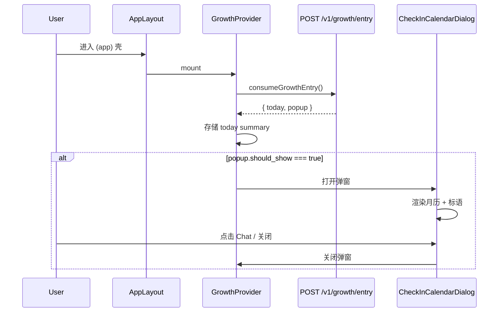
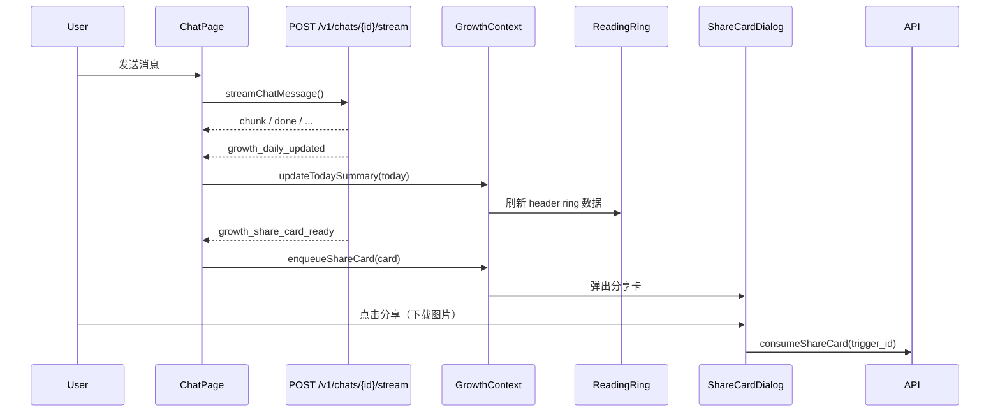
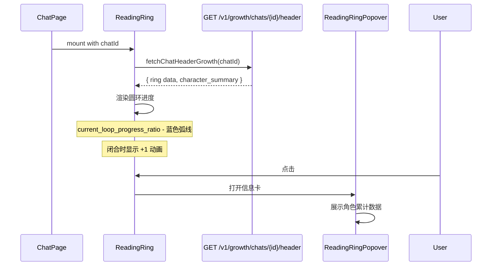
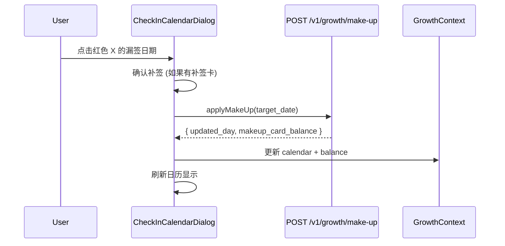

# Phase 5.1 — 轻量成长系统前端实现

## 0. 当前现状

- **后端 API 已就绪**：8 个新增端点 + 1 个修改端点（聊天流新增 growth SSE 事件），定义在 `openapi-phase5-growth-system.yaml`
- **前端技术栈**：Next.js 15 App Router + React 19 + Tailwind CSS 4 + shadcn/ui + Lucide React
- **现有 SSE 处理**：`streamChatMessage` 在 `api-service.ts` 中，`useChatSession` 消费事件
- **现有路由结构**：`(app)/` 下有 discover、chat、favorites、profile
- **头像弹窗**：`Sidebar.tsx` 中 DropdownMenu，含个人资料、设置、收藏夹、退出
- **ChatHeader**：简洁结构，左侧角色头像 + 名称，右侧新建聊天和历史按钮

## 1. 目标

实现第五阶段"轻量成长系统"的全部前端功能，对接真实后端 API，包括：

1. **签到弹窗** — 进站时弹出月历日历，展示签到状态
2. **Header 阅读圆环** — 聊天页右侧，显示 300 词阅读进度
3. **分享卡片系统** — 签到完成卡 + 角色里程碑卡，支持下载为图片
4. **数据总览页** — 独立页面，KPI、趋势图、角色排行、阅读等价
5. **SSE Growth 事件处理** — 实时更新签到进度和弹出分享卡
6. **补签功能** — 在日历弹窗中点击漏签日期使用补签卡

## 2. 影响范围与系统位置

### 2.1 新增文件

| 文件 | 用途 |
|------|------|
| `src/lib/growth-api.ts` | Growth 域 API 函数（不修改 api-service.ts 主体，独立文件） |
| `src/lib/growth-types.ts` | Growth 域全部 TypeScript 类型 |
| `src/lib/growth-context.tsx` | Growth 全局 Context：签到状态、补签卡余额、弹窗控制 |
| `src/components/growth/CheckInCalendarDialog.tsx` | 进站签到弹窗（月历 + 标语 + 补签） |
| `src/components/growth/ReadingRing.tsx` | ChatHeader 右侧阅读圆环组件 |
| `src/components/growth/ReadingRingPopover.tsx` | 圆环点击弹出的角色信息卡 |
| `src/components/growth/ShareCardDialog.tsx` | 分享卡片弹窗（签到卡 + 里程碑卡） |
| `src/components/growth/ShareCardRenderer.tsx` | 分享卡片内容渲染（用于截图下载） |
| `src/app/(app)/stats/page.tsx` | 数据总览页 |
| `src/components/growth/StatsKpiCards.tsx` | 总览页 KPI 卡片区 |
| `src/components/growth/StatsTrendChart.tsx` | 总览页趋势图 |
| `src/components/growth/StatsRankingChart.tsx` | 总览页角色排行 |
| `src/components/growth/StatsReadingBlock.tsx` | 总览页阅读等价区 |
| `src/components/growth/StatsCharacterTable.tsx` | 总览页角色详细表 |

### 2.2 修改文件

| 文件 | 修改点 |
|------|--------|
| `src/app/(app)/layout.tsx` | 挂载 GrowthProvider，触发 entry 调用 |
| `src/components/Sidebar.tsx` | DropdownMenu 新增"数据总览"入口 |
| `src/components/ChatHeader.tsx` | 右侧新增 ReadingRing 组件 |
| `src/app/(app)/chat/[id]/page.tsx` | 接收 growth SSE 回调、传递 chatId 到 ReadingRing |
| `src/lib/api-service.ts` | streamChatMessage 新增 growth_daily_updated 和 growth_share_card_ready 回调 |
| `src/hooks/useChatSession.ts` | 转发 growth SSE 事件到 GrowthContext |
| `src/lib/api.ts` | 重新导出 growth API 函数 |

### 2.3 不改动的模块

- 登录/注册、收藏、角色管理、音色管理的所有逻辑
- 聊天的核心消息流、候选切换、学习辅助逻辑
- Sidebar 角色列表渲染逻辑
- 任何现有 CSS 变量和设计系统定义

## 3. 核心流程

### 3.1 进站签到弹窗流程



### 3.2 聊天 SSE Growth 事件流程



### 3.3 Header 阅读圆环流程



### 3.4 补签流程



## 4. 契约级细节

### 4.1 Growth API 函数签名

```typescript
// src/lib/growth-api.ts

// 1. 进站
export async function consumeGrowthEntry(
  req?: { calendar_month?: string }
): Promise<GrowthEntryResponse>

// 2. 月历
export async function getGrowthCalendar(
  month?: string
): Promise<GrowthCalendarResponse>

// 3. 补签
export async function applyGrowthMakeUp(
  targetDate: string
): Promise<GrowthMakeUpResponse>

// 4. 聊天 Header
export async function getGrowthChatHeader(
  chatId: string
): Promise<GrowthChatHeaderResponse>

// 5. 总览
export async function getGrowthOverview(
  focusCharacterId?: string
): Promise<GrowthOverviewResponse>

// 6. 角色台账分页
export async function listGrowthCharacters(params: {
  cursor?: string;
  limit?: number;
  sort_by?: GrowthCharacterSortBy;
}): Promise<GrowthCharactersPageResponse>

// 7. 待消费分享卡
export async function listPendingShareCards(params: {
  chat_id?: string;
  limit?: number;
}): Promise<GrowthShareCardsPageResponse>

// 8. 消费分享卡
export async function consumeShareCard(
  triggerId: string
): Promise<void>
```

### 4.2 GrowthContext 接口

```typescript
interface GrowthContextType {
  // 今日签到摘要
  todaySummary: GrowthTodaySummary | null;
  
  // 弹窗控制
  isEntryPopupVisible: boolean;
  entryPopupData: GrowthPopup | null;
  closeEntryPopup: () => void;
  
  // 更新今日摘要（由 SSE 回调触发）
  updateTodaySummary: (today: GrowthTodaySummary) => void;
  
  // 分享卡队列
  pendingShareCards: GrowthShareCard[];
  enqueueShareCard: (card: GrowthShareCard) => void;
  dismissShareCard: (triggerId: string) => void;
  
  // 补签卡余额
  makeupCardBalance: number;
  
  // 数据加载状态
  isLoading: boolean;
}
```

### 4.3 SSE 新增事件类型

```typescript
// 新增到 api-service.ts 的 ChatStreamEvent union

interface ChatStreamGrowthDailyUpdatedEvent {
  type: "growth_daily_updated";
  today: GrowthTodaySummary;
}

interface ChatStreamGrowthShareCardReadyEvent {
  type: "growth_share_card_ready";
  share_card: GrowthShareCard;
}
```

### 4.4 streamChatMessage handlers 新增

```typescript
// 新增到 streamChatMessage 的 handlers 参数
onGrowthDailyUpdated?: (data: { today: GrowthTodaySummary }) => void;
onGrowthShareCardReady?: (data: { share_card: GrowthShareCard }) => void;
```

## 5. 方案决策

### 5.1 图表库选择

**决策：使用 Recharts**

理由：
- 轻量，社区活跃，React 原生组件式 API
- 支持折线图、柱状图、饼图，覆盖趋势图和排行图需求
- 与 shadcn/ui 配合良好
- 不需要引入额外重量级框架

### 5.2 分享卡截图方案

**决策：使用 html2canvas**

理由：
- 纯前端截图，不依赖服务端渲染
- 将 ShareCardRenderer 渲染为 canvas 然后转 PNG 下载
- 产品方案明确说本阶段不做服务端图片渲染

### 5.3 Growth 状态管理

**决策：独立 GrowthContext (React Context)**

理由：
- 与现有 AuthContext、UserSettingsContext 模式一致
- Growth 状态需要跨组件共享（弹窗、Header 圆环、分享卡）
- 挂载在 (app)/layout.tsx 的 UserSettingsProvider 之后
- 不引入新的状态管理库，符合项目规范

### 5.4 数据总览页路由

**决策：`/stats` 路由，放在 `src/app/(app)/stats/page.tsx`**

理由：
- 需要 Sidebar -> 放在 (app) 下
- 不塞进 /profile -> 独立页面
- 从头像弹窗 DropdownMenu 进入

## 6. 实施路径

### Step 1: 基础设施层（Types + API + Context）

1. 创建 `src/lib/growth-types.ts`
   - 定义所有 Growth 域 TS 类型（从 OpenAPI spec 映射）
   
2. 创建 `src/lib/growth-api.ts`
   - 8 个 API 函数，全部通过 httpClient 调用
   - consumeShareCard 使用 httpClient.post（返回 204）
   
3. 创建 `src/lib/growth-context.tsx`
   - GrowthProvider 和 useGrowth hook
   - mount 时调用 consumeGrowthEntry
   - 暴露 todaySummary、popup、shareCard 队列等

4. 修改 `src/app/(app)/layout.tsx`
   - 在 UserSettingsProvider 外层包裹 GrowthProvider

### Step 2: 签到弹窗

5. 创建 `src/components/growth/CheckInCalendarDialog.tsx`
   - 使用 shadcn Dialog
   - 上方标语（英文），下方月历网格
   - 日历视觉规则：蓝色圈、红色X、灰色数字
   - 点击漏签日期触发补签（有补签卡时）
   - 底部 "Chat" 按钮（关闭弹窗）
   - 补签卡余额显示

### Step 3: SSE Growth 事件集成

6. 修改 `src/lib/api-service.ts`
   - ChatStreamEvent union 新增两个类型
   - streamChatMessage handlers 新增两个可选回调
   - SSE 解析逻辑新增两个 else-if 分支

7. 修改 `src/hooks/useChatSession.ts`
   - handleSendMessage 中 streamChatMessage 调用新增 growth 回调
   - 通过回调参数或 ref 调用 GrowthContext 的方法

8. 修改 `src/app/(app)/chat/[id]/page.tsx`
   - 消费 GrowthContext
   - 渲染 ShareCardDialog（弹出分享卡）

### Step 4: Header 阅读圆环

9. 创建 `src/components/growth/ReadingRing.tsx`
   - SVG 圆环，蓝色弧线 = current_loop_progress_ratio
   - 中心数字 = completed_loops
   - 闭合瞬间 +1 动画
   - 点击弹出 Popover

10. 创建 `src/components/growth/ReadingRingPopover.tsx`
    - 展示角色累计数据
    - 使用 shadcn Popover

11. 修改 `src/components/ChatHeader.tsx`
    - 右侧按钮区新增 ReadingRing
    - 接收 chatId prop

### Step 5: 分享卡片

12. 创建 `src/components/growth/ShareCardDialog.tsx`
    - 使用 shadcn Dialog
    - 从 GrowthContext 读取 pendingShareCards 队列
    - 首张卡片弹出
    - 底部"分享"按钮调用 html2canvas 下载
    - 关闭时调用 consumeShareCard

13. 创建 `src/components/growth/ShareCardRenderer.tsx`
    - 纯 UI 组件，渲染卡片内容
    - 两种类型：daily_signin_completed / character_message_milestone
    - 设计精美，品牌感强

### Step 6: 数据总览页

14. 安装 recharts 依赖

15. 创建 `src/app/(app)/stats/page.tsx`
    - 调用 getGrowthOverview + listGrowthCharacters
    - 五屏结构

16. 创建 StatsKpiCards -- KPI 卡片
17. 创建 StatsTrendChart -- 趋势图（折线/柱状图）
18. 创建 StatsRankingChart -- 角色排行
19. 创建 StatsReadingBlock -- 阅读等价区
20. 创建 StatsCharacterTable -- 角色详细表

21. 修改 `src/components/Sidebar.tsx`
    - DropdownMenu 新增"数据总览"入口项

### Step 7: 检查修复循环

22. 逐一验证每个功能模块是否符合产品规则
23. 检查 CSS 是否符合 design.md 规范
24. 确保所有中文文案正确，无 unicode 编码
25. 确保无 mock 数据残留

## 7. Non-Goals

- 本阶段不做服务端图片渲染
- 不做社交 Feed
- 不做等级/徽章/XP 系统
- 不做用户可配置时区
- 不做历史聊天回溯统计
- 不引入新的状态管理库
- 不修改现有聊天核心逻辑

## 8. 验证标准

1. 进站弹窗：首次进入弹出，当天再进不弹
2. 月历日历：颜色规则正确（蓝圈/红X/灰色）
3. 补签：点击漏签日可使用补签卡，余额更新
4. Header 圆环：显示进度，闭合+1，点击弹出详情
5. SSE 事件：发消息后签到进度实时更新
6. 分享卡：签到完成/里程碑自动弹出，可下载图片
7. 数据总览页：KPI、趋势图、排行、阅读等价、角色表
8. 所有 API 调用真实后端，无 mock
9. `pnpm build` 通过
