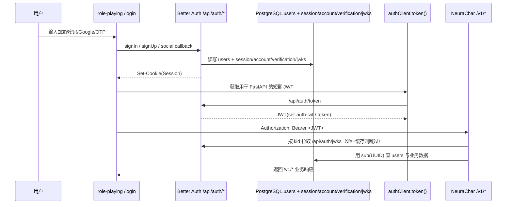

# Auth 迁移计划：从 NeuraChar 自定义 Auth 迁移到 Better Auth

## 背景

当前 NeuraChar（后端）和 role-playing（前端）使用自定义的邮箱验证码 + JWT 认证体系。计划将其完全迁移到 Better Auth，实现：
- 邮箱验证码登录（email-otp）
- 邮箱+密码登录（emailAndPassword）
- Google OAuth 登录
- JWT/JWKS 非对称密钥验证（用于 NeuraChar 后端验证）

## 架构设计

```
┌─────────────────────────────────────────────────────────────────┐
│  role-playing (Next.js 15.5.4, port 3001)                       │
│                                                                   │
│  ┌───────────────┐    ┌─────────────────────────────────────┐   │
│  │  React 前端    │◀──▶│  /api/auth/* (Better Auth)          │   │
│  │               │    │                                     │   │
│  │  - useSession  │    │  插件: email-otp (Resend 发验证码)   │   │
│  │  - signIn     │    │        emailAndPassword              │   │
│  │  - signOut    │    │        google OAuth                  │   │
│  │               │    │        jwt (JWKS)                    │   │
│  └───────────────┘    │        bearer                        │   │
│                       │        nextCookies (必须最后)         │   │
│                       └──────────────┬──────────────────────┘   │
│                                      │                           │
│  ┌───────────────────────────────────┼───────────────────────┐   │
│  │  middleware.ts (路由保护)          │                       │   │
│  │  src/app/api/auth/[...all]/route.ts │                   │   │
│  └───────────────────────────────────┼───────────────────────┘   │
│                                      │                           │
│  ┌───────────────────────────────────┼───────────────────────┐   │
│  │  next.config.ts rewrites:          │                       │   │
│  │    /v1/* → http://localhost:8000  │                       │   │
│  └───────────────────────────────────┼───────────────────────┘   │
└──────────────────────────────────────┼───────────────────────────┘
                                       │ Bearer JWT (从 better-auth-token.ts 获取)
                                       ▼
┌─────────────────────────────────────────────────────────────────┐
│  NeuraChar (FastAPI, port 8000)                                  │
│                                                                   │
│  改动: get_current_user 改为 JWKS 验证 JWT                        │
│  移除: /v1/auth/send_code, /v1/auth/login                        │
│  保留: /v1/auth/me (用 JWKS 验证后返回用户信息)                    │
└─────────────────────────────────────────────────────────────────┘
                                       │
                                       ▼
┌─────────────────────────────────────────────────────────────────┐
│  PostgreSQL (同一实例)                                            │
│                                                                   │
│  NeuraChar 业务表: characters, chats, memories, ...               │
│  Better Auth 表: user, session, account, verification, jwks       │
└─────────────────────────────────────────────────────────────────┘
```
┌─────────────────────────────────────────────────────────────────┐
│  role-playing (Next.js, port 3001)                               │
│                                                                   │
│  ┌───────────────┐    ┌─────────────────────────────────────┐   │
│  │  React 前端    │◀──▶│  /api/auth/* (Better Auth)          │   │
│  │               │    │                                     │   │
│  │  - useSession  │    │  插件: email-otp (Resend 发验证码)   │   │
│  │  - signIn     │    │        emailAndPassword              │   │
│  │  - signOut    │    │        google OAuth                  │   │
│  │               │    │        jwt (JWKS)                    │   │
│  └───────────────┘    │        bearer                        │   │
│                       │        nextCookies                   │   │
│                       └──────────────┬──────────────────────┘   │
│                                      │                           │
│  ┌───────────────────────────────────┼───────────────────────┐   │
│  │  next.config.ts rewrites:          │                       │   │
│  │    /v1/* → http://localhost:8000  │                        │   │
│  └───────────────────────────────────┼───────────────────────┘   │
└──────────────────────────────────────┼───────────────────────────┘
                                       │ Bearer JWT (JWKS 验证)
                                       ▼
┌─────────────────────────────────────────────────────────────────┐
│  NeuraChar (FastAPI, port 8000)                                  │
│                                                                   │
│  改动: get_current_user 改为 JWKS 验证 JWT                        │
│  移除: /v1/auth/send_code, /v1/auth/login                        │
│  保留: /v1/auth/me (用 JWKS 验证后返回用户信息)                    │
└─────────────────────────────────────────────────────────────────┘
                                       │
                                       ▼
┌─────────────────────────────────────────────────────────────────┐
│  PostgreSQL (同一实例)                                            │
│                                                                   │
│  NeuraChar 业务表: characters, chats, memories, ...               │
│  Better Auth 表: user, session, account, verification, jwks       │
└─────────────────────────────────────────────────────────────────┘
```

## 技术栈

| 组件 | 技术 |
|------|------|
| 前端框架 | Next.js 15 App Router |
| Auth 库 | better-auth |
| 数据库 | PostgreSQL (pg) |
| 邮件服务 | Resend |
| 后端 | Python FastAPI |
| JWT 验证 | PyJWT + PyJWKClient |

## 前置条件

### 凭证信息汇总

> ⚠️ **安全警告**: 以下 Resend API Key 已暴露在对话记录中，建议前往 Resend 控制台（resend.com）重新生成一个新的 Key 并作废旧 Key。

| 凭证 | 值 | 位置/说明 |
|------|-----|----------|
| **Resend API Key** | `<resend_api_key>` | resend.com 控制板获取 |
| **Google OAuth Client ID** | `<google_client_id>` | Google Cloud Console |
| **Google OAuth Client Secret** | `<google_client_secret>` | Google Cloud Console |
| **Google OAuth 项目 ID** | `role-playing-492318` | Google Cloud Console |
| **Google OAuth JSON 文件** | `<local_google_oauth_json_backup>` | 本地备份 |
| **Google OAuth Redirect URI** | `http://localhost:3001/api/auth/callback/google` | Google Cloud Console 配置 |
| **Google OAuth JS Origin** | `http://localhost:3001` | Google Cloud Console 配置 |

### 已配置项 ✅

- [x] PostgreSQL 连接字符串（Better Auth）: `postgresql://role_play_user:<db_password>@localhost:5432/role_play_mem`（来自 `E:\code\NeuraChar\.env` 的 `DATABASE_URL`，去掉 `+asyncpg`）
- [x] BETTER_AUTH_SECRET: `<better_auth_secret>`（已生成）

### Google OAuth 凭据说明

当前开发环境使用的 Google OAuth 凭据信息：

- **项目名称**: role-playing-492318
- **凭据类型**: Web application
- **JSON 文件备份**: `<local_google_oauth_json_backup>`
- **已配置**: JS Origin `http://localhost:3001`、Redirect URI `http://localhost:3001/api/auth/callback/google`

> **生产环境注意**: Google OAuth 不允许同一个 Client ID 同时用于多个域名。生产环境需要在 Google Cloud Console 新建一套 OAuth 凭据，JS Origin 和 Redirect URI 填写生产域名（如 `https://neurachar.com`、`https://auth.neurachar.com/api/auth/callback/google`）。

### 生成新的 BETTER_AUTH_SECRET（生产用）

```bash
# Linux/macOS
openssl rand -base64 32

# Windows PowerShell
[Convert]::ToBase64String((1..32 | ForEach-Object { Get-Random -Maximum 256 }))
```

## Phase 1: role-playing — Better Auth 基础设施搭建

> **注意**: role-playing 项目目前没有 `src/middleware.ts`，Phase 1 需要新建。

### 1.1 安装依赖

```bash
cd E:\code\role-playing
pnpm add better-auth pg resend
pnpm add -D @types/pg
```

### 1.2 创建 `src/lib/auth.ts`（服务端配置）

```typescript
import { betterAuth } from "better-auth"
import { emailOTP } from "better-auth/plugins"
import { jwt } from "better-auth/plugins"
import { bearer } from "better-auth/plugins"
import { nextCookies } from "better-auth/next-js"
import { Pool } from "pg"
import { Resend } from "resend"

const resend = new Resend(process.env.RESEND_API_KEY!)

export const auth = betterAuth({
  database: new Pool({
    connectionString: process.env.DATABASE_URL!,
  }),
  emailAndPassword: {
    enabled: true,
  },
  socialProviders: {
    google: {
      clientId: process.env.GOOGLE_CLIENT_ID!,
      clientSecret: process.env.GOOGLE_CLIENT_SECRET!,
    },
  },
  plugins: [
    emailOTP({
      otpLength: 6,
      expiresIn: 300, // 5 分钟
      resendStrategy: "reuse", // 防止邮件延迟导致多个有效验证码
      async sendVerificationOTP({ email, otp, type }) {
        if (type === "sign-in") {
          // 不 await，避免 timing attack
          resend.emails.send({
            from: "NeuraChar <onboarding@resend.dev>",
            to: email,
            subject: "NeuraChar 登录验证码",
            html: `<p>您的登录验证码是：<strong>${otp}</strong></p><p>验证码 5 分钟内有效。</p>`,
          })
        } else if (type === "email-verification") {
          resend.emails.send({
            from: "NeuraChar <onboarding@resend.dev>",
            to: email,
            subject: "NeuraChar 邮箱验证",
            html: `<p>您的邮箱验证码是：<strong>${otp}</strong></p><p>验证码 5 分钟内有效。</p>`,
          })
        } else if (type === "forget-password") {
          resend.emails.send({
            from: "NeuraChar <onboarding@resend.dev>",
            to: email,
            subject: "NeuraChar 密码重置",
            html: `<p>您的密码重置验证码是：<strong>${otp}</strong></p><p>验证码 5 分钟内有效。</p>`,
          })
        }
      },
    }),
    jwt(),
    bearer(),
    nextCookies(),
  ],
  secret: process.env.BETTER_AUTH_SECRET!,
  baseURL: process.env.BETTER_AUTH_URL || "http://localhost:3001",
})

export type Session = typeof auth.$Infer.Session
```

### 1.3 创建 `src/lib/auth-client.ts`（客户端 SDK）

```typescript
import { createAuthClient } from "better-auth/react"
import { emailOTPClient } from "better-auth/client/plugins"
import { jwtClient } from "better-auth/client/plugins"

export const authClient = createAuthClient({
  baseURL: process.env.BETTER_AUTH_URL || "http://localhost:3001",
  plugins: [emailOTPClient(), jwtClient()],
  fetchOptions: {
    // Bearer token 自动添加到请求头
    auth: {
      type: "Bearer",
      token: () => localStorage.getItem("bearer_token") || "",
    },
    // 登录成功时自动保存 Bearer token 到 localStorage
    onSuccess: async (context) => {
      const authToken = context.response.headers.get("set-auth-token")
      if (authToken) {
        localStorage.setItem("bearer_token", authToken)
      }
    },
  },
})
```

### 1.4 创建 API 路由 `src/app/api/auth/[...all]/route.ts`

```typescript
import { auth } from "@/lib/auth"
import { toNextJsHandler } from "better-auth/next-js"

export const { GET, POST } = toNextJsHandler(auth)
```

### 1.5 环境变量（`.env.local`）

```env
# Better Auth
# 注意：NeuraChar 用的是 postgresql+asyncpg://（Python asyncpg 驱动）
# Better Auth 用的是 postgresql://（Node.js pg 驱动），去掉 +asyncpg
DATABASE_URL=postgresql://role_play_user:<db_password>@localhost:5432/role_play_mem
BETTER_AUTH_URL=http://localhost:3001
BETTER_AUTH_SECRET=<better_auth_secret>

# Resend
# ⚠️ 建议重新生成 API Key，旧的已暴露
RESEND_API_KEY=<resend_api_key>

# Google OAuth
GOOGLE_CLIENT_ID=<google_client_id>
GOOGLE_CLIENT_SECRET=<google_client_secret>
```

### 1.6 数据库迁移

```bash
cd E:\code\role-playing
npx auth@latest migrate
```

这会在 PostgreSQL 中创建以下表：
- `user` — 用户表
- `session` — 会话表
- `account` — 社交登录账号表
- `verification` — 验证码表
- `jwks` — JWKS 密钥表

> **注意**: Better Auth 使用 `pg` 库连接 PostgreSQL，连接字符串格式为 `postgresql://`（不带 `+asyncpg`）。NeuraChar 使用 `asyncpg`，需要 `postgresql+asyncpg://` 格式。两者连接同一个数据库，但驱动不同。

### 1.7 验证 Phase 1

- [ ] 启动 `pnpm dev` 无报错
- [ ] 访问 `http://localhost:3001/api/auth/jwks` 返回 JWKS 数据（EdDSA 公钥）
- [ ] 数据库中出现 Better Auth 相关表（user, session, account, verification, jwks）
- [ ] `src/middleware.ts` 已创建

## Phase 2: role-playing — 前端 Auth 替换

### 2.1 替换登录页面 `src/app/login/page.tsx`

**目标**: 用 Better Auth 的 email-otp 替换现有的手动验证码登录

**当前逻辑**:
- 调用 `apiService.sendVerificationCode(email)` 发验证码
- 调用 `apiService.login(email, code)` 登录
- 登录成功后存 token 到 localStorage

**新逻辑**:
- 调用 `authClient.emailOtp.sendVerificationOtp({ email, type: "sign-in" })` 发验证码
- 调用 `authClient.signIn.emailOtp({ email, otp: code })` 登录
- Better Auth 自动管理 Cookie，无需手动存 token
- 登录成功后根据用户资料完整度跳转到 `/` 或 `/setup`

**关键变更**:
```typescript
// 旧代码
await apiService.sendVerificationCode(email)
await apiService.login(email, code)

// 新代码
await authClient.emailOtp.sendVerificationOtp({ email, type: "sign-in" })
await authClient.signIn.emailOtp({ email, otp: code })
```

### 2.2 替换 `src/lib/auth-context.tsx`

**目标**: 用 Better Auth 的 `useSession()` 替换手动管理的 Auth Context

**当前逻辑**:
- 手动管理 `user` state
- 手动调用 `apiService.getCurrentUser()` 获取用户信息
- 手动管理 token 变化订阅

**新逻辑**:
```typescript
import { authClient } from "./auth-client"

export function useAuth() {
  const { data: session, isPending, error } = authClient.useSession()
  
  return {
    user: session?.user ?? null,
    isAuthed: !!session?.user,
    isLoading: isPending,
    logout: async () => {
      await authClient.signOut()
    },
    refreshUser: () => authClient.getSession(),
  }
}
```

### 2.3 创建 `src/lib/better-auth-token.ts`

**目标**: 替代原来的 `tokenStore`，为 NeuraChar 的 `/v1/*` 请求提供 JWT

```typescript
import { authClient } from "./auth-client"

let cachedToken: string | null = null
let tokenExpiry = 0

export async function getBearerToken(): Promise<string | null> {
  // 检查缓存是否有效
  if (cachedToken && Date.now() < tokenExpiry) {
    return cachedToken
  }
  
  try {
    const { data } = await authClient.token()
    if (data?.token) {
      cachedToken = data.token
      tokenExpiry = Date.now() + 14 * 60 * 1000 // 14 分钟（JWT 默认 15 分钟）
      return cachedToken
    }
  } catch {
    // Token not available, user not logged in
  }
  return null
}

export function clearBearerToken() {
  cachedToken = null
  tokenExpiry = 0
}
```

### 2.4 更新 `src/lib/http-client.ts`

**目标**: 将 token 获取方式从 `tokenStore.getToken()` 改为 `getBearerToken()`

**变更**:
```typescript
// 旧代码
import { tokenStore } from "./token-store"
const token = tokenStore.getToken()

// 新代码
import { getBearerToken } from "./better-auth-token"
const token = await getBearerToken()
```

**注意**: `HttpClient` 的 `request` 方法需要改为 `async`，因为 `getBearerToken()` 是异步的。

### 2.5 更新 `src/lib/api-service.ts`

**目标**: 移除旧的 auth 方法，更新需要 token 的方法

**移除**:
- `sendVerificationCode()` 方法
- `login()` 方法
- `AuthResponse` 接口
- `SendCodeRequest` 接口
- `LoginRequest` 接口

**保留**:
- `getCurrentUser()` — 改为从 Better Auth session 获取，或保留调用 `/v1/auth/me`

### 2.6 简化 `src/lib/token-store.ts`

**目标**: 移除 token 管理逻辑，保留错误类

```typescript
// 只保留错误类，移除 TokenStore 类
export class UnauthorizedError extends Error {
    constructor(message = "authorization failed") {
        super(message)
        this.name = "UnauthorizedError"
    }
}

export class ApiError extends Error {
    constructor(
        public status: number,
        public code?: string,
        public detail?: string
    ) {
        super(detail || `API Error: ${status}`)
        this.name = "ApiError"
    }
}
```

### 2.7 更新 `src/lib/api.ts`

**目标**: 更新 auth 相关函数调用

```typescript
// 旧代码
export async function sendVerificationCode(email: string) {
  return apiService.sendVerificationCode(email)
}

// 新代码
import { authClient } from "./auth-client"

export async function sendVerificationCode(email: string) {
  const { error } = await authClient.emailOtp.sendVerificationOtp({
    email,
    type: "sign-in",
  })
  if (error) throw new Error(error.message)
}

export async function getCurrentUser() {
  const { data: session } = await authClient.getSession()
  return session?.user ?? null
}
```

### 2.8 创建 `src/middleware.ts`（新建）

**目的**: Next.js 15.5.4 没有现有的 middleware，需要创建路由保护

**重要**: Next.js 15.5.4 介于 15.1.7 和 15.2.0 之间，middleware 只能使用 HTTP fetch 方式验证 session，不能使用 Node.js runtime。

```typescript
import { NextRequest, NextResponse } from "next/server"
import { betterFetch } from "@better-fetch/fetch"

export async function middleware(request: NextRequest) {
  // 只需要保护 / 路径（首页），其他路径按需添加
  if (request.nextUrl.pathname === "/") {
    const { data: session } = await betterFetch("/api/auth/get-session", {
      baseURL: request.nextUrl.origin,
      headers: {
        cookie: request.headers.get("cookie") || "",
      },
    })

    if (!session) {
      return NextResponse.redirect(new URL("/login", request.url))
    }
  }

  return NextResponse.next()
}

export const config = {
  matcher: ["/"],
}
```

### 2.9 更新所有使用 `tokenStore` 的组件

需要检查并更新以下文件：
- `src/components/ChatMessage.tsx`
- `src/components/ChatInput.tsx`
- `src/components/chat/ChatThread.tsx`
- `src/components/layout/ChatMainFrame.tsx`
- `src/components/Sidebar.tsx`
- `src/lib/voice/stt-recorder.ts`
- `src/lib/llm-adapter.ts`

**变更模式**:
```typescript
// 旧代码
import { tokenStore } from "./token-store"
const token = tokenStore.getToken()

// 新代码
import { getBearerToken } from "./better-auth-token"
const token = await getBearerToken()
```

### 2.10 验证 Phase 2

- [ ] 邮箱验证码登录正常工作
- [ ] Google OAuth 登录正常工作
- [ ] 邮箱+密码登录正常工作
- [ ] 登录后能正常访问受保护的页面
- [ ] 登出后正常跳转到登录页
- [ ] `/v1/*` 请求能正常携带 JWT 并通过 NeuraChar 验证

## Phase 3: NeuraChar — JWT 验证替换为 JWKS

### 3.1 安装依赖

```bash
cd E:\code\NeuraChar
# 在 neurachar conda 环境中
pip install PyJWT>=2.8
```

**注意**: 移除 `python-jose` 依赖（如果不再用于其他用途）

### 3.2 创建 `src/core/jwks.py`（新建文件）

```python
"""JWKS-based JWT verification for Better Auth integration."""

from __future__ import annotations

import logging
from jwt import PyJWKClient, PyJWKClientError

logger = logging.getLogger(__name__)

_jwks_client: PyJWKClient | None = None


def get_jwks_client(jwks_url: str) -> PyJWKClient:
    """Get cached JWKS client instance."""
    global _jwks_client
    if _jwks_client is None:
        _jwks_client = PyJWKClient(
            jwks_url,
            cache_keys=True,
            max_cached_keys=16,
            cache_jwk_set=True,
            lifespan=300,  # 5 minutes
            timeout=30.0,
        )
    return _jwks_client


async def verify_bearer_token(token: str, jwks_url: str) -> dict:
    """
    Verify a JWT token using JWKS and return the payload.
    
    Better Auth 使用 EdDSA (Ed25519) 算法签名 JWT，
    PyJWKClient 会自动从 JWKS 获取公钥并验证签名。
    """
    try:
        jwks_client = get_jwks_client(jwks_url)
        signing_key = jwks_client.get_signing_key_from_jwt(token)
        
        import jwt
        # issuer 是 Better Auth 的 baseURL（不带 /api/auth/jwks 后缀）
        issuer = jwks_url.rsplit("/api/auth/jwks", 1)[0]
        payload = jwt.decode(
            token,
            key=signing_key.key,
            algorithms=["EdDSA"],  # Better Auth 默认使用 EdDSA
            options={
                "verify_aud": False,
                "verify_iss": True,
                "require": ["sub", "exp"],
            },
            issuer=issuer,
        )
        return payload
        
    except PyJWKClientError as e:
        logger.error(f"JWKS error: {e}")
        raise ValueError(f"JWKS error: {e}")
    except jwt.InvalidSignatureError:
        raise ValueError("Invalid token signature")
    except jwt.ExpiredSignatureError:
        raise ValueError("Token has expired")
    except jwt.InvalidTokenError as e:
        raise ValueError(f"Invalid token: {e}")
```

### 3.3 修改 `src/core/dependencies.py`

**目标**: 替换 `get_current_user` 的 JWT 验证逻辑

**变更**:
```python
# 移除
from jose import JWTError, jwt

# 添加
from src.core.jwks import verify_bearer_token
from src.core.config import settings

# 修改 get_current_user
async def get_current_user(
    credentials: HTTPAuthorizationCredentials | None = Depends(bearer_scheme),
    db: AsyncSession = Depends(get_db),
    user_repo: UserRepository = Depends(get_user_repository),
) -> User:
    credentials_exception = APIError(
        status_code=401,
        code="auth_token_invalid",
        message="authorization failed: token is missing or invalid",
    )
    if credentials is None:
        raise credentials_exception

    token = credentials.credentials
    
    try:
        payload = await verify_bearer_token(token, settings.BETTER_AUTH_JWKS_URL)
        email: str = payload.get("sub")
        if email is None:
            raise credentials_exception
    except ValueError:
        raise credentials_exception

    user = await user_repo.get_by_email(email)
    if user is None:
        raise credentials_exception

    await _bind_db_user_context(db, str(user.id))
    return user
```

### 3.4 修改 `src/core/config.py`

**移除**:
```python
SECRET_KEY: str
ALGORITHM: str = "HS256"
ACCESS_TOKEN_EXPIRE_MINUTES: int = 60 * 24 * 7
```

**添加**:
```python
BETTER_AUTH_JWKS_URL: str = "http://localhost:3001/api/auth/jwks"
```

### 3.5 修改 `src/api/routers/auth.py`

**移除**:
- `/v1/auth/send_code` 路由
- `/v1/auth/login` 路由

**保留**:
- `/v1/auth/me` 路由 — 改为用 JWKS 验证 JWT 后返回用户信息

### 3.6 删除不再需要的文件

- `src/services/auth_service.py`
- `src/repositories/auth_repository.py`
- `src/schemas/auth.py`（如果只有 auth 相关内容）

### 3.7 验证 Phase 3

- [ ] NeuraChar 启动无报错
- [ ] 访问 `/v1/auth/me` 能正常返回用户信息（携带 Better Auth JWT）
- [ ] 不带 token 访问受保护接口返回 401
- [ ] 带过期 token 返回 401
- [ ] JWT header 中 `alg` 为 `EdDSA`（不是 HS256）

## Phase 4: 数据迁移

### 4.1 创建迁移脚本 `scripts/migrate_users.py`

```python
"""Migrate existing users from NeuraChar to Better Auth."""

import asyncio
import asyncpg


async def migrate_users(database_url: str):
    """Migrate users from NeuraChar users table to Better Auth user table."""
    conn = await asyncpg.connect(database_url)
    
    try:
        # Get existing users
        users = await conn.fetch("""
            SELECT id, email, username, avatar_url, created_at, last_login_at
            FROM users
        """)
        
        migrated = 0
        skipped = 0
        
        for user in users:
            # Check if user already exists in Better Auth
            existing = await conn.fetchval(
                'SELECT id FROM "user" WHERE email = $1', user["email"]
            )
            if existing:
                skipped += 1
                continue
            
            # Insert into Better Auth user table
            await conn.execute("""
                INSERT INTO "user" (
                    id, email, name, image, 
                    created_at, updated_at, email_verified
                )
                VALUES ($1, $2, $3, $4, $5, $6, true)
            """, 
                str(user["id"]),
                user["email"],
                user["username"],
                user["avatar_url"],
                user["created_at"],
                user["last_login_at"] or user["created_at"]
            )
            migrated += 1
        
        print(f"Migration complete: {migrated} migrated, {skipped} skipped")
        
    finally:
        await conn.close()


if __name__ == "__main__":
    import os
    database_url = os.environ.get("DATABASE_URL")
    if not database_url:
        print("Error: DATABASE_URL environment variable not set")
        exit(1)
    
    asyncio.run(migrate_users(database_url))
```

### 4.2 执行迁移

```bash
cd E:\code\NeuraChar
# 确保 DATABASE_URL 已设置
python scripts/migrate_users.py
```

### 4.3 验证迁移

```sql
-- 对比用户数量
SELECT COUNT(*) FROM users;  -- NeuraChar 用户数
SELECT COUNT(*) FROM "user"; -- Better Auth 用户数

-- 对比邮箱列表
SELECT email FROM users ORDER BY email;
SELECT email FROM "user" ORDER BY email;
```

### 4.4 清理（可选）

迁移验证无误后，可以删除旧的验证码表：

```sql
DROP TABLE IF EXISTS email_login_codes;
```

### 4.5 验证 Phase 4

- [ ] 迁移脚本执行成功
- [ ] 用户数量一致
- [ ] 邮箱列表一致
- [ ] 现有用户能用邮箱验证码登录

## Phase 5: 集成测试与验证

### 5.1 测试邮箱验证码登录

- [ ] 访问 `http://localhost:3001/login`
- [ ] 输入邮箱，点击发送验证码
- [ ] 收到 Resend 发送的验证码邮件
- [ ] 输入验证码，成功登录
- [ ] 新用户首次登录自动注册

### 5.2 测试 Google OAuth 登录

- [ ] 点击 "Sign in with Google"
- [ ] 完成 Google 授权流程
- [ ] 成功登录并创建用户

### 5.3 测试邮箱+密码登录

- [ ] 注册新账号（邮箱+密码）
- [ ] 用邮箱+密码登录
- [ ] 密码错误时显示正确错误信息

### 5.4 测试 NeuraChar JWT 验证

- [ ] 登录后访问需要认证的 `/v1/*` 接口
- [ ] NeuraChar 能正确验证 Better Auth 签发的 JWT
- [ ] 过期 token 被拒绝
- [ ] 无效签名被拒绝

### 5.5 测试登出

- [ ] 点击登出
- [ ] Session 清除
- [ ] 重定向到登录页

### 5.6 测试业务功能

- [ ] 聊天功能正常
- [ ] 角色管理正常
- [ ] 记忆系统正常
- [ ] 语音功能正常
- [ ] 文件上传正常

## 风险与缓解

| 风险 | 影响 | 缓解措施 |
|------|------|----------|
| 迁移过程中用户无法登录 | 高 | 先部署 Better Auth，保留旧 auth 路由作为 fallback，逐步切换 |
| JWKS 验证失败导致所有请求 401 | 高 | NeuraChar 启动时验证 JWKS 可达性，失败则启动失败（fail-fast） |
| 用户数据迁移遗漏 | 中 | 迁移后对比两边用户数量和 email 列表 |
| Resend 测试域名邮件进垃圾箱 | 低 | 绑定自己的域名，配置 SPF/DKIM |
| Better Auth 默认 EdDSA 签名 | 中 | NeuraChar 验证代码已配置 EdDSA 算法，与 Better Auth 默认一致 |

## 重要技术细节

### JWT 算法差异

**重要**: Better Auth 默认使用 **EdDSA (Ed25519)** 算法签名 JWT，而旧的 NeuraChar 使用 **HS256**。

这意味着：
- Better Auth 签发的 JWT 使用 Ed25519 公钥/私钥对
- NeuraChar 必须使用 EdDSA 算法验证，不能用 HS256
- `jwt.decode(algorithms=["EdDSA"])` 是正确的验证方式

### User 类型映射

Better Auth User vs NeuraChar User 字段对照：

| Better Auth User | NeuraChar User | 说明 |
|-----------------|----------------|------|
| `id` | `id` | 用户唯一标识 |
| `email` | `email` | 邮箱地址 |
| `name` | `username` | 用户名（需要映射） |
| `image` | `avatar_url` | 头像 URL（需要映射） |
| `emailVerified` | - | 邮箱是否验证（Better Auth 新增） |
| `createdAt` | `created_at` | 创建时间 |
| `updatedAt` | - | 更新时间（Better Auth 新增） |
| - | `last_login_at` | 最后登录时间（需要在 customSession 中补充） |

### Next.js 15.5.4 Middleware 说明

Next.js 15.5.4 不支持 Node.js runtime middleware（需要 15.2.0+），因此：
- ✅ 使用 `betterFetch` 通过 HTTP 调用 `/api/auth/get-session`
- ❌ 不能使用 `auth.api.getSession({ headers })` 直接调用

### Bearer Token 获取方式

Better Auth 的 Bearer token 获取有多种方式，推荐使用 `authClient.token()`：

```typescript
const { data } = await authClient.token()
const bearerToken = data?.token
```

token 会缓存在 localStorage（通过 `fetchOptions.auth.token` 配置），后续请求自动携带。

## 部署注意事项

### 自建服务器

- Better Auth 的 Cookie 在 HTTP 下也能工作（开发环境），但生产环境**必须 HTTPS**
- `BETTER_AUTH_URL` 需要设置为实际的域名（如 `https://auth.neurachar.com`）
- `trustedOrigins` 需要包含前端域名
- 密钥文件路径（开发环境）: `<local_google_oauth_json_backup>`

### 生产环境部署检查清单

- [ ] 生成新的 BETTER_AUTH_SECRET（生产用，不能用开发环境的 `<better_auth_secret>`）
- [ ] 重新生成 Resend API Key（生产用）
- [ ] 在 Google Cloud Console 创建生产环境 OAuth 凭据（不能复用开发环境的 Client ID）
- [ ] 配置生产环境域名（如 `auth.neurachar.com`）
- [ ] 配置 HTTPS 证书
- [ ] 配置 PostgreSQL 连接池（建议 `max_connections >= 50`）
- [ ] 配置 Resend 域名绑定（SPF/DKIM/DMARC 记录）
- [ ] 更新 NeuraChar 的 `BETTER_AUTH_JWKS_URL` 为生产域名
- [ ] 更新 role-playing 的 `DATABASE_URL` 为生产 PostgreSQL 连接

### 环境变量（生产）

#### role-playing (`.env.production`)

```env
# Better Auth（注意：使用 postgresql:// 格式，不是 postgresql+asyncpg://）
DATABASE_URL=postgresql://role_play_user:<db_password>@localhost:5432/role_play_mem
BETTER_AUTH_URL=https://auth.neurachar.com
BETTER_AUTH_SECRET=<生产环境随机字符串，建议重新生成>

# Resend
RESEND_API_KEY=<生产环境 API Key，强烈建议重新生成>

# Google OAuth（生产环境需新建 OAuth 凭据，不能用开发环境的）
GOOGLE_CLIENT_ID=<生产环境 Client ID>
GOOGLE_CLIENT_SECRET=<生产环境 Client Secret>
```

#### NeuraChar (`.env`)

```env
# 保留不变（NeuraChar 用 asyncpg，需要 postgresql+asyncpg:// 格式）
DATABASE_URL=postgresql+asyncpg://role_play_user:<db_password>@localhost:5432/role_play_mem

# 移除（旧 auth 不再需要）
# SECRET_KEY=LSa6Cp4IUacz9W2v5SNdXy8rlfkR2X6ONqsvI9hq4rg
# ALGORITHM=HS256
# ACCESS_TOKEN_EXPIRE_MINUTES=10080
# SMTP_HOST=smtp.qq.com
# SMTP_PORT=465
# SMTP_USER=3047754883@qq.com
# SMTP_PASSWORD=ujmflmzdamfsddac

# 新增
BETTER_AUTH_JWKS_URL=http://localhost:3001/api/auth/jwks
# 生产环境改为:
# BETTER_AUTH_JWKS_URL=https://auth.neurachar.com/api/auth/jwks
```

## 执行顺序

```
Phase 1 (基础设施) → Phase 2 (前端替换) → Phase 3 (后端替换) → Phase 4 (数据迁移) → Phase 5 (测试)
```

**Phase 1 和 Phase 2 可以先做**，不影响现有的 NeuraChar auth。
**Phase 3 和 Phase 4 需要一起做**，因为一旦 NeuraChar 切换到 JWKS 验证，旧 auth 就失效了。

## 决策记录

| 决策 | 选择 | 理由 |
|------|------|------|
| 数据库 | 共用 PostgreSQL | 减少运维复杂度，Better Auth 表和业务表互不干扰 |
| 邮件服务 | Resend | 专业邮件服务，送达率高，免费额度足够 |
| JWT 验证 | JWKS 非对称 | 职责分离，支持密钥轮换，更安全 |
| JWT 算法 | EdDSA (Ed25519) | Better Auth 默认算法，更安全，PyJWT 支持良好 |
| 部署方式 | Better Auth 嵌入 Next.js | 零额外部署，同域无 CORS 问题 |
| 登录方式 | email-otp + emailAndPassword + Google | 保留现有体验，增加密码和社交登录选项 |
| OTP 存储 | plain（默认） | 配合 resendStrategy="reuse" 需要可逆存储 |
| Resend 策略 | reuse | 防止邮件延迟导致多个有效验证码 |
| Middleware | HTTP fetch 方式 | Next.js 15.5.4 不支持 Node.js runtime |

## 已配置的凭证

| 凭证 | 值 | 位置 |
|------|-----|------|
| DATABASE_URL（Better Auth 用） | `postgresql://role_play_user:<db_password>@localhost:5432/role_play_mem` | `.env.local` |
| DATABASE_URL（NeuraChar 用） | `postgresql+asyncpg://role_play_user:<db_password>@localhost:5432/role_play_mem` | `NeuraChar\.env` |
| BETTER_AUTH_SECRET | `<better_auth_secret>` | `.env.local` |
| Resend API Key | `<resend_api_key>` | `.env.local` |
| Google Client ID | `<google_client_id>` | `.env.local` |
| Google Client Secret | `<google_client_secret>` | `.env.local` |

## 2026-04-05 校正与细化补充（基于当前代码与官方文档）

> 说明：本节是对上文的增量校正，不删除原文。若与上文存在冲突，以本节为准。

### 先给结论

1. 推荐把 Better Auth 的 `user` 模型复用到 NeuraChar 现有 `users` 表，不要再维护单独的 `user` 表作为第二用户源。
2. 前端 Web 登录态继续以 Cookie Session 为主；JWT 只用于 `/v1/*` 对 FastAPI 的 Bearer 调用。
3. `set-auth-token`（Bearer 插件给 Better Auth 自己用的 session token）和 `set-auth-jwt` / `/token`（JWT 插件返回的 JWT）是两类不同 token，不能混用。
4. Better Auth JWT 默认 `sub = user.id`；NeuraChar 不应再把 `sub` 当作 email 解析。
5. Next.js `15.5.4` 已高于 `15.2.0`；middleware 允许走 Node runtime，但 Better Auth 官方仍建议 middleware 只做轻量 cookie 检查，真正鉴权放在页面/路由侧完成。

### 当前仓库真实锚点

#### role-playing

- `src/lib/auth-context.tsx`：当前登录态来源是 `tokenStore + /v1/auth/me`
- `src/lib/http-client.ts`：普通 JSON 请求统一注入 `Authorization`
- `src/lib/api-service.ts`：SSE、`FormData`、二进制接口仍有多处手写 `fetch` 直接读 token
- `src/app/login/page.tsx`：当前只支持邮箱验证码两步流
- `src/app/(app)/layout.tsx`：当前通过 client redirect 做受保护路由检查
- `next.config.ts`：只 rewrite `/v1/*` 与 `/uploads/*`，新增 `/api/auth/*` 不冲突

#### NeuraChar

- `src/db/models.py`：业务主用户表是 `users`，主键 `uuid`，且被 chats/characters/saved_items/growth/voice 等大量外键引用
- `src/core/dependencies.py`：当前 `get_current_user` 用 `SECRET_KEY + HS256` 校验，且把 `sub` 当 email
- `src/services/auth_service.py`：旧 auth 负责邮箱验证码登录并在 `users` 表内自动建用户
- `tests/integration/api/v1/endpoints/test_auth_router.py`：当前测试仍覆盖 `/send_code` 与 `/login`

### 推荐架构（方案 A，推荐执行）

#### A.1 只保留一套业务用户源

Better Auth 不新建独立 `user` 表作为业务用户源，而是映射到 NeuraChar 现有 `users` 表：

- `user.modelName = "users"`
- `user.fields.email -> email`
- `user.fields.name -> display_name`（新增列，不复用现有唯一 `username`）
- `user.fields.image -> avatar_url`
- `user.fields.emailVerified -> email_verified`
- `user.fields.createdAt -> created_at`
- `user.fields.updatedAt -> updated_at`

原因：

- NeuraChar 所有业务外键都依赖 `users.id`
- 上文双表方案会在“新用户第一次用 Better Auth 登录”时产生 user source 分裂
- 只要 `sub = users.id`，NeuraChar 的鉴权、聊天、角色、成长系统都不用做用户 ID 对账

#### A.2 `username` 继续作为业务资料字段，不作为 Better Auth 的核心 `name`

不要把 Better Auth 的核心 `name` 直接映射到 `username`，原因：

- `email-otp` 新用户注册时，如果没有传 `name`，Better Auth 默认写入空字符串
- `users.username` 目前是“可空 + 唯一”，多个空字符串/默认名会制造唯一约束与资料完整度问题

因此新增/保留字段策略应为：

- `display_name`：Better Auth 核心显示名，非业务强约束
- `username`：NeuraChar 业务唯一用户名，仍由 `/v1/users/me` 或专门资料完善流程维护
- `avatar_url`：两边共用同一列
- `last_login_at`：兼容字段，建议通过 sign-in/session-create hook 更新，不作为迁移阻塞项

#### A.3 Web 会话与 API JWT 分离

- Web 登录态：Better Auth Session Cookie
- FastAPI Bearer：Better Auth JWT（通过 `authClient.token()` 获取）
- `set-auth-token`：Bearer 插件给 Better Auth 自己用的 session token，不是 NeuraChar 要验证的 JWT
- `set-auth-jwt`：JWT 插件返回的短期 JWT，可直接给 FastAPI / 外部服务

在当前 same-origin Next.js Web 架构里：

- `bearer()` 不是必需插件
- `nextCookies()` 只在你要从 Server Action 调会写 Cookie 的 auth API 时才是“必须”
- `jwt()` 是必需插件，因为 NeuraChar 要做 JWKS 校验

建议：

- 最小可行实现：`plugins: [emailOTP(...), jwt(), nextCookies()]`
- 如果后续确实要让非 Cookie 客户端直接调 Better Auth，再额外启用 `bearer()`

#### A.4 JWT claim 契约以 Better Auth 默认行为为准

NeuraChar 侧校验契约应固定为：

- `alg = EdDSA`
- `iss = BETTER_AUTH_URL` 的 origin，例如 `http://localhost:3001`
- `aud = BETTER_AUTH_URL` 的 origin，例如 `http://localhost:3001`
- `sub = users.id`（UUID 字符串）

实现上：

- 不要再 `payload.get("sub")` 后按 email 查用户
- 应先 `user_id = UUID(payload["sub"])`
- 再 `user_repo.get_by_id(user_id)`

如果你坚持沿用 email subject：

- 必须在 Better Auth `jwt({ jwt: { getSubject: (session) => session.user.email } })` 显式覆盖
- 这会把 NeuraChar 鉴权契约绑定到邮箱，不推荐

### 推荐执行顺序（替换原 Phase 1~4 的推荐落地顺序）

#### Phase 0：数据库与 schema 先行

先改数据库，再接 Better Auth。

1. 在 `NeuraChar` 里新增 Alembic 迁移，修改 `users` 表：
   - 新增 `display_name` 列
   - 新增 `email_verified` 列
   - 按现有数据回填：
     - `display_name = COALESCE(username, split_part(email, '@', 1))`
     - `email_verified = true`
2. 同步更新 `src/db/models.py` 的 `User` 模型
3. 给 `UserRepository` 新增 `get_by_id`
4. 如果决定继续保留 `last_login_at` 实时语义：
   - 加一个 Better Auth sign-in / session-create 后置更新 hook
   - 或明确降级为“可选展示字段”

为什么要先做这一步：

- 这是把 Better Auth 与现有业务用户表对齐的前提
- 不先统一 user source，后面所有 JWT/JWKS 方案都会绕回“双用户同步”问题

#### Phase 1：role-playing 中落 Better Auth server/config

新增/修改这些文件：

- `src/lib/auth.ts`
- `src/lib/auth-client.ts`
- `src/app/api/auth/[...all]/route.ts`
- `src/lib/auth-user-mapper.ts`（推荐新增，做 Better Auth user -> 现有 `User` DTO 的兼容映射）
- `src/lib/better-auth-token.ts`

关键实现要求：

- `auth.ts` 用 Better Auth 映射到 `users` 表，不用默认 `user` 表
- `advanced.database.generateId` 明确用 UUID 策略，保证新用户 ID 可写入现有 `users.id`
- `auth-client.ts` 在当前 same-origin Web 场景下，不要读取 `process.env.BETTER_AUTH_URL`
  - 这是 client bundle，不会暴露非 `NEXT_PUBLIC_` 环境变量
  - 推荐直接省略 `baseURL` 或使用 `NEXT_PUBLIC_BETTER_AUTH_URL`
- `route.ts` 推荐导出 `GET/POST/PUT/PATCH/DELETE`，避免后续 `updateUser` / 插件端点缺 method
- `nextCookies()` 如果保留，必须放在插件数组最后

推荐 `auth.ts` 关键配置骨架：

```typescript
import { betterAuth } from "better-auth"
import { nextCookies } from "better-auth/next-js"
import { emailOTP, jwt } from "better-auth/plugins"
import { Pool } from "pg"

export const auth = betterAuth({
  database: new Pool({
    connectionString: process.env.DATABASE_URL!,
  }),
  baseURL: process.env.BETTER_AUTH_URL!,
  secret: process.env.BETTER_AUTH_SECRET!,
  user: {
    modelName: "users",
    fields: {
      name: "display_name",
      image: "avatar_url",
      emailVerified: "email_verified",
      createdAt: "created_at",
      updatedAt: "updated_at",
    },
    additionalFields: {
      username: {
        type: "string",
        required: false,
        input: false,
      },
    },
  },
  advanced: {
    database: {
      generateId: "uuid",
    },
  },
  emailAndPassword: {
    enabled: true,
  },
  socialProviders: {
    google: {
      clientId: process.env.GOOGLE_CLIENT_ID!,
      clientSecret: process.env.GOOGLE_CLIENT_SECRET!,
    },
  },
  plugins: [
    emailOTP({
      resendStrategy: "reuse",
      async sendVerificationOTP({ email, otp, type }) {
        // 发送 OTP
      },
    }),
    jwt(),
    nextCookies(),
  ],
})
```

#### Phase 2：前端登录态迁移，但保留现有 `useAuth` 对外 API 形状

不要让全站直接改成裸 `authClient.useSession()`。

推荐做法：

- 保留 `AuthProvider` / `useAuth`
- 内部实现改成 Better Auth session
- 对外仍返回当前前端依赖的 `user/isAuthed/isLoading/logout/refreshUser`

这样可以把改动控制在 auth 边界，而不是把全站组件一起改成 Better Auth 类型。

具体步骤：

1. `src/lib/auth-context.tsx`
   - 用 `authClient.useSession()` 取代 `tokenStore.subscribe()`
   - 内部把 `session.user` 映射为当前 `User` DTO：
     - `id <- session.user.id`
     - `email <- session.user.email`
     - `username <- session.user.username`
     - `avatar_url <- session.user.image ?? session.user.avatar_url`
     - `created_at <- session.user.createdAt`
     - `last_login_at <- session.user.last_login_at`
   - `logout` 时同时清理 JWT 内存缓存
2. `src/app/login/page.tsx`
   - OTP 流改用 `authClient.emailOtp.sendVerificationOtp`
   - OTP 校验改用 `authClient.signIn.emailOtp`
   - 额外新增：
     - 邮箱密码登录表单（`authClient.signIn.email`）
     - Google 登录按钮（`authClient.signIn.social({ provider: "google" })` 或对应 SDK 调用）
   - 登录成功后仍按“资料是否完整”跳 `/` 或 `/setup`
3. `src/lib/api.ts`
   - `sendVerificationCode()` 改成 Better Auth OTP API
   - `getCurrentUser()` 优先改为从 session mapper 返回
   - `loginWithCode()` 删除或标记废弃
4. `src/lib/token-store.ts`
   - 仅保留 `UnauthorizedError` / `ApiError`
   - 不再保留本地 `access_token` 持久化逻辑

#### Phase 3：NeuraChar JWT 校验切换到 JWKS

新增/修改：

- `src/core/jwks.py`
- `src/core/dependencies.py`
- `src/core/config.py`
- `src/repositories/user_repository.py`

关键校验逻辑必须改成：

- `PyJWT[crypto] >= 2.8`
- `PyJWKClient` 缓存 JWKS
- 校验 `algorithms=["EdDSA"]`
- 校验 `issuer`
- 校验 `audience`
- `sub` 按 UUID 解析
- `user_repo.get_by_id()` 查询业务用户

这里不要再：

- `verify_aud=False`
- `sub -> email`
- `get_by_email()`

推荐环境变量：

- `BETTER_AUTH_JWKS_URL=http://localhost:3001/api/auth/jwks`
- `BETTER_AUTH_JWT_ISSUER=http://localhost:3001`
- `BETTER_AUTH_JWT_AUDIENCE=http://localhost:3001`

推荐 `get_current_user` 骨架：

```python
import uuid

async def get_current_user(
    credentials: HTTPAuthorizationCredentials | None = Depends(bearer_scheme),
    db: AsyncSession = Depends(get_db),
    user_repo: UserRepository = Depends(get_user_repository),
) -> User:
    credentials_exception = APIError(
        status_code=401,
        code="auth_token_invalid",
        message="authorization failed: token is missing or invalid",
    )
    if credentials is None:
        raise credentials_exception

    try:
        payload = await verify_better_auth_jwt(
            credentials.credentials,
            jwks_url=settings.BETTER_AUTH_JWKS_URL,
            issuer=settings.BETTER_AUTH_JWT_ISSUER,
            audience=settings.BETTER_AUTH_JWT_AUDIENCE,
        )
        user_id = uuid.UUID(payload["sub"])
    except Exception:
        raise credentials_exception

    user = await user_repo.get_by_id(user_id)
    if user is None:
        raise credentials_exception

    await _bind_db_user_context(db, str(user.id))
    return user
```

#### Phase 4：把 `/v1/*` 请求的 Bearer 注入改为“JWT helper + 中央封装”

实际改动面比前文写得更集中，重点不是一批组件，而是两个中心文件：

- `src/lib/http-client.ts`
- `src/lib/api-service.ts`

当前真实代码里，token 注入集中在：

- `http-client.ts` 的通用 JSON 请求
- `api-service.ts` 的 SSE / `FormData` / binary fetch

因此推荐步骤：

1. `src/lib/better-auth-token.ts`
   - 仅缓存 Better Auth JWT，不缓存 Better Auth session token
   - 通过 `authClient.token()` 获取 JWT
   - 可选读取 `set-auth-jwt` 预热缓存
2. `src/lib/http-client.ts`
   - 在 `request()` 和 `upload()` 中改为 `await getBetterAuthJwt()`
   - `401` 时清理 JWT 缓存
3. `src/lib/api-service.ts`
   - 所有手写 `fetch` 的地方统一改成 `await getBetterAuthJwt()`
   - 重点位置：
     - chat stream
     - regen stream
     - edit stream
     - STT
     - TTS audio
     - voice clone
     - voice preview
   - 不需要去改 `ChatMessage.tsx` / `ChatInput.tsx` 这类组件本身的 token 逻辑，因为它们并不直接持 token

#### Phase 5：路由保护调整

前文关于 Next.js `15.5.4` middleware 限制的判断需要校正。

截至 `2026-04-05`：

- Better Auth 官方 Next.js 文档明确写到 `15.2.0+` 可以用 Node runtime middleware
- 但官方依然建议 middleware 只做“cookie 是否存在”的乐观重定向，不在 middleware 里做重型 DB 校验

因此这里的推荐实现是：

1. `src/middleware.ts`
   - 使用 `getSessionCookie(request)` 做轻量检查
   - matcher 覆盖：
     - `/`
     - `/chat/:path*`
     - `/favorites`
     - `/profile`
     - `/setup`
2. 保留 `src/app/(app)/layout.tsx` 的现有二次判断
   - 未登录 -> `/login`
   - 已登录但资料不完整 -> `/setup`

这样做的好处：

- 不需要在 middleware 里再额外打 `/api/auth/get-session` HTTP hop
- 也不强依赖实验性 Node runtime middleware 作为唯一安全边界
- 与 Better Auth 官方“middleware 乐观跳转、真实鉴权在 page/route”建议一致

### 如果坚持保留“双表方案”（方案 B，不推荐）

只有在你明确不愿意让 Better Auth 复用 `users` 表时，才继续执行原文思路。此时必须额外补上下面这些内容，否则方案不闭环：

1. Better Auth `user` 表需要保存 `legacy_user_id`
2. Better Auth 新用户创建后，必须同步 upsert 到 NeuraChar `users` 表
3. Better Auth 用户资料更新时，必须同步回写 NeuraChar `users`
4. NeuraChar JWT 校验后不能只看 email，还要能解析 `legacy_user_id`
5. 旧 Phase 4 的 `users -> user` 单向迁移脚本不够，还要有持续同步机制

可选同步实现：

- Better Auth `databaseHooks.user.create.after / update.after` 直接写 PostgreSQL
- 或 Better Auth hook 调 NeuraChar 内部受保护 upsert API

为什么不推荐：

- 双写与补偿逻辑复杂
- 一旦同步失败，业务用户与 auth 用户立刻分叉
- 调试成本明显高于共享 `users` 表

### 需要直接修正的原文条目（供执行时参考）

- 原文中“Next.js `15.5.4` 介于 `15.1.7` 和 `15.2.0` 之间”的判断无效，应以 `15.5.4 >= 15.2.0` 处理
- 原文中 `sub -> email` 的后端 JWT 解析方式应废弃
- 原文中 `role-playing` 客户端读取 `process.env.BETTER_AUTH_URL` 的写法不适用于客户端文件
- 原文中“需要改一批组件里的 tokenStore”不准确，真实改动中心应是 `http-client.ts` 与 `api-service.ts`
- 原文 Phase 4 的“把 `users` 迁入 Better Auth `user` 表”只适用于双表方案，不适用于本节推荐方案 A
- 原文里 `bearer()` 被写成必选插件，但在当前 same-origin Web 迁移里应降为可选

### 更细的文件级落点清单

#### role-playing

- `docs/plan/active/phase6-auth-migration-to-better-auth.md`
- `src/lib/auth.ts`
- `src/lib/auth-client.ts`
- `src/lib/auth-context.tsx`
- `src/lib/auth-user-mapper.ts`（推荐新增）
- `src/lib/better-auth-token.ts`
- `src/lib/http-client.ts`
- `src/lib/api-service.ts`
- `src/lib/api.ts`
- `src/app/login/page.tsx`
- `src/app/api/auth/[...all]/route.ts`
- `src/middleware.ts`
- `src/app/(app)/layout.tsx`

#### NeuraChar

- `src/db/models.py`
- `src/repositories/user_repository.py`
- `src/core/config.py`
- `src/core/jwks.py`
- `src/core/dependencies.py`
- `src/api/routers/auth.py`
- `tests/integration/api/v1/endpoints/test_auth_router.py`
- Alembic migration file（新增）

### 建议新增的契约与验收点

#### JWT 契约验收

- [ ] `GET http://localhost:3001/api/auth/jwks` 可返回 key set
- [ ] `authClient.token()` 返回 JWT
- [ ] JWT header `alg=EdDSA`
- [ ] JWT payload `sub` 为 UUID
- [ ] JWT payload `iss/aud` 与 `BETTER_AUTH_URL` 对齐
- [ ] NeuraChar 用未知 `kid` 时能重新拉 JWKS

#### 路由与登录态验收

- [ ] 未登录访问 `/`、`/chat/*`、`/favorites`、`/profile`、`/setup` 时被拦截
- [ ] 已登录但 `username/avatar_url` 不完整时被导向 `/setup`
- [ ] 已登录且资料完整时访问 `/login` 不再停留在登录页
- [ ] 刷新页面后 Cookie Session 仍有效
- [ ] `/v1/*` 请求不依赖旧 `access_token`

#### 数据一致性验收（方案 A）

- [ ] Better Auth 新注册用户直接落到 `users` 表
- [ ] 新用户创建聊天/角色/收藏时不再出现“用户不存在”或外键失配
- [ ] `/v1/users/me` 更新资料后，`authClient.getSession()` 下一次读取能看到最新字段
- [ ] Google 首次登录用户如果没有业务 `username`，仍会被正确导向 `/setup`

#### 测试改造清单

- [ ] 删除/废弃 `/v1/auth/send_code` 与 `/v1/auth/login` 的后端测试
- [ ] 新增 `get_current_user` 的 JWKS 验签测试：
  - 合法 token
  - 过期 token
  - 错误 audience
  - 错误 issuer
  - 错误 kid / 无法取 key
- [ ] 新增 `GET /v1/auth/me` 的 Better Auth JWT 兼容测试
- [ ] 前端至少补一组 auth mapper / token helper 单测（若暂不补单测，明确用手工 smoke 覆盖）

### 迁移时序图（推荐方案 A）



### 参考资料（2026-04-05 核对）

- Better Auth Next.js integration: https://www.better-auth.com/docs/integrations/next
- Better Auth JWT plugin: https://www.better-auth.com/docs/plugins/jwt
- Better Auth Bearer plugin: https://www.better-auth.com/docs/plugins/bearer
- Better Auth Email OTP plugin: https://www.better-auth.com/docs/plugins/email-otp
- Better Auth Database customization: https://www.better-auth.com/docs/concepts/database
- Better Auth Options reference: https://www.better-auth.com/docs/reference/options
- Better Auth Session management: https://www.better-auth.com/docs/concepts/session-management
- Next.js middleware/runtime doc: https://nextjs.org/docs/app/building-your-application/routing/middleware
