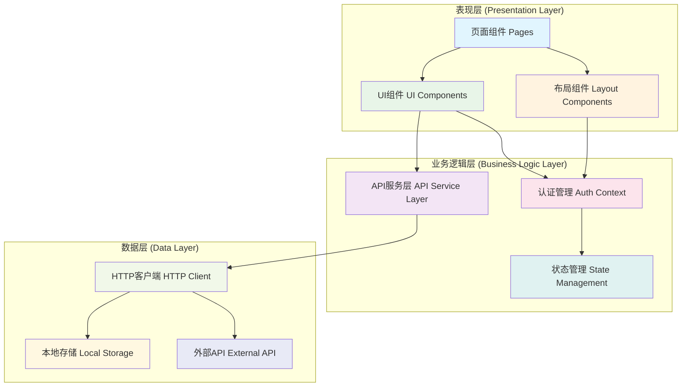
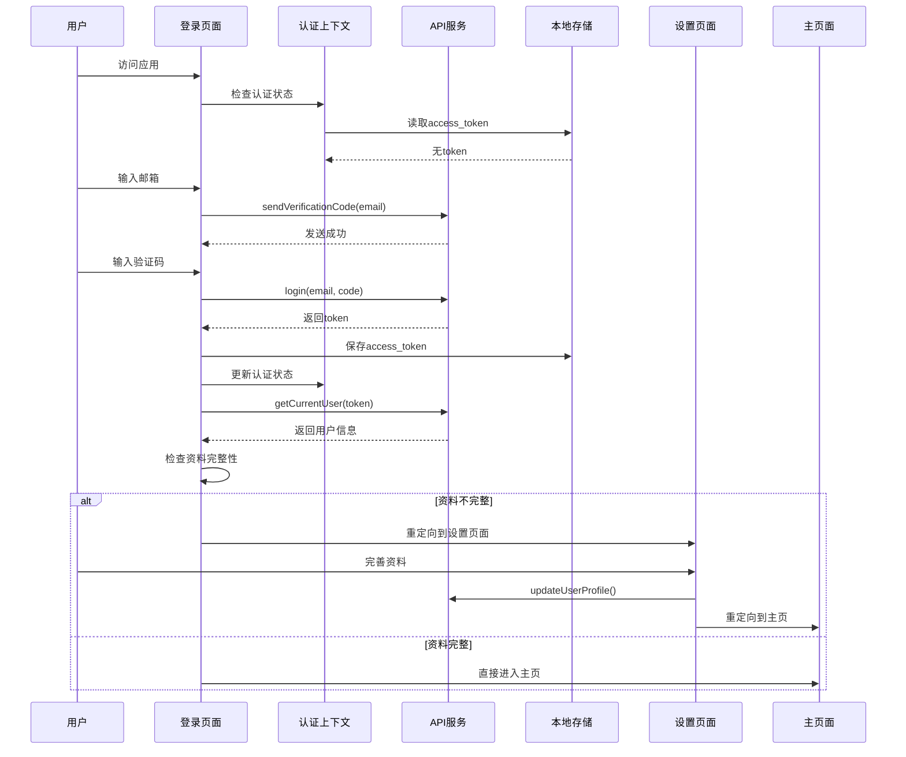
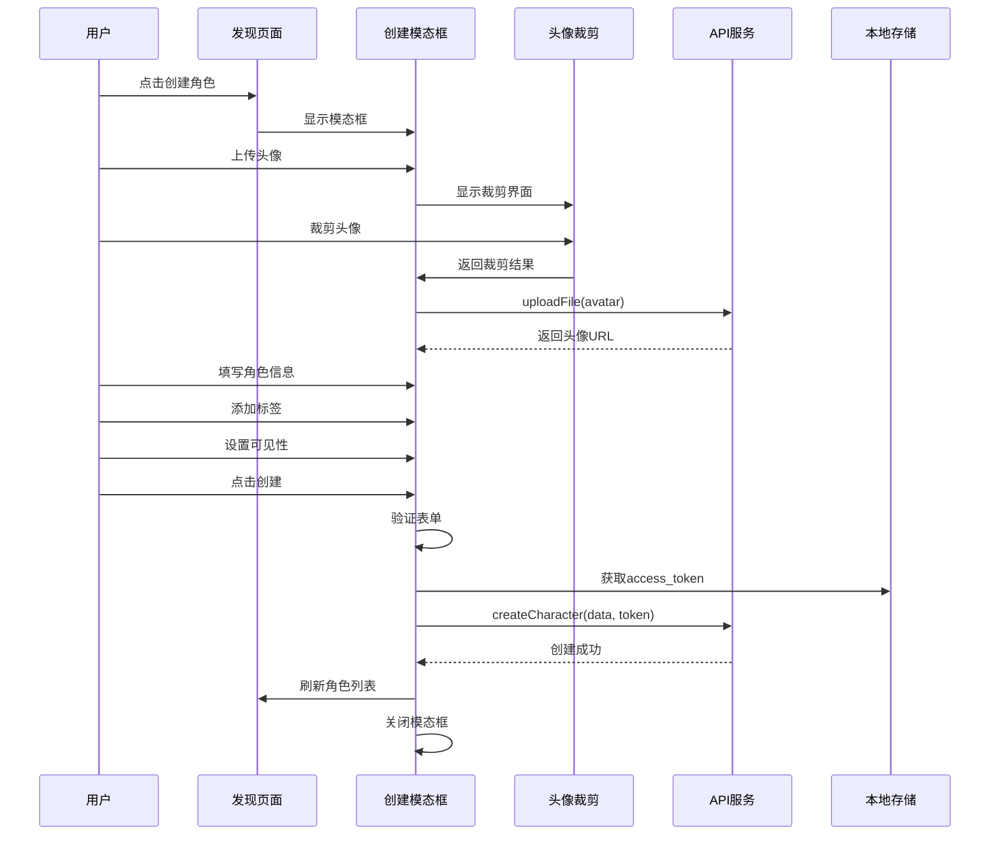
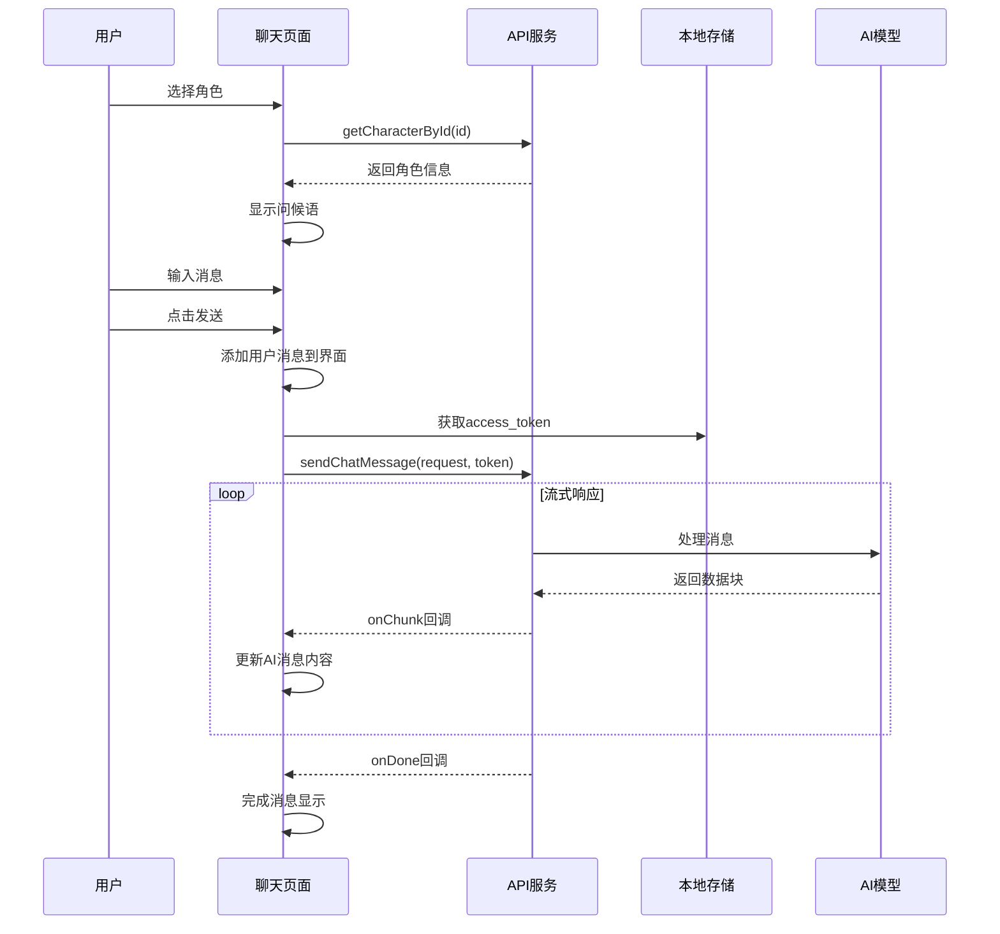

这是虚拟角色扮演网站的前端项目文档，最后更新时间为2025年12月16日
# 虚拟角色扮演网站项目总结文档

## 1. 项目架构

### 1.1 目录结构

```
role-playing/
├── src/
│   ├── app/                          # Next.js App Router 页面
│   │   ├── (app)/                   # 应用主布局组
│   │   │   ├── layout.tsx           # 应用主布局
│   │   │   ├── page.tsx             # 发现页面（首页）
│   │   │   ├── chat/[id]/          # 动态聊天页面
│   │   │   │   └── page.tsx
│   │   │   └── profile/             # 用户资料页面
│   │   │       └── page.tsx
│   │   ├── login/                   # 登录页面
│   │   │   └── page.tsx
│   │   ├── setup/                   # 用户设置页面
│   │   │   └── page.tsx
│   │   ├── layout.tsx               # 根布局
│   │   └── globals.css              # 全局样式
│   ├── components/                   # React 组件
│   │   ├── AvatarCropper.tsx        # 头像裁剪组件
│   │   ├── CharacterCard.tsx         # 角色卡片组件
│   │   ├── ChatHeader.tsx           # 聊天头部组件
│   │   ├── ChatInput.tsx            # 聊天输入组件
│   │   ├── ChatMessage.tsx          # 聊天消息组件
│   │   ├── CreateCharacterModal.tsx  # 创建/编辑角色模态框
│   │   ├── DeleteConfirmDialog.tsx  # 删除确认对话框
│   │   ├── ProfileDialog.tsx        # 用户资料对话框
│   │   └── Sidebar.tsx             # 侧边栏组件
│   └── lib/                        # 工具库
│       ├── api.ts                   # API 接口封装
│       └── auth-context.tsx         # 认证上下文
├── public/                         # 静态资源
│   ├── characters.json              # 示例角色数据
│   └── *.svg                      # 图标资源
├── API.md                         # API 文档
├── database_schema.md              # 数据库模式文档
├── package.json                   # 项目依赖
├── next.config.ts                # Next.js 配置
└── tsconfig.json                 # TypeScript 配置
```

### 1.2 架构层次 Mermaid 图



## 2. 程序处理流程

### 2.1 用户认证流程

用户认证是系统的核心流程，包含邮箱验证码登录和用户资料设置两个主要阶段。

**流程描述：**
1. 用户访问应用，系统检查本地存储的认证状态
2. 未认证用户被重定向到登录页面
3. 用户输入邮箱地址，系统发送验证码
4. 用户输入验证码，系统验证并创建认证会话
5. 系统检查用户资料完整性，如不完整则跳转到设置页面
6. 用户完善资料后，进入主应用界面

### 2.2 用户认证流程 UML 时序图



### 2.3 角色创建流程

角色创建是用户的核心交互功能，支持头像上传、信息填写和标签设置。

**流程描述：**
1. 用户在发现页面点击创建角色按钮
2. 系统显示创建角色模态框
3. 用户上传头像，系统调用裁剪组件处理
4. 用户填写角色基本信息（名称、描述、系统提示词）
5. 用户可选择添加标签（最多3个，1-4字符）
6. 用户设置角色可见性（公开/链接可见/私有）
7. 系统验证所有必填字段
8. 调用API创建角色，成功后刷新角色列表

### 2.4 角色创建流程 UML 时序图



### 2.5 聊天交互流程

聊天是应用的核心功能，支持实时流式响应和历史记录管理。

**流程描述：**
1. 用户在发现页面选择角色，进入聊天页面
2. 系统加载角色信息，显示问候语（如有）
3. 用户输入消息并发送
4. 系统构建聊天历史，调用流式聊天API
5. 系统实时显示AI响应内容
6. 聊天记录自动保存到历史中
7. 用户可继续对话或切换到其他角色

### 2.6 聊天交互流程 UML 时序图



## 3. 各模块详细说明

### 3.1 表现层模块

#### 3.1.1 页面组件 (Pages)

**src/app/(app)/page.tsx - 发现页面**
- **功能**: 展示所有可用角色，提供角色发现和创建入口
- **核心特性**: 
  - 角色卡片网格展示
  - 创建角色浮动按钮
  - 响应式布局设计
- **状态管理**: 角色列表、创建模态框状态
- **API集成**: getMarketCharacters()

**src/app/(app)/chat/[id]/page.tsx - 聊天页面**
- **功能**: 提供与特定角色的聊天交互界面
- **核心特性**:
  - 动态路由支持多角色聊天
  - 流式消息显示
  - 聊天历史管理
  - 自动滚动到最新消息
- **状态管理**: 角色信息、消息列表、流式状态
- **API集成**: getCharacterById(), sendChatMessage()

**src/app/login/page.tsx - 登录页面**
- **功能**: 处理用户认证流程
- **核心特性**:
  - 邮箱验证码登录
  - 两步骤认证流程
  - 错误处理和用户反馈
- **状态管理**: 邮箱、验证码、认证步骤、错误状态
- **API集成**: sendVerificationCode(), login()

**src/app/setup/page.tsx - 设置页面**
- **功能**: 用户首次登录后的资料完善
- **核心特性**:
  - 头像上传和裁剪
  - 用户名设置
  - 表单验证
- **状态管理**: 用户名、头像文件、预览状态
- **API集成**: uploadFile(), updateUserProfile()

#### 3.1.2 UI组件 (UI Components)

**src/components/CharacterCard.tsx - 角色卡片**
- **功能**: 角色信息的可视化展示
- **核心特性**:
  - 头像、名称、描述展示
  - 标签系统（彩色分类）
  - 在线状态指示器
  - 悬停动画效果
  - 编辑/删除菜单（可选）
- **Props接口**: character, onClick, showMenu, onEdit, onDelete

**src/components/ChatMessage.tsx - 聊天消息**
- **功能**: 单条聊天消息的展示
- **核心特性**:
  - 用户/AI消息区分
  - 头像显示
  - 消息内容渲染
  - 时间戳显示
- **Props接口**: message, userAvatar, assistantAvatar

**src/components/ChatInput.tsx - 聊天输入**
- **功能**: 用户消息输入和发送
- **核心特性**:
  - 多行文本输入
  - 发送按钮状态管理
  - 键盘快捷键支持
  - 禁用状态处理
- **Props接口**: onSend, disabled

**src/components/ChatHeader.tsx - 聊天头部**
- **功能**: 聊天页面顶部信息展示
- **核心特性**:
  - 角色基本信息显示
  - 返回按钮
  - 角色头像和名称
- **Props接口**: character

**src/components/CreateCharacterModal.tsx - 创建角色模态框**
- **功能**: 角色创建和编辑的完整界面
- **核心特性**:
  - 头像上传和裁剪集成
  - 表单验证和错误处理
  - 标签管理系统
  - 可见性设置
  - 创建/编辑模式切换
- **Props接口**: isOpen, onClose, onSuccess, character, mode

**src/components/AvatarCropper.tsx - 头像裁剪**
- **功能**: 图片裁剪和预览功能
- **核心特性**:
  - 拖拽裁剪区域
  - 实时预览
  - 缩放支持
  - 确认/取消操作
- **Props接口**: file, onConfirm, onCancel

**src/components/DeleteConfirmDialog.tsx - 删除确认**
- **功能**: 危险操作的二次确认
- **核心特性**:
  - 模态对话框
  - 确认/取消按钮
  - 危险操作警告
- **Props接口**: isOpen, onClose, onConfirm, title, message

**src/components/ProfileDialog.tsx - 用户资料对话框**
- **功能**: 用户资料查看和编辑
- **核心特性**:
  - 用户信息展示
  - 编辑功能
  - 登出操作
- **Props接口**: isOpen, onClose

#### 3.1.3 布局组件 (Layout Components)

**src/app/(app)/layout.tsx - 应用主布局**
- **功能**: 应用的整体布局结构
- **核心特性**:
  - 侧边栏集成
  - 认证状态检查
  - 响应式设计
  - 全局样式应用

**src/components/Sidebar.tsx - 侧边栏**
- **功能**: 导航和角色列表展示
- **核心特性**:
  - 角色列表滚动
  - 选中状态高亮
  - 发现页面链接
  - 用户资料入口
  - 折叠/展开功能
- **Props接口**: characters, selectedCharacterId, onSelectCharacter, onToggle

### 3.2 业务逻辑层模块

#### 3.2.1 认证管理 (src/lib/auth-context.tsx)
- **功能**: 全局认证状态管理
- **核心特性**:
  - React Context封装
  - 登录/登出功能
  - 用户状态持久化
  - 资料完整性检查
- **主要接口**: 
  - useAuth(): 返回user, login, logout, isLoading, refreshUser
  - isProfileComplete(): 检查用户资料完整性

#### 3.2.2 API服务层 (src/lib/api.ts)
- **功能**: 所有后端API调用的统一封装
- **核心特性**:
  - TypeScript类型定义
  - 错误处理统一
  - 流式响应支持
  - 认证token管理
- **主要API分类**:
  - **认证API**: sendVerificationCode(), login(), getCurrentUser()
  - **用户API**: updateUserProfile()
  - **角色API**: getMarketCharacters(), getCharacterById(), createCharacter(), updateCharacter(), deleteCharacter()
  - **文件API**: uploadFile()
  - **聊天API**: sendChatMessage()

### 3.3 数据层模块

#### 3.3.1 HTTP客户端
- **实现**: 基于fetch API的封装
- **特性**: 
  - 自动添加认证头
  - 错误状态码处理
  - 流式响应支持
  - 请求/响应拦截

#### 3.3.2 本地存储
- **存储内容**: 
  - access_token: 认证令牌
  - 用户会话信息
- **存储方式**: localStorage
- **特性**: 
  - 持久化存储
  - 自动过期处理
  - 安全性考虑

## 4. 数据模型

### 4.1 用户数据模型

```typescript
interface User {
    id: string;
    username: string;
    email: string;
    avatar_url?: string;
    created_at: string;
    updated_at: string;
}
```

### 4.2 角色数据模型

```typescript
interface Character {
    id: string;
    name: string;
    description: string;
    avatar: string;
    system_prompt?: string;
    greeting_message?: string;
    tags?: string[];
    visibility?: CharacterVisibility;
    creator_id?: string;
    creator_username?: string;
}

type CharacterVisibility = "PUBLIC" | "UNLISTED" | "PRIVATE";
```

### 4.3 聊天数据模型

```typescript
interface Message {
    id: string;
    role: "user" | "assistant";
    content: string;
}

interface ChatRequest {
    user_id: string;
    chat_id: string;
    message: string;
    history: Array<{
        role: string;
        content: string;
    }>;
}
```

### 4.4 Milvus Schema（基于database_schema.md）

根据项目文档，系统使用Milvus向量数据库进行角色相似性搜索：

```yaml
collections:
  - name: characters
    fields:
      - name: id
        data_type: Int64
        is_primary: true
        auto_id: true
      - name: character_id
        data_type: VarChar
        max_length: 100
      - name: name
        data_type: VarChar
        max_length: 200
      - name: description
        data_type: VarChar
        max_length: 500
      - name: system_prompt
        data_type: VarChar
        max_length: 8000
      - name: embedding
        data_type: FloatVector
        dim: 1536  # OpenAI embedding dimension
      - name: tags
        data_type: Array
        element_type: VarChar
        max_capacity: 10
        max_length: 50
      - name: visibility
        data_type: VarChar
        max_length: 20
      - name: creator_id
        data_type: VarChar
        max_length: 100
      - name: created_at
        data_type: Int64
      - name: updated_at
        data_type: Int64

indexes:
  - name: embedding_index
    field_name: embedding
    index_type: HNSW
    metric_type: COSINE
    params:
      M: 16
      efConstruction: 200
```

## 5. 测试

### 5.1 当前测试覆盖情况

经过项目分析，当前项目**缺乏正式的测试框架和测试用例**。这是一个需要改进的重要方面。

### 5.2 建议的测试策略

#### 5.2.1 单元测试 (Unit Tests)
**测试框架**: Jest + React Testing Library
**覆盖范围**:
- **组件测试**:
  - CharacterCard组件渲染和交互
  - ChatInput组件输入和提交
  - CreateCharacterModal表单验证
  - AvatarCropper裁剪功能
- **工具函数测试**:
  - API响应处理函数
  - 数据验证函数
  - 格式化工具函数

**对应文件**: `__tests__/components/`, `__tests__/lib/`

#### 5.2.2 集成测试 (Integration Tests)
**测试框架**: Jest + MSW (Mock Service Worker)
**覆盖范围**:
- **API集成测试**:
  - 用户认证流程
  - 角色CRUD操作
  - 聊天消息发送
- **页面流程测试**:
  - 完整的用户注册流程
  - 角色创建到聊天流程
  - 状态管理集成

**对应文件**: `__tests__/integration/`

#### 5.2.3 端到端测试 (E2E Tests)
**测试框架**: Playwright
**覆盖范围**:
- **用户旅程测试**:
  - 新用户注册和首次使用
  - 角色创建和管理
  - 多角色聊天切换
  - 响应式设计测试

**对应文件**: `e2e/`

#### 5.2.4 属性测试 (Property Testing)
**测试框架**: Fast-check
**覆盖范围**:
- **数据模型验证**:
  - 角色数据边界条件
  - 用户输入格式验证
  - API响应格式一致性

**对应文件**: `__tests__/property/`

### 5.3 测试配置建议

**package.json脚本**:
```json
{
  "scripts": {
    "test": "jest",
    "test:watch": "jest --watch",
    "test:coverage": "jest --coverage",
    "test:e2e": "playwright test",
    "test:e2e:ui": "playwright test --ui"
  }
}
```

**Jest配置**:
```javascript
module.exports = {
  testEnvironment: 'jsdom',
  setupFilesAfterEnv: ['<rootDir>/jest.setup.js'],
  moduleNameMapping: {
    '^@/(.*)$': '<rootDir>/src/$1',
  },
  collectCoverageFrom: [
    'src/**/*.{ts,tsx}',
    '!src/**/*.d.ts',
  ],
  coverageThreshold: {
    global: {
      branches: 80,
      functions: 80,
      lines: 80,
      statements: 80,
    },
  },
};
```

### 5.4 测试优先级建议

**高优先级**:
1. 核心业务逻辑测试（认证、角色管理）
2. 关键组件测试（聊天界面、角色创建）
3. API集成测试

**中优先级**:
1. 边界条件测试
2. 错误处理测试
3. 性能相关测试

**低优先级**:
1. UI细节测试
2. 辅助功能测试
3. 兼容性测试

## 6. 技术栈总结

### 6.1 前端技术栈
- **框架**: Next.js 14 (App Router)
- **语言**: TypeScript
- **样式**: Tailwind CSS
- **状态管理**: React Context
- **HTTP客户端**: Fetch API
- **图像处理**: 自定义头像裁剪组件

### 6.2 后端集成
- **API**: RESTful API
- **认证**: JWT Token
- **数据库**: Milvus (向量数据库)
- **AI服务**: 流式聊天API

### 6.3 开发工具
- **包管理**: npm
- **代码规范**: ESLint
- **类型检查**: TypeScript
- **构建工具**: Next.js内置

## 7. 项目特点与优势

### 7.1 技术特点
1. **现代化架构**: 采用Next.js 14 App Router，支持服务端渲染
2. **类型安全**: 全面使用TypeScript，提供完整的类型定义
3. **响应式设计**: 移动端友好的界面设计
4. **实时交互**: 支持流式聊天响应
5. **模块化设计**: 组件高度可复用，便于维护

### 7.2 用户体验特点
1. **直观的界面**: 清晰的视觉层次和交互反馈
2. **流畅的动画**: 精心设计的过渡效果和微交互
3. **完整的流程**: 从注册到使用的完整用户旅程
4. **错误处理**: 友好的错误提示和恢复机制

### 7.3 业务特点
1. **角色系统**: 灵活的角色创建和管理
2. **标签系统**: 便于角色分类和发现
3. **可见性控制**: 支持公开、链接可见、私有三种模式
4. **向量搜索**: 基于AI的角色相似性推荐

## 8. 改进建议

### 8.1 测试覆盖
- 建立完整的测试体系
- 提高代码覆盖率到80%以上
- 添加自动化CI/CD测试流程

### 8.2 性能优化
- 实现图片懒加载
- 添加缓存策略
- 优化bundle大小

### 8.3 功能扩展
- 添加角色分享功能
- 实现聊天历史导出
- 支持角色收藏和分类

### 8.4 代码质量
- 添加更严格的TypeScript配置
- 实现更细粒度的错误处理
- 添加代码注释和文档

---

*本文档基于项目当前状态生成，反映了虚拟角色扮演网站前端的完整技术架构和实现细节。*
